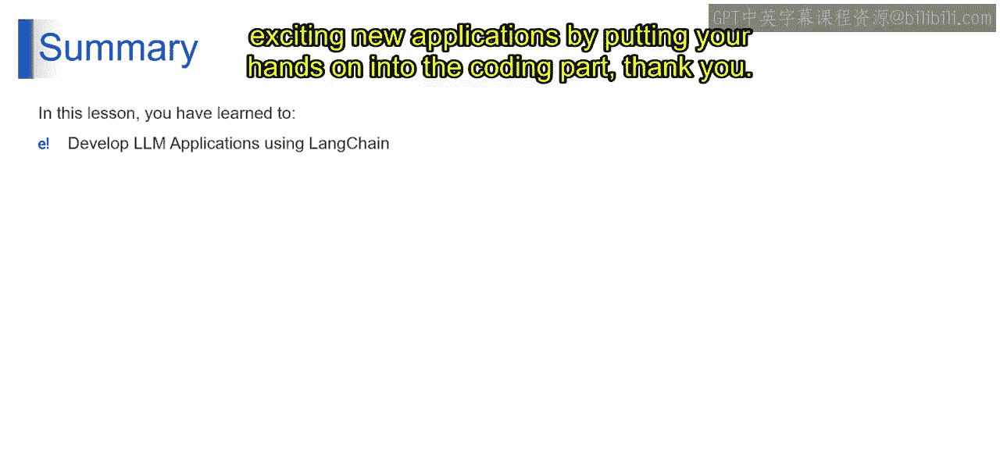

# 第二三四部分 62：配置凭证与LLM应用逻辑 🧠

在本节课中，我们将学习如何配置LangChain以连接大型语言模型，并理解构建LLM驱动应用的核心逻辑。我们将从配置凭证开始，逐步深入到如何调用LLM、调整参数以及处理更复杂的应用场景。

---

## 配置凭证：连接LLM的桥梁 🔑

上一节我们介绍了LangChain的基本概念，本节中我们来看看如何配置凭证，使其作为你的应用与强大LLM之间的中介。要使用这些LLM，你需要配置授予LangChain访问权限的凭证。

以下是关键要点的解析：

**支持的提供商**
LangChain可以与多个流行的LLM提供商连接。一些常见的例子包括：
*   **OpenAI**：大型语言模型的领先提供商，例如GPT-3.5和GPT-4。
*   **Hugging Face**：一个提供访问各种预训练LLM及其相关工具的平台。
*   **Cohere**：另一个高级LLM提供商，专注于企业级应用。

**API密钥**
可以将API密钥视为授予访问提供商LLM服务的特殊通行证。每个提供商都有自己获取API密钥的流程。你通常需要在其平台上创建账户，并按照说明生成唯一的API密钥。无论是OpenAI、Hugging Face还是Cohere，你都需要准备或创建一个API密钥来开发应用。

**配置方法**
准备好API密钥后，你需要告诉LangChain如何使用它。在LangChain中配置凭证主要有两种方式：
*   **环境变量**：这是一种非常常见的方法，你在系统上设置具有特定名称的环境变量。例如，你可以设置一个名为`OPENAI_API_KEY`的环境变量，并将你的OpenAI API密钥作为其值。
*   **上下文管理器**：LangChain提供了一种更高级的方法，使用上下文管理器。这允许你在代码本身内部管理凭证，为特定用例提供更多的控制和灵活性。

**一些额外的注意事项**
*   **安全性**：务必妥善保管你的API密钥，避免泄露。
*   **提供商特定配置**：不同提供商可能需要额外的配置步骤。

通过遵循这些步骤并确保凭证安全，你可以让LangChain与你选择的LLM提供商进行交互，从而释放这些强大语言模型的潜力。

---

## LLM驱动应用的逻辑 ⚙️

了解了如何连接LLM后，现在让我们深入理解LLM驱动应用背后的逻辑。

**发起LLM调用**
这是核心功能，你将使用LangChain向选定的LLM提供商发送提示。这些提示明确告诉LLM你想要它做什么，例如回答问题、生成创意文本或总结信息。LangChain处理与LLM提供商的通信并获取LLM的响应。这是你向LLM发起调用的第一步。

**参数调优**
这是第二步，即参数调优。LangChain允许你微调与LLM的交互方式。以下是一些关键参数：
*   **温度 (`temperature`)**：控制LLM响应的随机性。较高的温度会导致更具创造性但可能准确性较低的输出。
    ```python
    # 示例：设置温度参数
    llm = OpenAI(temperature=0.7)
    ```
*   **最大长度 (`max_tokens`)**：你可以限制LLM响应的长度，防止输出过于冗长。
    ```python
    # 示例：设置最大生成长度
    llm = OpenAI(max_tokens=150)
    ```
*   **Top-k (`top_k`)**：此参数影响LLM响应的多样性。较低的值会导致更可预测但可能重复的输出。

**错误处理**
事情并非总是完美进行。LangChain可以帮助你处理在与LLM通信或处理其响应时可能发生的错误。例如，你可能需要捕获LLM返回错误消息或其响应毫无意义的情况。LangChain可以帮助你实现逻辑来优雅地处理这些情况，提供流畅的用户体验。

**高级用法**
对于更复杂的LLM应用，LangChain提供了更多功能，正如我们在之前的构建模块中讨论的那样，包括链式调用、内存管理和自定义组件。

以下是具体内容：
*   **链式调用**：这允许你顺序发送多个提示，与LLM创建对话流。想象一下，先提出一个初始问题，然后利用LLM的答案来优化你的下一个提示，以获得更具体的信息。
*   **内存管理**：LangChain允许你的应用存储过去与LLM交互的信息。这对于需要上下文的任务很有帮助，例如构建一个能在整个对话中记住用户偏好的聊天机器人。
*   **自定义组件**：LangChain的开放式架构允许开发者为特定需求创建自定义组件。这些组件可以扩展LangChain的能力，解决你应用中的独特挑战。

---

## 总结 📝




本节课中，我们一起探索了LangChain是什么，以及它作为构建强大应用的框架如何发挥作用。我们学习了如何连接到LLM、如何配置有效的凭证，并设计了这些创新型LLM驱动工具背后的核心逻辑。通过使用LangChain，你现在可以释放LLMs的潜力，并通过动手编码部分来创建令人兴奋的新应用。