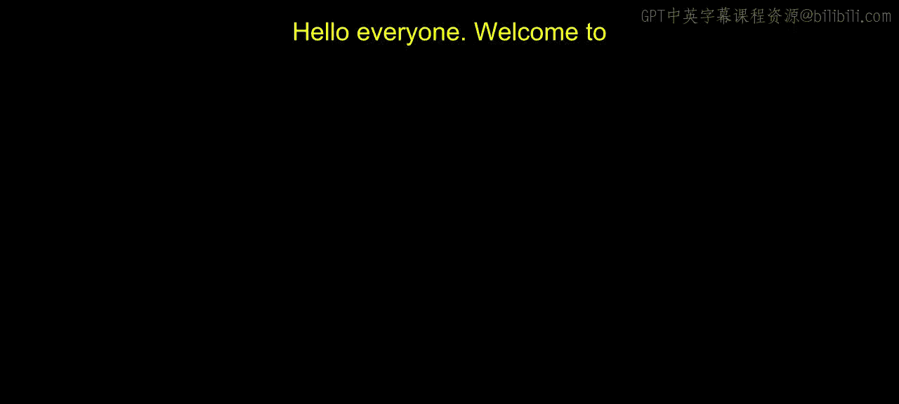
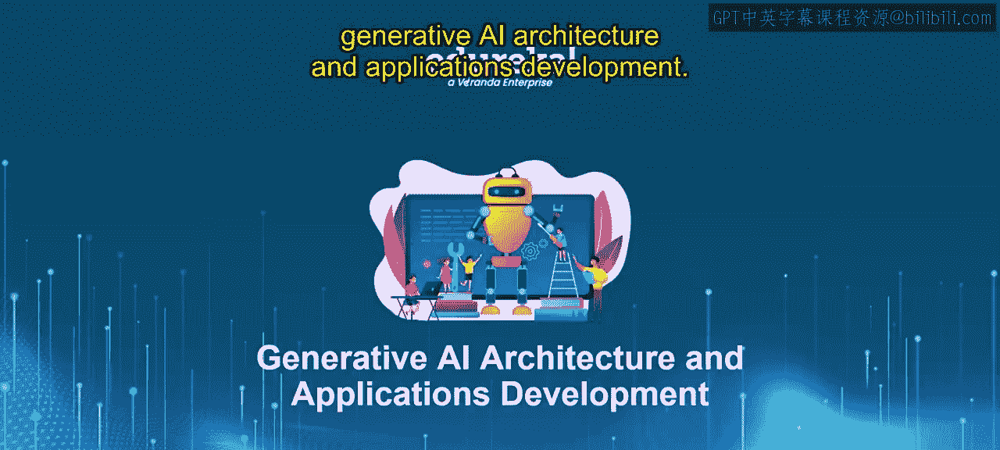
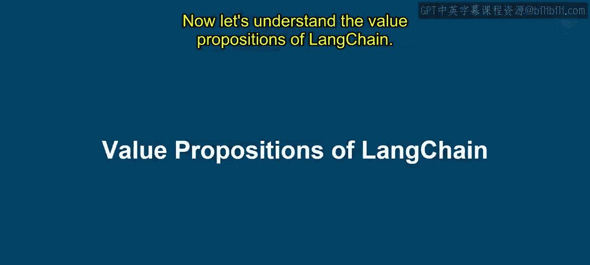
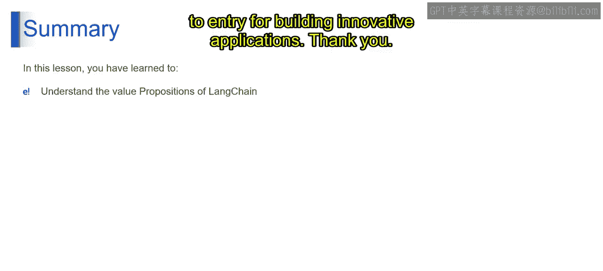

# 第二三四部分 63：LangChain的价值主张

在本节课中，我们将学习LangChain的核心价值主张。我们将了解LangChain如何简化与大语言模型的交互，以及它提供的各种强大功能，帮助开发者更高效地构建基于大语言模型的应用。

---

在上一节中，我们了解了LangChain是什么。我们将其比作一个能与知识渊博的“超级智能朋友”进行有效沟通的特殊工具。它帮助用户提出清晰的问题并获得有用的回答。

本节中，我们来看看LangChain的价值主张如何转化为实际益处。

以下是LangChain价值主张的详细解析。

### 简化的大语言模型交互
LangChain提供了用户友好的接口，例如带有清晰指令的聊天窗口。这允许你向大语言模型发出具体的指令，即**提示词**，就像向朋友提出一个定义明确的问题。

### 强大的链式能力
想象一下与朋友进行对话，可以根据他之前的回答提出后续问题。LangChain的链式能力允许你按顺序向大语言模型发送多个提示词，从而创建更自然的交互流程。

从技术上讲，LangChain的价值主张可以总结为以下几点：

*   **降低复杂性**：LangChain通过提供易于使用的提示词构建和响应处理工具，简化了与复杂大语言模型的交互。
*   **实现高级对话流**：链式能力支持与大语言模型进行复杂的多步骤交互，营造更自然、动态的用户体验。
*   **执行数据集成**：LangChain弥合了大语言模型与外部数据源之间的鸿沟，允许你的应用程序访问和处理现实世界的信息。
*   **开源与可定制性**：其开源特性促进了社区发展，并允许通过为特定应用需求定制的组件来实现高度定制。

---

现在，让我们具体理解LangChain的价值主张。简单来说，价值主张指的是它为希望构建基于大语言模型应用的开发者提供的关键优势和益处。以下是详细分解：

### 模块化组件
想象一下用乐高积木搭建模型。乐高提供各种构建块，如砖块、窗户和门。LangChain的功能类似，它提供了一套模块化组件，可以组合起来在LLM应用程序中构建不同的功能。

这意味着LangChain提供了一系列具有特定功能的可重用代码块，即**组件**。这些组件可以以各种方式组合，在你的应用程序中创建复杂的工作流程。这种模块化方法促进了代码的可重用性并简化了开发。

### 开箱即用的链
想一想带有搭建特定结构说明的预制乐高套装。LangChain提供了**开箱即用的链**，这些是使用其组件构建的预定义工作流程。这些链可以作为你应用程序的起点，或者为你构建自定义工作流程提供灵感。

开箱即用的链是LangChain内预建的工作流程，用于处理常见的大语言模型交互模式。它们为你构建更复杂的功能或直接用于更简单的任务提供了基础。

### 灵活性与可定制性
虽然乐高套装附有说明书，但你也可以发挥创造力搭建完全不同的东西。LangChain提供了类似的灵活性。你可以使用其组件和链作为构建块，但并不受限于它们。你可以定制和扩展LangChain以适应你特定的应用程序和需求。

这意味着LangChain的开源特性允许高度定制。开发者可以修改现有组件、创建全新的组件，并将它们无缝集成到自己的应用程序中。这种灵活性使开发者能够应对独特的挑战，并构建真正创新的大语言模型应用。

### 增强的大语言模型能力
想象一下给你的“超级智能朋友”提供额外的资源，比如书籍和百科全书。这会扩展他们的知识并改善他们的回答。LangChain以完全相同的方式运作。

LangChain允许你将大语言模型应用程序与外部数据源（如数据库和API）集成。这赋予了大语言模型访问更广泛知识库的能力，从而在你的应用程序中产生更全面、信息更丰富的回答。

### 降低入门门槛
学习编码可能是一项具有挑战性的任务，但LangChain通过提供一种更简单的方式来与复杂的大语言模型交互，从而提供了帮助。它简化了构建大语言模型应用程序的过程，使各级别的开发者都能更容易地接触这项技术。

---

在本节课中，我们一起学习了LangChain引人注目的价值主张。我们探讨了它如何通过模块化组件和预建工作流程（即开箱即用的链）来简化与大语言模型的交互。LangChain为开发者提供了灵活性和定制选项，释放了大语言模型的全部潜力，同时降低了构建创新应用程序的入门门槛。