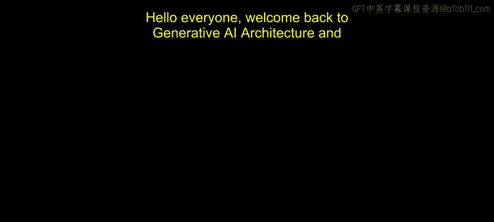
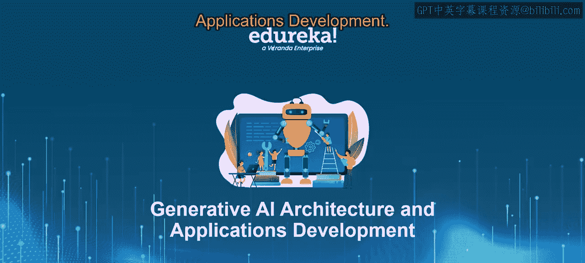
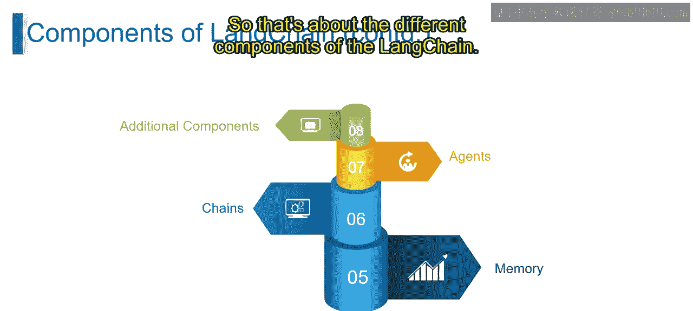

# 第二三四部分 64：LangChain的组件 🧩

在本节课中，我们将学习LangChain框架的核心组件。我们将了解每个组件的作用、它们如何工作，以及如何将它们组合起来构建强大的LLM应用。

---

## 概述

LangChain是一个用于开发由语言模型驱动的应用程序的框架。它通过提供一系列模块化组件，简化了与LLM交互、处理数据和管理复杂工作流的流程。理解这些组件是构建高效、可维护的LLM应用的基础。

---

## 核心组件详解

上一节我们概述了LangChain，本节中我们将逐一深入探讨其核心组件。

### 1. LLM包装器

想象一下为不同的电子设备准备各种适配器。这些适配器允许你将设备连接到强大的电源。LangChain中的LLM包装器功能与此类似。

LLM包装器为与不同的LLM提供商（如OpenAI、Hugging Face等）交互提供了一个统一的接口。尽管这些提供商各有不同，但包装器封装了通信细节，让你可以专注于设计提示词和处理响应，而无需担心特定提供商的查询方式。

**核心概念**：`LLMWrapper` 提供了一个标准化的调用方式。

### 2. 提示模板

设想一本烹饪书中的预制食谱模板。这些模板为制作美味菜肴提供了基本结构。LangChain的提示模板以类似的方式工作。

提示模板为设计有效的提示词（即给LLM的指令）提供了预定义的结构。它们作为一个起点，节省你的时间，并确保在向LLM制定提示词时的一致性。你可以根据应用程序的具体需求自定义这些模板。

**核心概念**：`PromptTemplate` 用于结构化、可复用的提示词生成。

### 3. 响应解析器

想象一下拿到一份复杂的说明书，但只需要其中组装特定部件的具体信息。LangChain中的响应解析器功能与此类似。

响应解析器分析LLM的响应，并提取你的应用程序所需的相关信息。它们可以过滤掉不必要的细节，并将响应转换为可在应用程序逻辑中使用的格式。

**核心概念**：`ResponseParser` 用于从LLM的原始输出中提取和结构化信息。

### 4. 索引

想一想书籍的索引，它能帮助你快速找到特定信息。LangChain中的索引为大型数据集提供了类似的功能。

索引是一种数据结构，允许从大型数据集中高效检索信息。LangChain可以与外部索引集成，使LLM能够访问和处理其核心训练数据之外的信息。

**核心概念**：`Index` 用于高效的数据检索和增强LLM的知识。

### 5. 记忆

想象一下在多天里搭建一个乐高作品，你可能会记住之前的进度。LangChain的记忆组件为你的LLM应用程序提供了类似的功能。

记忆组件允许你的应用程序存储与LLM过去交互的信息。这对于需要上下文的任务至关重要，例如构建一个能记住用户在对话中偏好的聊天机器人。可以把它想象成一个记录对话历史的日志本，但存在于你的应用程序和LLM之间。

**核心概念**：`Memory` 用于在对话或工作流中维护状态和上下文。

### 6. 链

设想搭建一个乐高作品涉及多个步骤，而不是单一一步。LangChain中的链允许你将多个步骤连接成更复杂的工作流。

链是LangChain的核心工作流组件。它使你能够将不同的组件（如LLM、提示词、响应解析器和数据操作工具）链接在一起。这允许你创建与LLM的多步交互，并在应用程序中构建更复杂的功能。

**核心概念**：`Chain` 用于将多个组件按顺序组合，形成完整的工作流。

### 7. 代理

想象一下有一个为你管理各种任务的私人助理。LangChain中的代理在你的LLM应用程序中发挥着类似的作用。

代理在你的应用程序中充当管理者的角色。它们处理诸如连接到LLM提供商、发送提示词、接收响应以及协调由你的链定义的整个工作流等任务。它们充当你的应用程序逻辑与强大的LLM之间的中介。

**核心概念**：`Agent` 是一个可以自主决定调用哪些工具或链来完成任务的高级组件。

### 8. 其他组件

除了上述核心组件，LangChain还提供了一个丰富的附加组件生态系统。

以下是这些附加组件可能包括的类型：

*   **数据集成**：实现与外部数据源（如数据库和API）的无缝连接。
*   **错误处理**：优雅地处理与LLM通信或处理其响应过程中可能出现的潜在问题。
*   **日志记录与监控**：跟踪你的应用程序行为和LLM的响应，用于调试和优化过程。

通过理解并有效利用这些组件，你可以释放LangChain的全部潜力，创建出以独特而强大的方式与世界交互的创新LLM应用程序。

---

## 总结

本节课中，我们一起学习了LangChain框架的八大核心组件：**LLM包装器**、**提示模板**、**响应解析器**、**索引**、**记忆**、**链**、**代理**以及其他**附加组件**。每个组件都扮演着特定的角色，共同构成了构建复杂LLM应用的基石。理解它们如何协同工作，是设计高效、可扩展AI应用程序的关键。在接下来的课程中，我们将进一步探讨如何将这些组件组合起来解决实际问题。