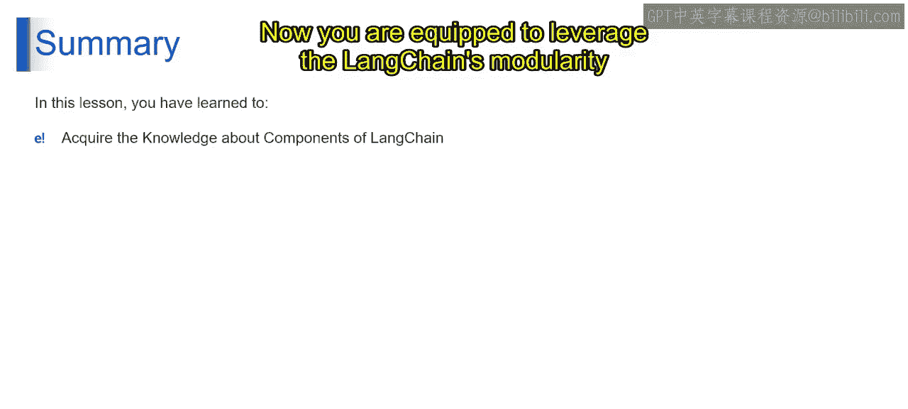

# 第二三四部分 65：基于组件方法的优势 🧱

在本节课中，我们将探讨基于组件方法的核心优势。我们将了解这种方法如何降低技术门槛、提升代码复用性、提供灵活性并支持深度定制，从而赋能开发者高效构建LLM应用。

上一节我们介绍了LangChain的基本构建块，本节中我们来看看采用这种基于组件的方法具体能带来哪些好处。

### 降低入门门槛 🚪

想象一下第一次搭建乐高积木。预制好的积木块和清晰的说明书让新手也能轻松上手，即使面对大型套装也是如此。基于组件的LLM开发方法与此类似，它显著降低了使用LLM的技术门槛。

从技术上讲，基于组件的方法简化了与LLM的交互。开发者无需成为LLM技术或特定供应商的专家。LangChain组件封装了底层复杂性，允许不同水平的开发者都能专注于构建其应用程序的核心功能。

### 提升代码复用性 ♻️

以下是复用性的体现：

想象使用相同的乐高积木块搭建不同的作品。LangChain以完全相同的方式促进代码复用。组件封装了特定功能，使其能够在不同应用程序中重复使用。

这节省了开发时间并减少了代码重复。开发者可以利用现有组件，并以新的方式组合它们，从而构建多样化的LLM应用。

### 提供高度灵活性 🧩

虽然乐高套装附有说明书，但你也可以发挥创造力，搭建出完全不同的东西。LangChain提供了类似的灵活性。

从技术上讲，基于组件的方法允许高度的灵活性。开发者可以使用预构建的组件，修改现有组件，甚至创建全新的组件，以满足其应用程序的特定需求。这使开发者能够构建独特且创新的LLM功能。

### 支持深度定制 🛠️

想象用不同颜色的积木或额外零件来定制你的乐高创作。LangChain允许类似的深度定制。

LangChain及其组件的开源性质允许进行广泛的定制。开发者可以根据特定的用例调整组件，集成自定义功能，并扩展LangChain的能力，以适应其独特的应用程序需求。

总而言之，LangChain的基于组件方法提供了一系列引人注目的优势：它降低了使用LLM的入门门槛，促进了代码复用，赋予了开发者灵活性，并允许进行广泛的定制。这些优势使LangChain成为一个强大而多功能的框架，适用于跨不同领域构建创新的LLM应用。

在本节课中，我们一起探索了基于组件方法的四大优势。它通过模块化设计，像乐高积木一样，让开发者能够更轻松、更高效、更灵活地组合出强大的LLM应用。现在，你已经准备好利用LangChain的模块化特性，将你基于LLM的创意变为现实。