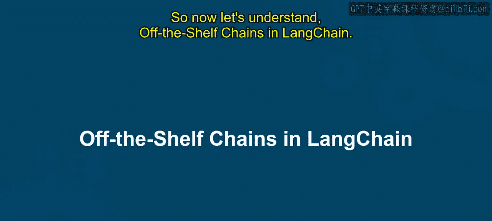
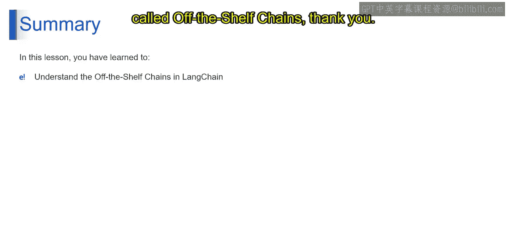

# 第二三四部分 66：现成的链

## 概述
在本节课中，我们将学习LangChain中的“现成的链”。我们将了解它们是什么、如何工作以及使用它们的好处。这些预构建的工作流程能简化与大型语言模型的交互，加速应用开发。

## 什么是现成的链？
在LangChain中，现成的链指的是预构建的工作流程，它们简化了与大型语言模型的交互。可以将它们想象成带有清晰说明的预制乐高套装。它们为在你的应用程序中构建LLM功能提供了基础，而无需从零开始。现成的链是LangChain组件的预定义序列，链接在一起以执行特定任务。这些链封装了常见的LLM交互模式，例如文本摘要、问答，甚至是创意文本生成。

现在，让我们具体理解LangChain中的现成的链。

## 现成链的构成与特点
它由用于构建各种应用程序的模块化组件组成。这强调了LangChain方法中固有的可重用性和灵活性。

它们为特定任务而设计，简化了应用程序开发。这意味着它们为特定任务而设计，强调了加快开发和降低复杂性的好处。

这些链为LangChain中的常见用例提供了现成的解决方案。它们允许通过修改组件和设置来进行定制和增强。

## 现成链的主要类型
以下是不同类型的现成链。

**对话AI链**
想象一下拥有一个预编程的聊天机器人对话流程。对话AI链的功能与此类似。这些链专门用于构建聊天机器人或虚拟助手。它们处理对话的来回性质，允许LLM理解用户查询、适当响应并在多次交互中保持上下文。

**内容生成与处理链**
想象一个预制的食谱模板，帮助你生成不同的菜肴。内容生成链在LLM中的功能与此完全相似。这些链专注于文本摘要、创意文本生成（如诗歌和脚本）或不同写作格式（如电子邮件、信件等）等任务。它们提供了一种结构化方法来指导LLM生成特定的内容格式。

**数据探索与分析链**
想象一下拥有针对特定主题的预定义搜索查询。数据探索链对于LLM的功能与此完全相似。这些链有助于问答或数据分析等任务。它们允许你构建提示词，并以一种便于基于你的特定需求进行数据探索和分析的方式从LLM访问信息。

这些只是几个例子，现成链提供的具体功能可能会有所不同，这取决于你将使用的LangChain版本。这里还有一些额外的要点，例如定制化和不断发展的生态系统等。

## 使用现成链的好处
现在让我们来理解使用现成链的好处。

**快速开发**
想象从头开始建造一座房子，这需要大量的规划、获取材料和执行施工的每一步。现成链的功能类似于预制建筑模块。它们提供预定义的工作流程，可以真正集成到你的应用程序中，与从零开始构建一切相比，为你节省大量时间和精力。你可以专注于应用程序的核心功能，利用链提供的预构建结构。

**降低入门门槛**
想象开始一个新食谱，但缺乏丰富的烹饪经验。一个带有清晰说明的预先写好的食谱降低了入门门槛，增加了你成功的几率。同样，现成链降低了使用LLM的入门门槛。它们提供了一种结构化方法，使LLM交互更容易上手，即使对于刚接触这项技术的开发人员也是如此。你不需要成为LLM专家，就能在你的应用程序中有效地利用它们的能力。

**经过验证的功能**
想象与一个以成功食谱闻名的经验丰富的厨师团队合作。预构建链提供了类似的安心感。这些链代表了针对常见LLM任务的经过充分测试的方法。它们由LangChain社区开发和改进，增加了你对它们将在你的方法中高效运行的信心。你可以从这些预定义工作流程中嵌入的集体知识和经验中受益。

**定制选项**
想象一家完美的服装店，允许你根据特定需求定制成衣。现成链提供了类似级别的定制。虽然它们提供了坚实的基础，但你并不局限于按原样使用它们。你可以修改链内的现有组件、调整设置，甚至组合多个链来创建更复杂的工作流程，以完美符合你应用程序的独特需求。这种灵活性使你能够利用预构建解决方案的力量，同时根据你的特定用例进行调整。

## 总结
本节课中，我们一起探索了LangChain中称为“现成的链”的预构建工作流程。我们了解了它们的定义、构成、主要类型以及使用它们带来的快速开发、降低门槛、功能可靠和高度可定制等核心优势。掌握现成的链是高效利用LangChain进行应用开发的关键一步。