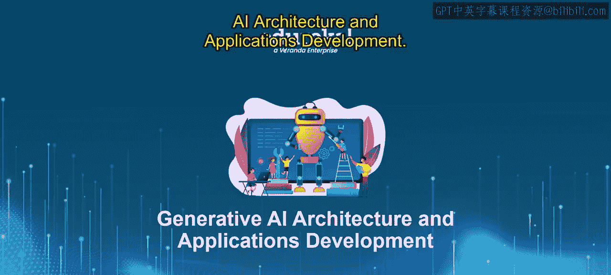
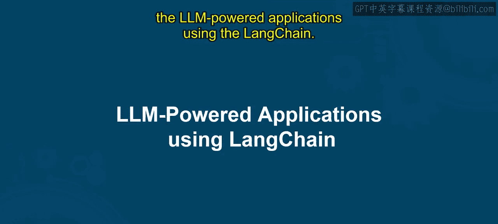
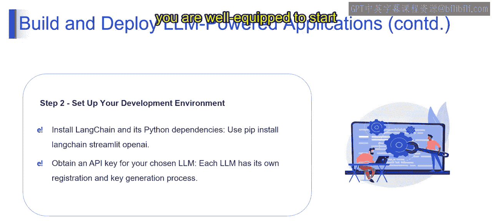
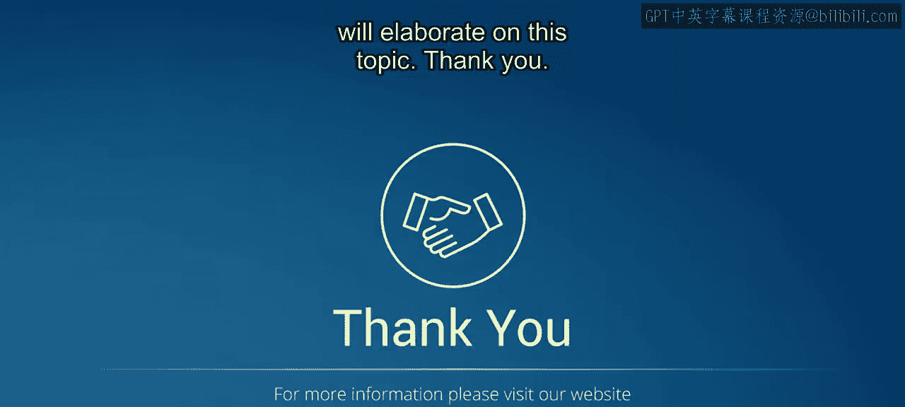

# 第二三四部分 67：使用LangChain构建和部署LLM驱动的应用




## 概述
在本节课中，我们将学习如何使用LangChain框架来构建和部署一个由大型语言模型驱动的应用程序。我们将从规划应用开始，逐步完成环境设置，为后续的开发工作打下基础。

---



## 第一步：定义你的应用 🎯

在开始编写代码或构建应用之前，你需要花时间规划你的LangChain应用。以下是简化的步骤分解。

首先，你需要明确要解决的问题。将你的应用想象成一个工具。它要解决什么具体的任务或需求？你是想构建一个用于客户服务的聊天机器人，一个用于研究文章的内容总结器，还是其他全新的东西？你需要决定要解决的问题类型。

接下来，你需要选择你的LLM伙伴。将大型语言模型视为拥有不同专长的专家。对于创作诗歌等创造性任务，GPT-3、GPT-3.5甚至GPT-4可能是好选择。LangChain允许你选择最适合你应用需求的LLM。

然后，如果可能，你可以使用预构建的快捷方式。如前所述，LangChain为常见任务提供了预构建的工作流程，可以将它们视为配方模板。如果有一个模板符合你的应用目标，你可以使用它来节省时间并快速启动。

通过清晰地定义应用核心，并选择合适的工具（如LLM和潜在的预构建链），你将为你LangChain应用的构建打下坚实的基础。

---

## 第二步：设置你的开发环境 ⚙️

现在你已经对应用有了清晰的规划，是时候设置你的开发环境了。

首先，你需要为你的应用安装必要的依赖。想象一下盖房子，首先你需要工具。在我们的案例中，我们将使用`pip`命令。`pip`是安装Python包的常用工具。

为此，我们需要运行以下命令：
```bash
pip install langchain streamlit openai
```
这个命令会安装LangChain核心框架，以及用于构建Web应用的有用工具Streamlit。如果你计划使用OpenAI的LLM，这里以OpenAI为例，你也可以安装Hugging Face的库。

完成必要的安装后，下一步是获取你的LLM密钥。将LLM API密钥视为一张特殊的门禁卡。每个LLM提供商都有自己的注册流程来获取密钥。在另一个视频中，我们已经看到如何创建OpenAI API密钥。为了获取API密钥，你需要登录他们的网站，从他们的仪表板页面获取API密钥，并遵循特定的说明来解锁对其LLM功能的访问。

通过这两个步骤，你就已经装备齐全，可以开始使用LangChain构建你的LLM应用了。

---





## 总结
本节课中，我们一起学习了构建LLM驱动应用的前两个关键步骤：定义应用目标和设置开发环境。我们明确了应用需要解决的问题，选择了合适的LLM模型，并安装了必要的工具和依赖。这些准备工作为后续的实际编码和部署奠定了坚实的基础。