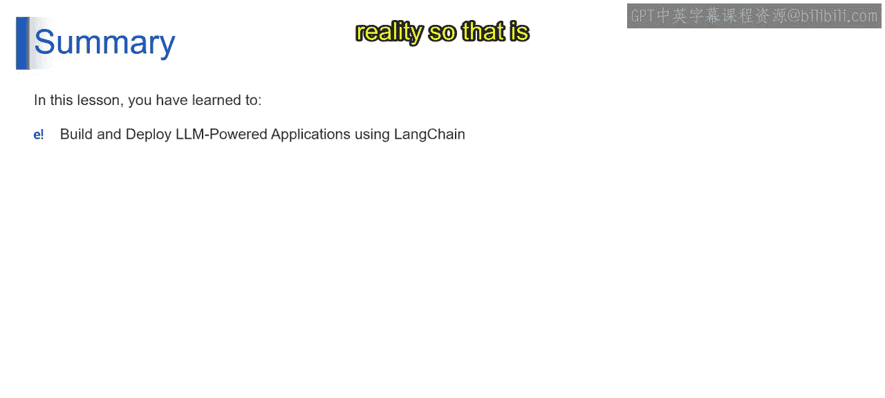
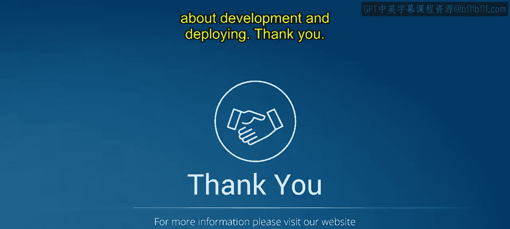

# 第二三四部分 68：设计LLM工作流程及其他步骤 🛠️

在本节课中，我们将学习设计大型语言模型（LLM）工作流程的关键步骤，包括定制现有链、构建自定义链、开发应用逻辑，以及最终的测试与优化。我们将详细探讨如何将LLM集成到实际应用中。

---

## 步骤三：设计你的LLM工作流程

上一节我们介绍了定义应用目标和设计LLM交互。本节中，我们来看看如何具体设计LLM的工作流程。LangChain提供了两种主要方式：定制现有链和构建自定义链。

以下是关于定制现有链的说明。

*   **定制现有链**：想象你有一个食谱模板，但想根据现有需求调整香料或配料。LangChain为常见任务提供了预构建的链。你可以修改这些链中的提示词、记忆设置和响应解析器，以针对你的具体需求进行微调。

接下来，我们看看如何构建自定义链。

*   **构建自定义链**：这好比从头开始建造一栋房子。LangChain允许你从零开始构建自定义工作流。你可以组合独立的LangChain组件，例如LLM包装器、提示词模板，甚至是解析器，来创建独特的对话流程。

通过定制现有链或构建你自己的链，你可以定义应用程序与LLM交互并实现其预期结果所需的具体步骤。

---

## 步骤四：开发你的应用逻辑

理解了工作流程设计后，下一步是开发具体的应用逻辑。这涉及多个环节，我们将逐一拆解。

以下是开发应用逻辑的四个关键环节。

1.  **连接到LLM**：想象你有一个特殊的适配器。在这里，你使用LangChain包装器来与你选择的LLM API进行交互。就像手机充电器的适配器一样，LangChain提供的包装器充当适配器，允许你的应用程序与你选择的LLM API无缝连接。
2.  **为LLM编写指令**：将提示词视为给LLM的清晰、简明的指令。你将使用LangChain开发特定的提示词，以从LLM中引出期望的输出。此外，你还需要设置数据管道来管理应用程序内的任何数据流。
3.  **理解LLM的响应**：一旦LLM响应了你的查询，LangChain解析器就开始发挥作用。将它们视为数据过滤器，从LLM有时冗长的响应中提取最相关的信息，并使其在你的应用程序中可用。
4.  **开发用户界面**：如果你正在创建Web应用程序，可以利用像Streamlit这样的框架来快速构建简易界面。或者，你也可以构建自定义界面，使其与你的LangChain应用逻辑无缝集成。

通过完成这些步骤，你将把LLM交互设计转化为一个功能性的应用程序，该程序能与LLM集成，并以用户友好的方式呈现其洞察。

---

## 步骤五：测试与优化

应用逻辑开发完成后，在将其发布给世界之前，通过测试和优化来打磨你的LLM应用至关重要。

以下是测试与优化的两个阶段。

*   **全面测试你的应用**：想象在开车上路前进行试驾。在LangChain中运行模拟，以模仿真实世界的使用场景并检查应用程序的行为。这使你能在部署前优化提示词、调整组件，并识别任何潜在问题。
*   **获取真实世界反馈（可选）**：想象获取对一道菜的反馈。考虑将你的应用程序部署给有限的受众（即Beta用户或测试人员），以收集有价值的用户反馈。这可以帮助你改进用户体验，识别功能上的改进领域，并确保你的LLM应用真正出色。

通过对你的LLM应用程序进行彻底的测试和优化，你将保证它能够提供流畅且用户友好的体验。

---

## 总结 📝

本节课中，我们一起探索了利用LangChain构建LLM应用程序的强大能力。从定义应用目标，到设计与LLM的交互，再到打磨最终产品，LangChain赋能你将LLM的想法变为现实。这就是关于开发与部署的核心步骤。