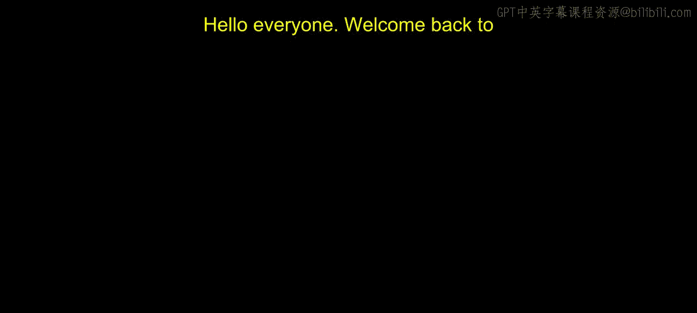
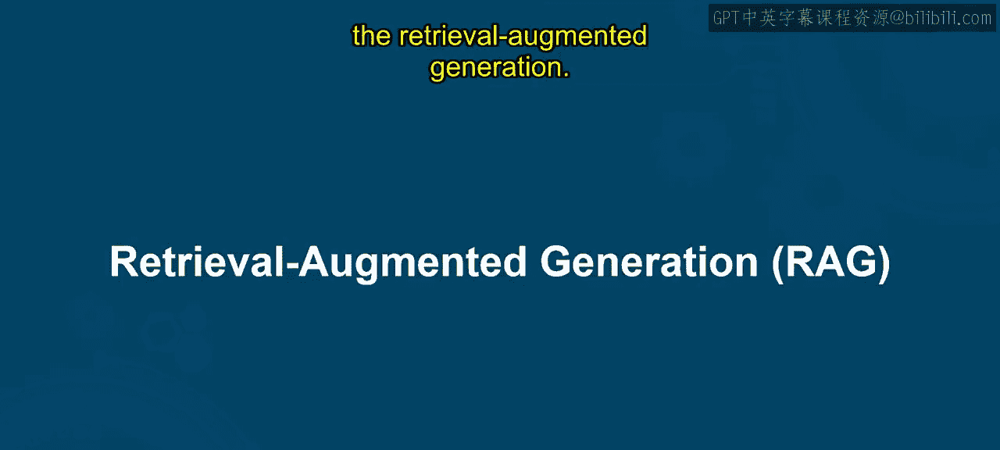
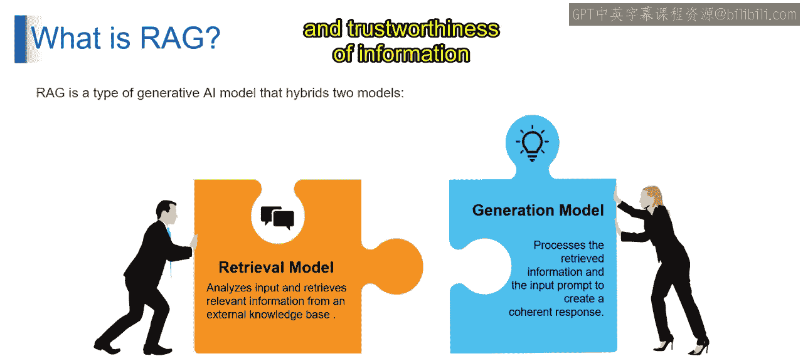

# 第二三四部分 69：理解检索增强生成（RAG）

在本节课中，我们将要学习检索增强生成（RAG）技术。这是一种提升大型语言模型（LLM）能力的方法，通过让模型访问外部知识库，使其生成既富有创意又基于事实的可靠回答。

---

### 什么是检索增强生成（RAG）？

检索增强生成，通常缩写为 **RAG**，是一种提升大型语言模型能力的强大技术。它的核心思想是将模型“锚定”在事实准确性之上。

我们可以用一个比喻来理解它：想象一位法庭上的法官。他拥有丰富的法律知识，但在处理复杂案件时，也会查阅外部资料，如判例和案例研究，以确保裁决的准确性。同样地，RAG 为 LLM 提供了访问外部知识库的途径，从而提升其回答的质量和可靠性。

让我们再看一个例子。想象你有一位极具创造力的朋友（在我们的例子中，这位朋友就是 LLM），他能写出精彩的故事，但有时这些故事可能包含一些不真实的奇幻细节。在这种情况下，RAG 就像一位乐于助人的图书管理员。当你问你的朋友一个问题时，例如“谁建造了埃菲尔铁塔？”，RAG 会去查阅外部资料（比如百科全书或维基百科），找出真实的答案，然后将这些正确的信息“悄悄告诉”你的朋友。你的朋友就能利用这些知识，为你讲述一个既富有创意又准确无误的故事。

通过这种方式，RAG 确保了你朋友（即 LLM）的回答是可靠的，并且基于真实的事实。

---

### RAG 的技术定义

用技术术语来说，RAG 是一种旨在提高生成式 AI 模型事实准确性的自然语言处理（NLP）技术。它充当了 LLM 与外部知识源之间的中介。RAG 从外部知识源中检索并整合现实世界的知识，以确保 AI 的回应是基于事实、有据可依且可靠的。

---

### RAG 是如何工作的？

还记得你那位能写精彩故事但有时会加入奇幻细节的超级有创造力的朋友吗？RAG 就是那位确保故事内容真实准确的图书管理员。

*   **你的朋友（LLM）**：负责生成文本，但其知识可能并不总是完美的。
*   **RAG 模型（图书管理员/检索系统）**：它分析你的问题（例如“谁建造了埃菲尔铁塔？”），然后像一个超级搜索引擎一样，在一个庞大的外部知识库（如维基百科）中搜索，找出最相关的信息。
*   **生成模型（你的朋友 + 图书管理员的帮助）**：你的朋友（LLM）在图书管理员（RAG）的帮助下，结合检索到的信息和你的原始问题，来构建一个结构良好、内容准确的回答。

这个过程类似于生成式 AI 模型如何处理检索到的信息和输入提示，以生成连贯的回应。

---

### RAG 的核心组件

RAG 结合了两个核心模型：

1.  **检索模型**：这个模型分析你的输入，并像一个超级搜索引擎，在庞大的外部知识库中进行筛选，以找到最相关的信息。
2.  **生成模型**：这就是你的朋友，即 LLM。它接收检索到的信息和你的问题，来生成一个既富有创意又事实准确的回答。

**公式表示**：
`最终回答 = 生成模型( 用户问题 + 检索模型(用户问题, 外部知识库) )`

RAG 作为 LLM 与外部知识源之间的中介，确保 LLM 的回应基于真实事实。这使得 RAG 成为一个强大的工具，用于提高 AI 模型所提供信息的可靠性和可信度。

---

### 总结

本节课中，我们一起学习了检索增强生成（RAG）技术。我们了解到，RAG 通过为大型语言模型接入外部知识库，有效弥补了模型可能存在的知识不足或“幻觉”问题。它就像一个智能的图书管理员，先检索事实，再辅助生成，从而确保最终的回答既富有创意，又准确可靠。这是一种提升 AI 应用可信度和实用性的关键技术。