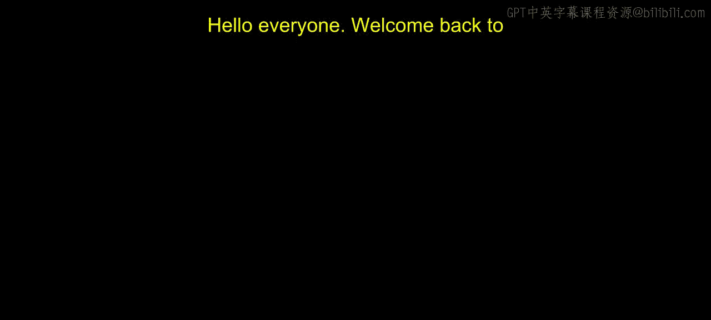
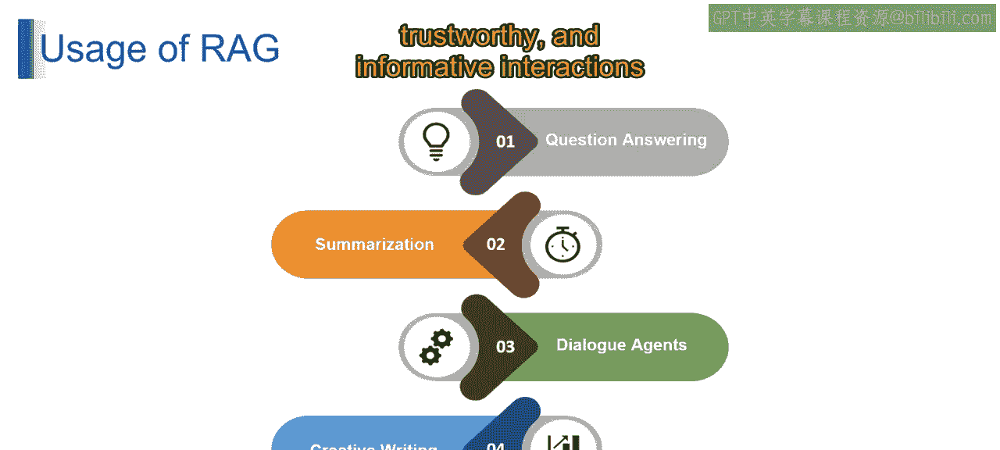

# 第二三四部分 70：检索增强生成（RAG）的应用 🚀

在本节课中，我们将学习检索增强生成（RAG）技术的几种核心应用场景。RAG通过将大型语言模型（LLM）与外部知识库连接，显著提升了AI响应的准确性和可靠性。

---

### **概述**

RAG为大型语言模型（LLM）提供了访问外部、最新或特定领域知识的能力。这使其在需要事实准确性的任务中表现出色。接下来，我们将逐一探讨RAG的几个主要应用领域。

---

### **1. 问答系统**

上一节我们介绍了RAG的基本原理，本节中我们来看看它的具体应用。首先，RAG非常适合构建问答系统。

想象一下，当你向一个富有创造力的朋友询问一个事实性问题时，例如“法国的首都是哪里？”，他可能会给出一个不确定的答案。但借助RAG，LLM可以查询外部知识库来找到准确答案，并提供可靠的响应。

以下是RAG在问答系统中的优势：
*   **信息准确**：答案来源于可信的知识库。
*   **值得信赖**：减少了模型“幻觉”（即编造信息）的风险。

这使得RAG成为构建既信息丰富又值得信赖的问答系统的理想选择。

---

### **2. 内容摘要**

除了回答问题，RAG在信息处理方面也大有可为。接下来，我们看看它在内容摘要中的应用。

设想需要总结一篇复杂的研究论文。RAG可以赋能LLM，使其不仅能浓缩信息，还能通过参考知识库来核实文中的事实和数据。

这确保了生成的摘要不仅精炼，而且准确，能够抓住原始材料的精髓。

---

### **3. 对话代理**

在交互式应用中，RAG同样能发挥关键作用。现在，让我们探讨它如何提升对话代理（如聊天机器人）的质量。

想象与一个聊天机器人对话。RAG可以通过将聊天机器人的回应建立在事实信息的基础上，来提升这些交互的质量。

这在**医疗健康**或**客户服务**等领域尤为重要，因为在这些领域，信息的准确性至关重要。

---

### **4. 创意写作**

虽然RAG擅长确保事实准确性，但这并不意味着它会完全扼杀创造性。最后，我们来看看它在创意写作中的独特作用。

可以想象你的朋友利用图书馆寻找灵感。同样，RAG可以帮助LLM生成诸如诗歌或剧本之类的创意文本格式，这些文本仍然植根于事实细节。

这为创意写作的可能性增添了新的维度，意味着RAG是一个有价值的工具，能够在保持创意的基础上增加内容的可信度。

---

### **总结**

本节课中，我们一起学习了RAG在多个领域的应用：**问答系统**、**内容摘要**、**对话代理**和**创意写作**。通过为LLM架起通往事实信息的桥梁，RAG为我们与AI模型的交互铺平了道路，使其变得更加**可靠**、**值得信赖**且**信息丰富**。