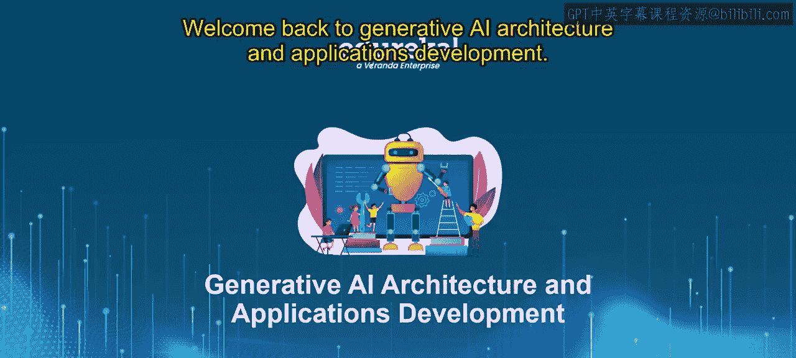
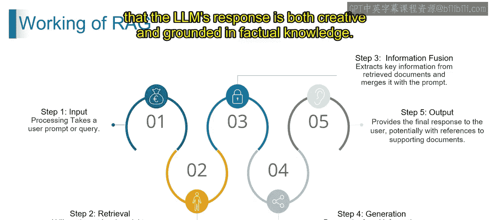

# 第二三四部分 71：检索增强生成（RAG）的工作原理 🧠


在本节课中，我们将学习检索增强生成（RAG）技术的工作原理。RAG是一种结合了信息检索与文本生成的技术，旨在让大型语言模型（LLM）的回答更具事实依据和准确性。我们将通过一个简单的故事创作例子，一步步拆解RAG的工作流程。



---

## 概述

RAG的核心思想是让生成模型在创作时，能够参考外部知识库中的信息，从而确保生成内容的准确性和相关性。整个过程可以类比为一位富有创造力的作家（生成模型）在一位知识渊博的图书管理员（检索模型）的帮助下进行创作。

---

## 第一步：输入处理 📥

你向你的朋友（即生成模型）提出了一个创作请求，例如：“写一个关于会说话的猫去月球旅行的故事”。在RAG系统中，这一步对应的是接收并处理用户的查询。

**公式表示**：`用户查询 = “写一个关于会说话的猫去月球旅行的故事”`

---

## 第二步：信息检索 🔍

上一节我们介绍了输入处理，本节中我们来看看RAG如何获取相关知识。你的朋友（生成模型）会向图书管理员（外部知识库）求助，询问与“会说话的猫”和“月球旅行”相关的信息。

以下是检索模型执行的关键操作：
*   **搜索知识库**：系统利用检索模型在知识库中搜索与提示词相关的文档。
*   **识别关键元素**：系统会识别出查询中的核心概念，如“猫”、“太空旅行”、“月球”。
*   **获取相关文档**：检索到的文档可能包括关于太空旅行的百科全书条目、关于猫的生物学资料，甚至是著名的虚构故事。

---

## 第三步：信息融合 🧩

在获取了相关信息后，我们需要将这些事实与原始的创作想法结合起来。图书管理员将找到的相关书籍（如太空百科全书、关于猫的故事）的关键信息告知你的朋友。

**技术过程描述**：
1.  **提取关键信息**：从检索到的文档中提取核心事实（例如，“人类尚未携带宠物登陆月球”）。
2.  **与原始提示合并**：将这些事实约束与原始的创意提示（写一个关于猫去月球的故事）进行融合。
3.  **创建融合表示**：生成一个同时考虑了创意想法和事实限制的、更丰富的上下文表示。

---

## 第四步：内容生成 ✍️

现在，你的朋友在图书管理员提供的信息启发下，开始发挥创造力来构思故事。例如，故事可能变成猫利用超级发明登上月球，或者更侧重于描述猫梦想中的月球冒险。

**技术实现**：融合后的信息被传递给生成模型（即大型语言模型LLM）。LLM运用其语言能力和这个增强的上下文来生成回应，在我们的例子中就是创作一个故事。

**代码逻辑示意**：
```python
# 第二三四部分 伪代码示意
enhanced_prompt = original_prompt + retrieved_facts
generated_story = llm.generate(enhanced_prompt)
```

---

## 第五步：输出结果 📤

最后，你的朋友将创作完成的故事分享给你。这个故事可能是一个关于猫试图建造火箭的幽默故事，也可能是一个更富想象力、描述猫在月球奇遇的故事。

RAG系统将最终的响应（即我们的故事）提供给用户。根据具体实现，输出有时还可能包含对检索阶段所用文档的引用，例如附上相关太空旅行文章的链接。

---



## 总结


本节课中，我们一起学习了检索增强生成（RAG）的工作原理。通过输入处理、信息检索、信息融合、内容生成和输出结果这五个步骤，RAG技术巧妙地结合了检索模型的事实查找能力和生成模型的创意表达能力。这种协作确保了大型语言模型的回应既能天马行空，又能扎根于事实知识，从而生成既有趣又可靠的内容。