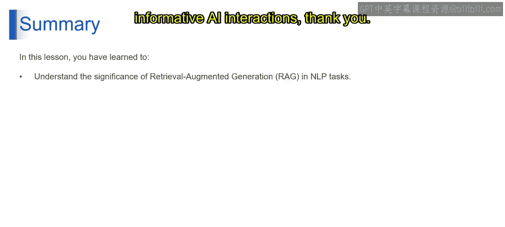

# 第二三四部分 72：检索增强生成（RAG）的优势与局限

在本节课中，我们将要学习检索增强生成（RAG）这一关键技术。我们将探讨RAG如何通过为大型语言模型（LLM）提供外部知识，来提升其回答的准确性和可靠性，同时也会分析其存在的局限性。

## 概述

检索增强生成（RAG）是一种自然语言处理技术，它通过为LLM提供对外部知识库的访问权限，来增强其能力。RAG就像一个为LLM服务的图书管理员，确保其生成的回答基于真实世界的信息，从而更加准确、可靠。

上一节我们介绍了RAG的基本概念，本节中我们来看看RAG的具体优势与局限。

## RAG的优势

RAG为LLM带来了多方面的显著提升，以下是其主要优势：

**1. 提升事实性与准确性**

想象一下，你有一位极具创造力的朋友（即LLM），他不仅能编写奇幻故事，还能确保故事内容在科学上是准确和真实的。借助RAG，这成为了现实。通过访问外部知识库，RAG确保LLM的响应基于真实世界的信息，从而最大限度地减少了事实性错误或误导性陈述的风险。这对于问答或事实性主题总结等应用至关重要。

**2. 增强上下文理解**

设想与某人交谈时，对方不仅能听懂你的话，还能理解更广泛的背景。RAG通过从外部来源检索相关信息，使LLM能够达到类似的理解水平。RAG为LLM提供了超出用户即时查询的额外上下文，这使得它们能够生成更相关、更细致、更贴合特定情境的响应。

**3. 增加多功能性**

想象你的朋友不仅能写故事，还能创作诗歌、剧本甚至事实摘要。RAG通过提供更广泛的信息访问权限和理解不同写作风格的能力，为LLM解锁了这种多功能性。这使得LLM能够调整其响应以适应各种风格和创意格式，从而为LLM的能力开辟了更多样化的应用场景。

**4. 透明性与可信度**

设想你能确切知道你的朋友是从哪里获取故事信息的。RAG在LLM交互中促进了类似的透明度。一些RAG的实现允许用户查看检索步骤中使用的文档引用。这种透明度增强了对LLM所提供信息的信任，并允许用户验证响应的**事实基础**。

总而言之，RAG提供了一系列引人注目的优势，提升了LLM的能力。

## RAG的局限性

尽管RAG优势显著，但它也存在一些需要注意的局限性：

**1. 对外部源的依赖**

想象一下，你极具创造力的LLM完全依赖图书馆（即外部知识库）来获取信息。如果图书馆关于某个主题（例如行星与太阳的距离）的信息有限或过时，那么你朋友的故事就可能不准确。同样地，RAG依赖于外部知识库的质量和全面性。如果检索到的信息不准确或不完整，则会对LLM的响应产生负面影响。在我们的例子中，如果知识库错误地将金星（Venus）陈述为离太阳最近的行星，RAG可能会将这个错误纳入LLM的响应中。

**2. 潜在的偏见风险**

设想一个带有偏见的图书馆，它只推荐符合其自身观点的书籍。外部知识库也可能包含偏见，如果处理不当，RAG可能会继承这些偏见。必须警惕用于检索模型和知识库本身的训练数据中可能存在的偏见，因为偏见可能导致LLM的响应出现**倾斜或不公平的表述**。

**3. 计算成本**

想象一个拥有数十亿本书的巨大图书馆，要从中搜索相关信息可能是一个耗时的过程。同样地，RAG中的信息检索和融合过程在计算上可能非常昂贵，需要大量资源。这对于需要实时响应的应用来说可能是一个限制。

## 总结

本节课中我们一起学习了检索增强生成（RAG），这是一种通过为LLM提供真实世界信息访问权限来增强其能力的自然语言处理技术。RAG就像LLM的图书管理员，确保响应是事实性的、准确的和可靠的。这为建立更可信、信息更丰富的人工智能交互铺平了道路。