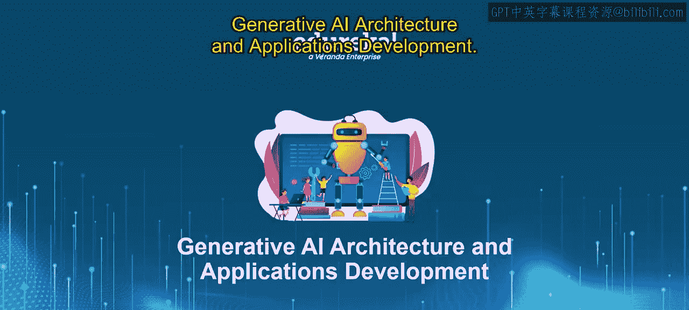
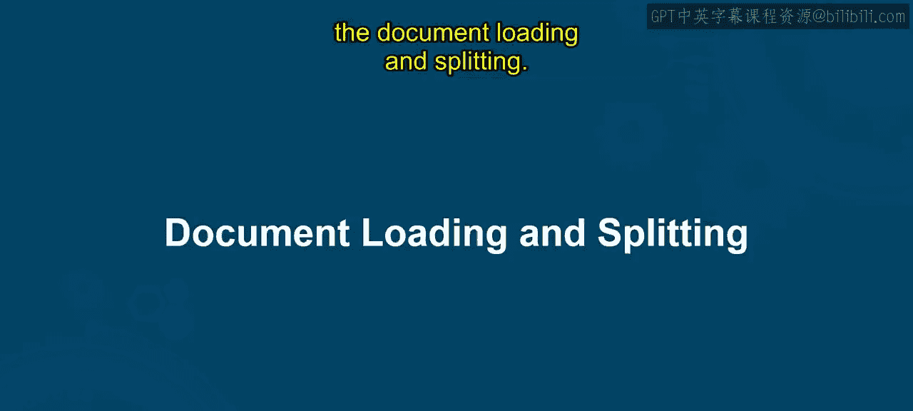
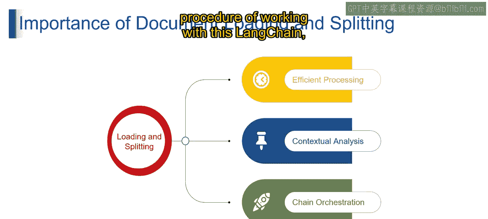

# 第二三四部分 73：文档加载与分割 📄✂️




在本节课中，我们将要学习文档加载与分割的概念、重要性及其在RAG数据准备中的关键作用。这是构建高效NLP应用的基础步骤。

## 概述

上一节我们介绍了RAG（检索增强生成）的基本概念。本节中，我们来看看如何为RAG准备数据，核心就是**文档加载**与**文档分割**。这两个步骤如同为你的LLM（大语言模型）朋友整理一个图书馆，确保信息易于查找和处理。

## 什么是文档加载与分割？



文档加载与分割是处理文本数据，尤其是长文档和大数据集时的关键预处理步骤。

*   **文档加载**：想象将书籍（即你的数据）从不同来源（如网站、文件、数据库）搬进图书馆（即LangChain环境）。这涉及将各种文件格式（如TXT、PDF）转换为LLM能够理解的格式。
*   **文档分割**：想象将书籍分门别类地整理到书架上。分割涉及将大型文档分解成更小的单元，如段落、章节或句子。这使LLM能更轻松地处理信息，就像逐章阅读一本书比一次性读完一整本要容易得多。

通过有效地加载和分割文档，你为数据在LangChain中的无缝使用做好了准备。这使得你的LLM能够高效地访问和处理信息，为强大的NLP应用铺平道路。

## 为什么文档加载与分割很重要？

以下是文档加载与分割至关重要的三个原因：

1.  **高效处理**
    想象一个庞大且杂乱无章的图书馆，要找到特定信息将是一场噩梦。同样，处理未经分割的大型文档会让LLM不堪重负。通过将文档分割成更小的块（如段落或句子），LLM可以一次专注于较小的单元，使整体任务资源消耗更少、完成速度更快。

2.  **上下文分析**
    思考理解一个复杂的故事。脱离上下文阅读单个句子可能会令人困惑。分割文档有助于进行更好的上下文分析。例如，情感分析可能需要理解整个句子的情感，而主题建模则可能受益于分析段落甚至整个文档的更广泛上下文。分割有助于保持这种上下文，使LLM能够掌握信息的真实含义。

3.  **链式编排**
    想象编排一场复杂的表演，演员（数据组件）来自不同的书籍（文档）。在LangChain的链式编排中，文档分割扮演着至关重要的角色。这些链结合了不同的LangChain组件（如提示词和解析器），通常对较小的文本单元进行操作。分割确保链中的每个组件都能接收到合适大小的数据，以实现最佳性能。

通过高效处理信息、支持上下文分析并促进链式编排，文档加载与分割成为在LangChain内构建有效LLM应用的基础。就像整理图书馆一样，这些步骤确保你的数据随时可用，让你的LLM能够施展其魔力。

## 工作流程与架构

以下是使用LangChain进行文档加载与分割的典型步骤：

1.  **选择加载器**：根据数据源（如本地文件、网页、数据库）选择合适的文档加载器。例如，使用 `TextLoader` 加载 `.txt` 文件，或使用 `UnstructuredPDFLoader` 加载PDF文件。
    ```python
    from langchain.document_loaders import TextLoader
    loader = TextLoader("example.txt")
    documents = loader.load()
    ```

2.  **加载文档**：使用加载器将原始文档读入系统，通常转换为包含文本内容和元数据的 `Document` 对象列表。

3.  **选择分割器**：根据需求选择文本分割器。常见的分割器按字符、递归字符或标记进行分割。
    ```python
    from langchain.text_splitter import RecursiveCharacterTextSplitter
    text_splitter = RecursiveCharacterTextSplitter(chunk_size=500, chunk_overlap=50)
    ```

4.  **执行分割**：使用分割器将加载的文档拆分成更小的块（chunks）。`chunk_size` 定义每个块的最大大小，`chunk_overlap` 定义块之间的重叠字符数，以保持上下文连贯。
    ```python
    chunks = text_splitter.split_documents(documents)
    ```

5.  **输出与存储**：分割后的文本块可以用于后续步骤，如嵌入向量化并存储到向量数据库中，以供LLM在RAG流程中检索使用。

## 总结

本节课我们一起学习了文档加载与分割。我们了解到，**文档加载**是将外部数据源导入系统的过程，而**文档分割**是将长文本切分为更小、更易管理的单元的过程。这两个步骤对于实现高效处理、保持上下文连贯性以及支持复杂的链式工作流至关重要，是准备RAG应用数据不可或缺的环节。




请关注下一个视频，我们将详细阐述如何在LangChain中具体实现这些步骤。