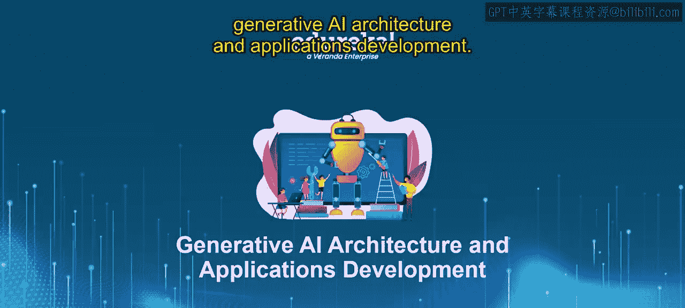
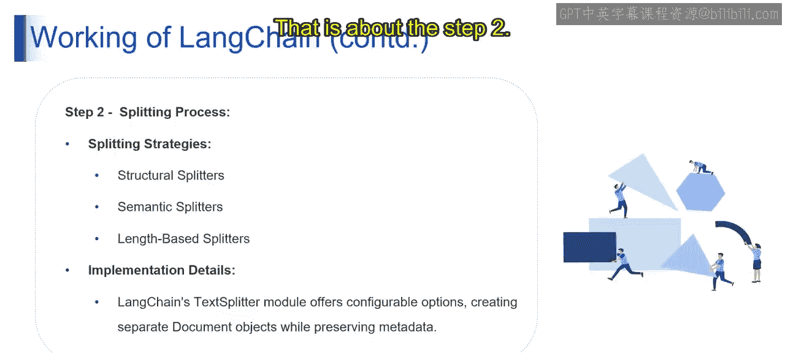

# 第二三四部分 74：LangChain的工作原理

在本节课中，我们将学习LangChain框架的核心工作原理，特别是其处理文档的流程。我们将重点介绍文档加载和文本分割这两个关键步骤，了解它们如何将原始数据转化为适合大型语言模型处理的结构化信息。

## 概述：LangChain的模块化设计

LangChain采用模块化设计来处理文档。这就像拥有一个由专家组成的团队，每位专家都擅长处理特定格式的“书籍”（即数据）。这种设计使得处理不同来源和格式的数据变得高效且灵活。

## 第一步：文档加载器架构

上一节我们概述了模块化设计，本节中我们来看看文档加载器的具体职责。文档加载器模块负责从各种来源获取原始数据，并将其转换为LangChain能够理解的格式。

以下是加载器模块承担的几个关键任务：

1.  **从源访问数据**：加载器像图书管理员一样，从各种来源接收“书籍”（数据）。这可能涉及从本地文件系统访问文件、从数据库获取数据，甚至与提供文本信息的网络API交互。
2.  **将原始内容解析为结构化数据**：想象图书管理员仔细检查一本新到的书。加载器使用特定格式的库来解析原始内容，并将其转换为LangChain可以理解的结构化数据格式。这可能涉及从PDF的不同部分提取文本，或转换下载文件中的特殊字符。
3.  **清理和规范化文本**：就像图书管理员在将书籍上架前会清洁和整理它们一样，加载器通常会对提取的文本执行必要的清理和规范化步骤。这可能包括：
    *   **分词**：将文本分解为单个单词或有意义的单元，以便进一步处理。
    *   **处理编码**：确保不同数据源之间字符表示的一致性。
    *   **去除噪音**：消除不相关的信息，如特殊字符或多余的空格。

## 第二步：文本分割过程

在文档被加载和清理之后，下一步是将其分割成更小的、可管理的块。这就像根据不同的标准来组织你的图书馆，将书籍分类到不同的类型中。

以下是几种主要的分割策略：

1.  **结构分割器**：这些分割器就像根据书籍的物理结构（如段落、句子、章节）来分类的图书管理员。LangChain提供的结构分割器可以基于这些元素来划分文档。
2.  **语义分割器**：想象一位根据书籍内容进行分类的图书管理员。虽然仍在开发中，但LangChain的语义分割器旨在根据文本内的含义或主题转换来分割文档。这对于主题建模或信息提取等任务特别有用。
3.  **基于长度的分割器**：这就像一位根据书籍大小来整理的图书管理员。基于长度的分割器允许你将文档分割成特定长度的块。例如，将一篇长文章分割成每个200词的小块。这对于确保高效处理（尤其是在资源受限的环境中）非常有用。

### 实现细节

LangChain提供了一个用户友好的文本分割器模块来处理分割过程。该模块提供可配置的选项，允许你根据特定需求选择所需的分割策略（如按段落、句子等）。重要的是，LangChain的分割过程会创建独立的文档对象，同时保留与原始文档相关的元数据。这确保了即使在分割之后，你仍然可以保留不同文本块的来源或上下文信息。

通过提供多种分割策略并维护元数据，LangChain使你能够以优化LLM应用程序处理和分析的方式组织数据。

## 总结

本节课中我们一起学习了LangChain处理文档的前两个核心步骤：**文档加载**和**文本分割**。我们了解到，文档加载器通过模块化设计从各种来源获取并清理数据，而文本分割器则通过多种策略（结构、语义、长度）将文档组织成适合后续处理的块。这两个步骤为将原始数据有效输入大型语言模型奠定了基础。