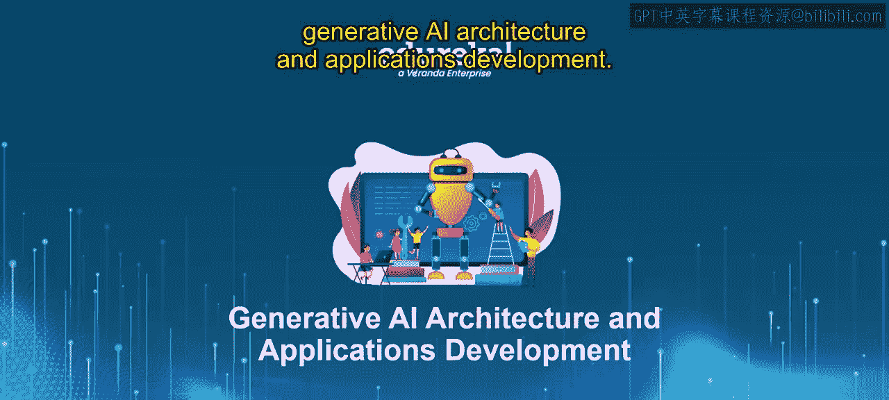
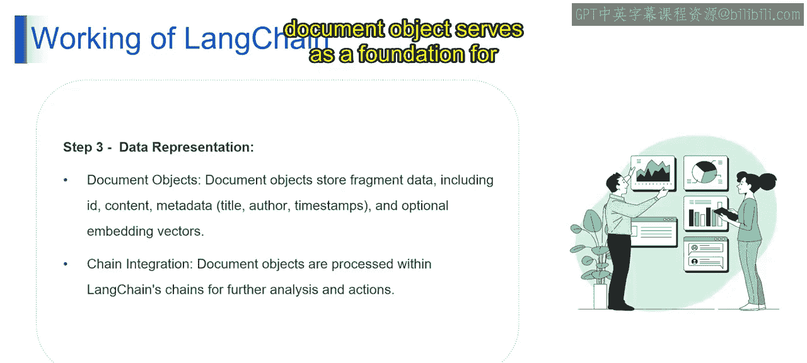

# 第二三四部分 75：LangChain工作原理续

在本节课中，我们将继续深入探讨LangChain的工作原理，重点学习数据表示（Data Representation）这一核心步骤。我们将了解文档对象（Document Object）的概念、其包含的信息以及它如何作为构建有效LLM工作流的基础。

上一节我们介绍了LangChain的基本流程，本节中我们来看看其中的第三步：数据表示。

## 数据表示：文档对象

想象一下，经过分割后的每个文档片段（如段落或句子）就像图书馆书架上的一本本整理有序的书。LangChain使用**文档对象**来表示这些独立的片段。每个文档对象就像一个容器，存放着多种类型的信息。

以下是文档对象通常包含的五类信息：

1.  **片段数据**：这是片段的核心内容，即文本本身。
2.  **唯一标识符**：为每个文档对象分配一个唯一的ID，便于在LangChain工作流中进行引用。
3.  **元数据**：与原始文档相关的附加信息，例如标题、时间戳或来源URL。这些元数据对于追踪和理解文本上下文至关重要。
4.  **嵌入向量**：在一些高级应用场景中，文档对象还可能包含嵌入向量。这是通过机器学习技术生成的文本数值化表示，可用于文本相似性分析等任务。

## 链式集成

可以将这些文档对象视为LLM与LangChain集成的构建模块。这些对象被无缝集成到LangChain的**链**中。链就像装配线，将不同的组件（如提示词、解析器等）组合起来，以处理数据并实现特定目标。

文档对象被输入到这些链中，LLM便可以访问和分析其中的文本内容，根据您的应用需求生成响应、回答问题或执行其他自然语言处理任务。

通过为数据提供结构化和信息丰富的表示，文档对象为在LangChain内构建有效的LLM工作流奠定了基础。

本节课中我们一起学习了LangChain数据表示的核心概念——文档对象，了解了其构成和作用。下一节我们将继续深入探讨相关主题。