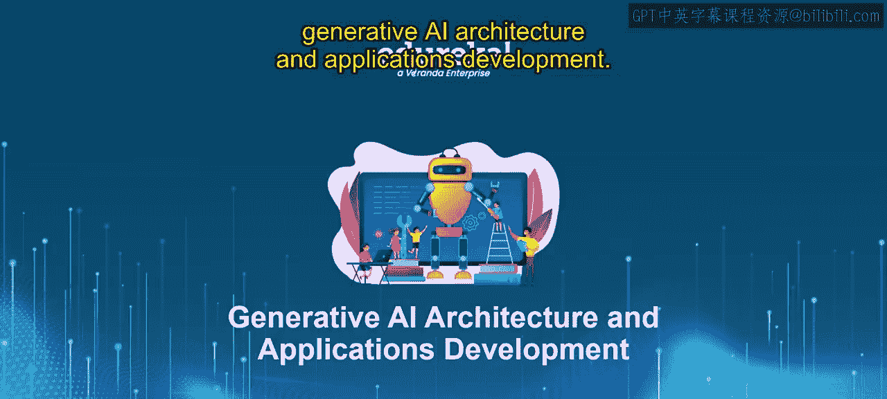
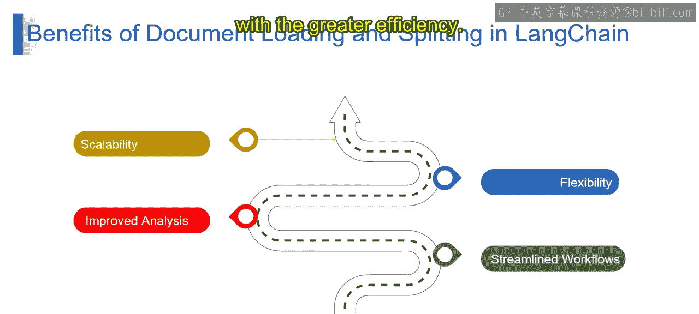

# 第二三四部分 76：文档加载与分割的优势 📄✂️

在本节课中，我们将要学习LangChain中**文档加载**与**文档分割**这两个核心步骤所带来的四大优势。理解这些优势有助于我们构建更高效、更强大的大语言模型应用。

上一节我们介绍了文档加载与分割的基本概念，本节中我们来看看它们具体能带来哪些好处。

## 可扩展性 📈

想象一个能够轻松处理海量信息的图书馆。高效的文档加载和分割为实现**可扩展性**铺平了道路。通过将大型文档分解为独立的文本块，LangChain可以高效地处理海量数据。这使你能够处理更大、更复杂的自然语言处理任务，而不会压垮大语言模型或遭遇性能瓶颈。

## 灵活性 🧩

设想一个允许你以多种方式对书籍进行分类的图书馆。LangChain中的分割策略提供了类似的**灵活性**。你可以选择基于文档结构、语义甚至预定义长度来分割文档。这种灵活性允许你根据LLM应用的具体需求来定制数据准备过程，从而确保最佳结果。

## 提升的分析质量 🔍

想象一个组织有序的图书馆，它能让你更容易地找到特定信息。同样，分割文档通过提供更小、更聚焦的文本单元，提升了LangChain内的**分析质量**。这使得LLM能够以更细粒度的方式分析信息。在执行情感分析、主题建模或信息提取等任务时，这可以带来更准确、更有洞察力的结果。

以下是分割如何提升分析质量的示例：
*   **情感分析**：将长评论文本分割成句子或段落，可以更精确地判断每个部分的情感倾向。
*   **主题建模**：将文档按章节或语义分割，有助于模型识别出更清晰、更具体的主题。
*   **信息提取**：从结构清晰的文本块（如表格、列表项）中提取关键信息（如日期、名称）会更加高效和准确。

## 简化的工作流 ⚙️

沿用图书馆的例子，一个易于导航和访问信息的图书馆能提升效率。同样，文档加载和分割有助于**简化LangChain中的工作流**。这些步骤确保了数据在LangChain的不同组件之间能够顺畅可用并格式得当。这简化了整体的处理流程，让你能够以更高的效率构建和执行LLM应用。

本节课中我们一起学习了文档加载与分割的四大核心优势：**可扩展性**、**灵活性**、**提升的分析质量**和**简化的工作流**。掌握这些优势是设计高效LLM应用管道的基础。下一节我们将深入探讨具体的文档分割策略。