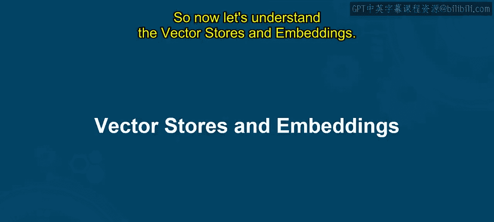
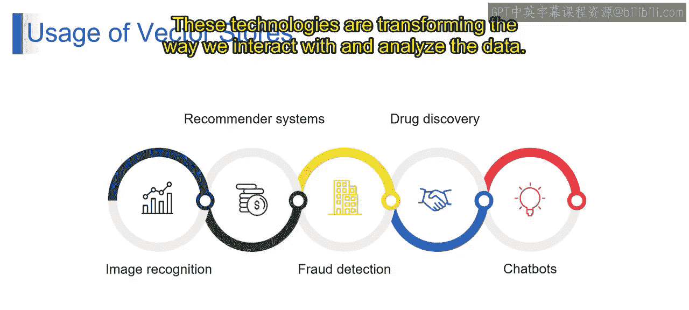
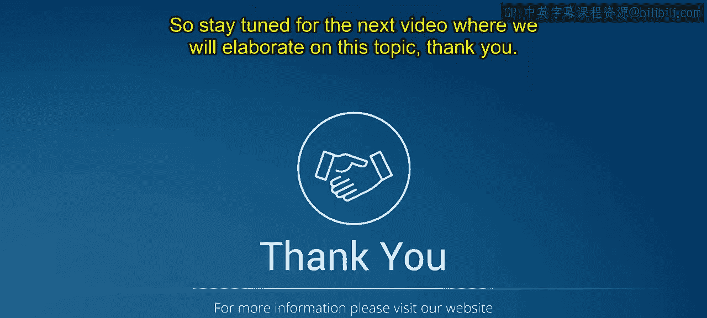

# 第二三四部分 77：向量存储与嵌入

## 概述
在本节课中，我们将学习向量存储与嵌入的核心概念。我们将了解它们是什么、如何工作，以及在实际应用中的多种用途。通过本课，你将能够理解向量存储和嵌入在RAG模型中的作用。

## 向量存储与嵌入简介

上一节我们介绍了RAG模型的基本框架，本节中我们来看看支撑其高效检索能力的两个关键技术：向量存储与嵌入。

### 什么是向量存储？
想象一下，你正在为一个极具创意的厨师（这里指大型语言模型）组织一个庞大的食谱库。你希望他能根据相似的食材或主题（如素食、甜点或非素食）轻松找到食谱。向量存储就在这里发挥作用。

你可以将向量存储想象成一本食谱的索引。这个索引通过将食谱按类别（如素食、甜点）或关键词（即食材）列出，帮助你快速找到食谱。类似地，向量存储能够高效地存储和检索关于文本数据的信息。

### 什么是嵌入？
嵌入可以理解为将每个食谱转换成一个独特的“购物清单代码”。这个代码捕捉了食谱的精髓（即食材），而无需包含所有细节。向量存储使用嵌入来执行相似性搜索，嵌入就像是文本文档的浓缩代码。

### 技术定义
现在，让我们将这些概念连接到技术定义上。

向量存储是专门设计用来以向量形式存储和检索信息的数据存储。这些向量是通过嵌入技术创建的，嵌入技术将文本数据（即文档数据）转换为数值表示。这使得向量存储能够执行高效的相似性搜索。

可以将余弦相似度看作一种衡量两个文档在内容上有多接近的巧妙方法。两个文档之间的高余弦相似度分数表明它们共享相似的主题或概念。

通过使用向量存储和嵌入，LangChain RAG系统可以有效地在你的数据集合中找到相关信息，以支持LLM的创造性任务。这就像拥有一个专为文本数据设计的强大搜索引擎，使你的LLM能够为任何“文本烹饪挑战”找到完美的信息。

## 向量存储的用途

理解了基本概念后，我们来看看向量存储在实际场景中的多种应用。以下是几个关键领域：

### 1. 图像识别
向量存储可用于高效地识别和分类图像中的物体。图像通过卷积神经网络等技术转换为向量。向量存储能够基于其向量表示快速检索相似图像，从而在图像搜索或内容审核等任务中实现精确的物体识别。

### 2. 推荐系统
推荐系统用于向用户推荐相关的产品、文章或内容。其工作原理是：将用户画像和物品描述转换为向量。向量存储能够检索与用户画像具有高余弦相似度的物品，从而在电商平台、流媒体服务等场景中实现个性化推荐。

### 3. 欺诈检测
在欺诈检测中，挑战在于实时识别交易或活动中的欺诈行为。解决方案是：将交易数据（如金额、位置或时间戳）转换为向量。向量存储能够标记出与已知欺诈模式高度相似的交易，帮助金融机构和其他实体防范欺诈。

### 4. 药物发现
在药物发现领域，挑战在于加速新药的发现和开发。解决方案是：将现有药物的分子结构和性质转换为向量。向量存储能够识别具有相似性质的分子，从而可能发现具有所需治疗效果的新候选药物。

### 5. 聊天机器人
开发能够理解用户意图并以自然方式回应的聊天机器人是一个挑战。解决方案是：将用户查询和聊天机器人回复转换为向量。向量存储能够根据用户查询，从聊天机器人的知识库中检索相关回复，从而实现更具吸引力和信息量的聊天机器人交互。

向量存储和嵌入是强大的工具，它们释放了跨多个领域（从图像识别到欺诈检测及其他）进行高效相似性搜索的潜力。这些技术正在改变我们与数据交互和分析数据的方式。

## 总结
本节课中，我们一起学习了向量存储与嵌入。我们了解了向量存储作为高效信息检索的专用数据库，以及嵌入作为将文本转换为数值向量的技术。我们还探讨了它们在图像识别、推荐系统、欺诈检测、药物发现和聊天机器人等多个实际领域中的应用。理解这些概念是掌握现代生成式AI应用，特别是RAG架构的关键一步。