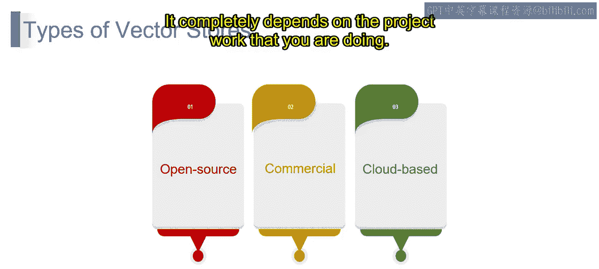

# 第二三四部分 78：向量存储的类型 🗂️

在本节课中，我们将要学习向量存储的不同类型。向量存储是生成式AI架构中的关键组件，用于高效存储和检索高维向量数据。理解其类型有助于为你的项目选择最合适的解决方案。

上一节我们介绍了向量存储的基本概念，本节中我们来看看它的主要分类。

## 开源向量存储

开源向量存储可以免费获取并允许自定义。这类存储的优势在于其可访问性和可修改性，能够满足特定需求。

以下是常见的开源选项：

*   **Pinecone**：这是一个流行的托管向量数据库，以其易用性和性能著称。
*   **Facebook AI Similarity Search (FAISS)**：由Facebook AI Research开发，专注于高效的相似性搜索和稠密向量聚类。
*   **Milvus**：一个开源的向量数据库，旨在管理海量的非结构化数据，并支持混合搜索。

开源方案通常依赖开发者社区提供支持和故障排除。虽然一些项目拥有活跃的社区或论坛，但扩展开源解决方案可能需要额外的技术专长来管理基础设施和资源。

## 商业向量存储

商业向量存储提供企业级功能和支持。这类存储通常具备高可用性、强大的安全性和专门的客户支持，非常适合生产环境和关键应用。

以下是商业向量存储的特点：

*   **企业级功能**：例如**Weaviate**、**Vectara** 和 **Pinecone（企业版）** 等，提供高级功能。
*   **托管服务**：许多商业产品提供托管服务，负责基础设施和维护，让你能专注于应用开发。
*   **许可成本**：这类存储通常需要付费许可，费用根据功能、存储容量和使用量而变化。

## 基于云的向量存储

基于云的向量存储提供了部署的灵活性和可扩展性。它们可以轻松部署在AWS、GCP或Azure等主要云平台上，简化了基础设施管理，并能实现按需无缝扩展。

以下是基于云存储的示例与考量：

*   **平台示例**：例如**Amazon Kendra**、**Azure Cognitive Search** 和 **Google Cloud AI Platform** 的向量搜索功能。
*   **按需付费定价**：云选项通常遵循按需付费的定价模式，使成本与实际使用量保持一致。
*   **潜在的供应商锁定**：虽然易于使用，但在不同云提供商之间切换基于云的存储可能会更复杂。

## 如何选择与总结

选择正确的向量存储取决于你的具体需求。在决策时，需要考虑预算、技术专长、所需功能、可扩展性要求和数据隐私问题等因素。也值得探索结合开源和商业解决方案元素的混合选项，这完全取决于你正在进行的项目工作。

在下一节中，我们将深入了解如何实际使用向量存储。

本节课中我们一起学习了向量存储的三种主要类型：开源型、商业型和基于云型。每种类型都有其独特的优势、适用场景和考量因素，理解这些将帮助你在构建生成式AI应用时做出明智的技术选型。