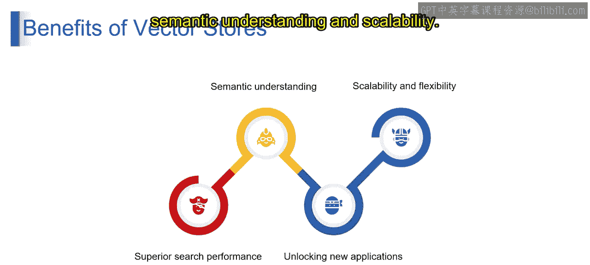

# 第二三四部分 79：向量数据库的工作原理 🧠

在本节课中，我们将要学习向量数据库的核心工作原理。我们将从数据编码开始，逐步深入到索引和相似性搜索，最后总结向量数据库的优势。理解这些过程是构建高效检索增强生成（RAG）系统的关键。

## 数据编码：从文本到数字

向量数据库工作的第一步是数据编码。这个过程将文本数据（如文档或句子）转换为称为“嵌入向量”的数值表示。这些嵌入向量以压缩格式捕捉数据的本质，侧重于语义含义而非确切的词语本身。

以下是几种流行的编码技术：

*   **词嵌入**：例如 Word2Vec、GloVe、ELMo。这些方法捕捉词语之间的语义关系，使含义相似的词具有相似的向量表示。
*   **句嵌入**：例如 Sentence-BERT、通用句子编码器。这些技术对整个句子进行编码，同时考虑句子中词语之间的上下文和关系。

上一节我们介绍了数据编码，本节中我们来看看数据被编码后如何被高效地存储和检索。

## 索引：实现高效检索

数据被编码为向量后，会存储在向量数据库中。为了实现高效检索，数据库会采用索引技术，这类似于传统数据库的做法。

常见的索引策略包括：

*   **HNSW（可导航小世界分层图）**：该方法创建一个多层索引结构，允许在搜索空间中高效地探索相似向量。
*   **IVF（倒排文件索引）**：该技术构建一个倒排索引，将向量映射到其对应的数据点，从而能够基于特定查询实现更快的检索。

理解了索引如何组织数据后，接下来我们看看当用户发起查询时，系统如何找到最相关的结果。

## 相似性搜索：寻找最匹配项

当用户提交查询时，向量数据库会执行相似性搜索。这涉及将查询向量与代表存储数据的索引向量进行比较。

相似性搜索的核心在于计算查询向量与存储向量之间的距离。以下是常用的度量方法：

*   **余弦相似度**：此度量计算两个向量之间的夹角。余弦相似度得分越高，表示查询与文档向量之间的语义越接近。公式表示为：`相似度 = (A·B) / (||A|| * ||B||)`。
*   **L2距离（欧几里得距离）**：此度量计算高维空间中两个向量之间的直线距离。距离越小，表示向量越相似。公式表示为：`距离 = sqrt(Σ(A_i - B_i)^2)`。

通过利用这些核心过程，向量数据库能够高效检索出与用户查询具有语义相似性的信息。这使RAG系统能够从您的数据集合中获取相关知识，从而生成更明智的响应，并在您的NLP应用中促成更有效的交互。

## 向量数据库的优势总结

本节课中我们一起学习了向量数据库的工作原理。现在，让我们总结一下它的主要优势：

*   **卓越的搜索性能**：向量数据库擅长语义搜索，即使没有出现确切的关键词，也能基于含义和上下文检索信息。这超越了依赖关键词匹配的传统搜索引擎。
*   **高效的扩展能力**：向量数据库能高效处理大型数据集。像HNSW、IVF这样的索引技术，即使数据量不断增长，也能实现相似向量的快速检索。
*   **深层的语义理解**：与关键词匹配不同，向量数据库考虑词语和概念之间的语义关系。这使得它们能够识别含义相似的文档，即使这些文档使用了不同的词汇。这对于问答等任务至关重要。
*   **解锁新的应用场景**：向量数据库为广泛的NLP应用提供支持，例如推荐系统、聊天机器人和文本摘要。
*   **可扩展性与灵活性**：向量数据库旨在高效处理海量数据。其索引结构和云端部署选项使得随着数据增长可以无缝扩展，确保性能稳定。此外，向量数据库可以集成到各种NLP框架和工具中，为构建和部署应用程序提供了灵活性。许多向量数据库还提供API，便于与开发工作流轻松集成。

总而言之，向量数据库提供了高效搜索、语义理解和强大可扩展性的强大组合。