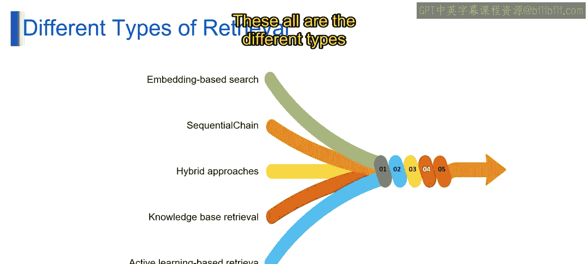

# 第二三四部分 80：检索

## 概述

在本节课中，我们将学习检索（Retrieval）这一核心概念。我们将了解检索是什么、它是如何工作的，以及它在大型语言模型（LLM）应用中的用途。通过本课的学习，你将能够掌握在RAG（检索增强生成）驱动的聊天机器人中实现检索和问答功能的技能。

## 什么是检索？

想象一下，你是一个巨大图书馆的管理员，这个图书馆收藏了无数书籍，代表你的数据集合。这些书籍就是文档。一位学生（即用户）带着一个研究问题（即请求或知识查询）来向你求助。你的工作就是从海量藏书中检索出最相关的书籍，帮助他找到答案。这正是检索在LLM中所扮演的角色。

可以把图书馆的卡片目录看作一个检索系统。这个目录通过按标题、作者或主题列出书籍，帮助你快速找到目标。类似地，LangChain的检索系统使用**嵌入（Embeddings）** 和**相似性搜索（Similarity Search）**，在你的数据中高效地找到与用户请求匹配的相关段落。

## 检索如何工作？

想象为每本书创建一个索引卡片，这张卡片就是**嵌入**。它捕捉了书籍的精髓，但不包含所有细节。LangChain使用嵌入（即文本的浓缩摘要）来执行相似性搜索。

通过结合**嵌入**和**相似性搜索**，LangChain的检索系统能够高效地从你的数据集合中检索出最相关的信息，使你的LLM能够访问完成任务或回答查询所需的知识。

以下是检索的两个主要用途：

1.  **增强LLM性能**：检索弥合了LLM内部知识与海量外部数据之间的鸿沟。它让LLM能够实时访问相关信息，从而提高回答的准确性和信息丰富度。
2.  **改进搜索与导航**：用户可以通过相似性搜索高效地探索大型数据集合。迭代搜索允许用户根据检索到的信息来优化查询。通过提供上下文丰富的信息并实现高效探索，检索赋能了LLM和用户，使其在NLP应用中协同工作。

## 检索的不同类型

上一节我们介绍了检索的基本概念和用途，本节中我们来看看几种不同类型的检索方法。

以下是几种主要的检索技术：

*   **基于嵌入的方法**：这是一种基础技术，它利用**嵌入**（文本的浓缩表示）和**相似性搜索算法**（如**余弦相似度**）来识别与用户查询在语义上最相似的文档。这是一种强大且通用的方法，适用于数据集合中的通用信息检索。
*   **顺序链**：这种技术超越了单次查询。它利用LLM在链式流程中某一步生成的输出，作为下一步检索的查询。这使得检索过程可以迭代进行，基于LLM对用户意图不断演进的理解来逐步优化搜索。具体来说，LLM的输出被转换为嵌入，然后作为新检索步骤的查询。该步骤检索到的文档将通知LLM在链中的后续操作。
*   **混合方法**：混合方法结合了基于嵌入的搜索与其他检索技术，以利用不同方法的优势。例如，一种混合方法可能先使用**关键词匹配**进行初步粗过滤，然后再使用**基于嵌入的搜索**进行更精确的检索。混合方法的具体实现取决于所选技术和NLP应用的总体目标，因此精心的设计和评估对于确保最佳性能至关重要。
*   **基于知识的检索**：这种方法涉及使用专门为底层数据结构设计的查询语言来查询知识库。
*   **基于主动学习的检索**：主动学习检索算法通常依赖机器学习技术，从用户交互中学习，并随着时间的推移改进检索过程。

选择正确的检索技术取决于多个因素，包括你正在处理的数据类型、用户查询的性质以及所需的准确度水平。LangChain的灵活性允许你探索和组合这些技术，以构建满足特定需求的有效NLP应用。

## 总结

本节课中，我们一起学习了检索在生成式AI架构中的关键作用。我们首先将检索比喻为图书馆管理员的工作，解释了其核心是**从海量数据中高效找到相关信息**。接着，我们探讨了检索的工作原理，核心在于利用**嵌入**进行**相似性搜索**。然后，我们介绍了检索在**增强LLM性能**和**改进搜索导航**两方面的主要用途。最后，我们详细讲解了多种检索类型，包括基础的**基于嵌入的方法**、迭代的**顺序链**、综合的**混合方法**，以及**基于知识的检索**和**基于主动学习的检索**。理解这些方法将帮助你为具体的应用场景选择和设计合适的检索策略。