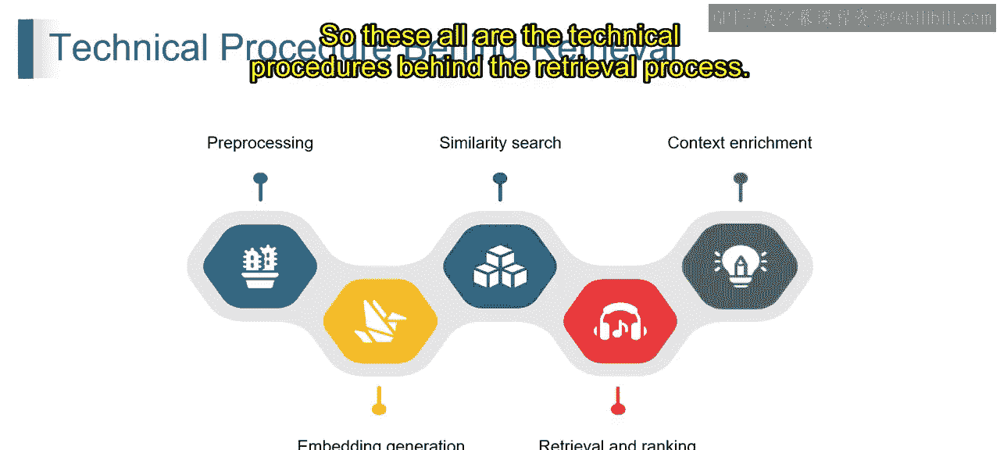

# 第二三四部分 81：检索背后的技术过程 🧠

在本节课中，我们将要学习检索增强生成（RAG）中“检索”环节背后的完整技术流程。我们将分步拆解从原始数据到为大型语言模型提供相关上下文信息的整个过程。

---

### 概述

检索过程是将用户查询与知识库中的信息进行匹配的核心环节。它确保大型语言模型能够获取到最相关、最准确的背景信息来生成回答。这个过程主要包含四个关键步骤：预处理与嵌入生成、相似性搜索、检索与排序，以及上下文增强。

---

### 预处理与嵌入生成

上一节我们介绍了RAG的基本概念，本节中我们来看看检索流程的第一步：数据准备。这个阶段的目标是将原始文本数据转化为机器可以理解和计算的数值形式。

**1. 预处理**
在这个初始步骤中，系统会清理知识库中的文本数据。这包括移除无关字符、处理拼写错误或将文本统一转换为小写以确保一致性。预处理保证了后续步骤所用数据的质量。

**2. 分词**
文本数据被分解成更小的单元，例如单词或句子，具体取决于所选的嵌入技术。分词为嵌入生成阶段做好了数据准备。

**3. 嵌入生成**
这是关键的一步，它将文本数据转换为称为“嵌入”的数值表示。嵌入以压缩格式捕捉数据的本质，侧重于语义含义而非确切的单词本身。

以下是执行嵌入生成的流行技术：
*   **词嵌入**：例如 Word2Vec 和 GloVe。
*   **句子嵌入**：例如 Sentence-BERT 和通用句子编码器。

嵌入的生成可以抽象地表示为：
`embedding_vector = model.encode(text)`
其中，`model` 是嵌入模型，`text` 是输入文本，输出 `embedding_vector` 是一个高维数值向量。

---

### 相似性搜索

在将查询和文档都转化为嵌入向量后，下一步是找到最匹配的文档。这个过程的核心是计算向量之间的距离。

当用户提交一个查询时，该查询也会被转换为一个嵌入向量（即提示向量）。检索系统随后执行相似性搜索，这涉及将查询向量与存储的文档向量进行比较。

相似性搜索的核心在于计算查询向量和文档向量之间的距离。常用的度量标准包括：
*   **余弦相似度**：衡量两个向量在方向上的相似性，公式为 `cosine_similarity(A, B) = (A·B) / (||A|| * ||B||)`。
*   **L2距离（欧几里得距离）**：衡量两个向量在空间中的直线距离。

---

### 检索与排序

基于相似性搜索得出的分数，系统需要识别并组织最相关的文档。

**1. 检索**
检索系统根据相似性分数，识别出与用户查询最相似的文档。这些文档被视为最符合用户信息需求的资料。

**2. 排序**
检索到的文档通常会根据相似性分数进行排序。分数最高的文档会首先呈现，确保最相关的信息出现在结果列表的顶部。

---

### 上下文增强

在某些情况下，为了提升最终效果，检索到的信息会被进一步丰富。

检索到的文档可能会通过以下方式被增强额外的上下文：
*   **关键句提取**：识别检索到的文档中最能回应用户查询的重要句子。
*   **实体链接**：将检索到的文档中提及的实体链接到外部知识库，以提供关于这些实体的额外信息。

通过遵循这些步骤，RAG的检索系统能够高效地从你的数据集中检索相关信息，使你的大型语言模型能够获取所需知识，从而有效地完成任务或回答用户查询。

---

### 总结

本节课我们一起学习了检索过程背后的完整技术链条。我们从**预处理和嵌入生成**开始，将文本转化为数值向量；然后通过**相似性搜索**计算向量间的匹配度；接着进行**检索与排序**，筛选并组织最相关的文档；最后，通过**上下文增强**进一步提炼信息。这个过程是R架构高效运作的基石，确保了大型语言模型能够获得高质量、高相关性的上下文输入。