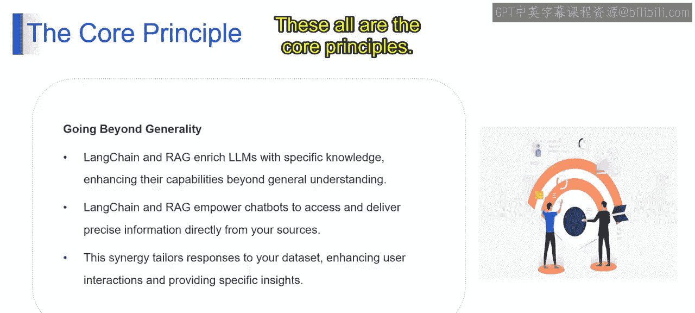

# 第二三四部分 82：使用聊天机器人进行问答

在本节课中，我们将学习如何使用聊天机器人进行问答。我们将探讨其核心原理、工作流程以及如何通过特定技术（如RAG）来提升问答的准确性和相关性。

## 核心原理：上下文是关键

想象一下，你可以向一位知识渊博的朋友提问任何问题。大型语言模型在聊天机器人中的工作方式与此类似，但需要**上下文**作为燃料。这些模型如同强大的引擎，擅长文本生成、翻译和创意内容创作等多种任务。

然而，虽然它们能识别广泛的模式，但要提供具体且细致的信息，则依赖于它们接收到的**上下文**。上下文引导LLMs发挥最佳性能，确保回答的准确性和相关性。没有上下文，它们的表现可能会大打折扣，这凸显了上下文在优化聊天机器人问答能力中的关键作用。

## RAG：弥合上下文鸿沟

上一节我们介绍了上下文的重要性，本节中我们来看看RAG如何弥合LLM潜力与特定问答数据之间的鸿沟。RAG代表“检索增强生成”，它是一个两步流程：**检索**和**增强**。

以下是RAG的两个核心步骤：

1.  **检索**
    *   **数据扫描**：LangChain等工具会高效地扫描数据仓库，并选择相关信息。
    *   **上下文仓库**：检索到的信息形成一个上下文仓库，为大型语言模型提供输入。

2.  **增强**
    *   检索到的信息会主动引导和启发LLM的生成过程。
    *   它通过融入相关上下文来补充LLM的理解，从而生成更具信息量的回答。

## 工作流程详解

了解了核心步骤后，我们来看看具体的工作流程是如何运作的。

1.  **用户查询**：用户提出问题。
2.  **检索**：LangChain工具扫描并检索相关信息。
3.  **LLM输入**：检索到的信息成为LLM的输入。
4.  **增强**：LLM在检索到的上下文引导下得到增强。
5.  **生成响应**：LLM生成更准确、上下文更丰富的回答。

## 超越通用性：丰富特定知识

RAG与LangChain的结合，使LLM超越了通用理解，增强了其在**特定知识领域**的能力。这种协同作用将LLM的能力定制化，用于在特定领域生成更精确、上下文更准确的回答。

这种方法带来了以下优势：

*   **直接获取源内容**：它使聊天机器人能够直接访问并交付来自源头的精确信息。
*   **确保准确性与时效性**：这种直接连接确保了回答的准确性和时效性，能提供实时洞察。
*   **提供个性化体验**：通过针对特定数据集定制回答，增强了用户交互的个性化体验。
*   **交付具体洞察**：这种方法提供了基于上下文的特定洞察，超越了通用回答，能交付更准确、更有价值的信息。

本节课中，我们一起学习了使用聊天机器人进行问答的核心原理。我们了解到**上下文**是驱动准确回答的燃料，并深入探讨了**RAG（检索增强生成）** 技术如何通过`检索`和`增强`两步流程，弥合LLM通用知识与特定信息之间的鸿沟。最后，我们看到了这种技术如何使聊天机器人超越通用回答，提供更精准、个性化和有价值的特定领域洞察。