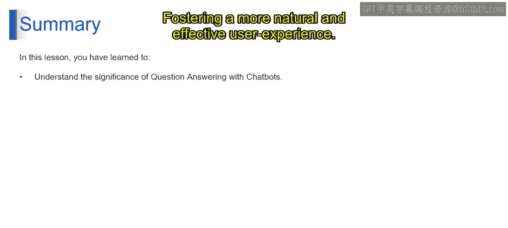

# 第二三四部分 83：使用LangChain和RAG构建聊天机器人

在本节课中，我们将学习如何使用LangChain和检索增强生成（RAG）技术来构建一个能够回答问题的聊天机器人。我们将了解构建流程、其优势、应用场景以及需要考虑的局限性。

## 构建聊天机器人的步骤

上一节我们介绍了RAG的基本概念，本节中我们来看看构建一个聊天机器人的具体步骤。整个过程可以分为五个主要阶段。

以下是构建聊天机器人的五个关键步骤：

1.  **数据准备**：清理和组织数据，以确保检索和聊天机器人训练的有效性。
2.  **检索系统**：配置LangChain的检索技术，以便在数据中为用户查询找到相关信息。
3.  **LLM集成**：在检索到信息后，将选定的LLM连接到LangChain，使其能够在生成响应时访问检索到的信息。
4.  **聊天机器人设计**：设计聊天机器人的用户界面和交互流程，需要考虑用户体验。
5.  **微调与测试**：通过持续的测试和调整，优化聊天机器人的响应和检索系统。

## 使用聊天机器人进行问答的优势

了解了构建流程后，我们来看看使用聊天机器人进行问答能带来哪些好处。这些优势使其成为提升用户体验的强大工具。

以下是聊天机器人问答的主要优势：

*   **自然直观的交互**：聊天机器人提供了一个对话式界面，让用户能以自然的方式提问。
*   **专注且具体的答案**：通过利用你的数据，聊天机器人可以提供针对性强且精确的答案来响应用户查询。
*   **上下文理解**：聊天机器人可以考虑之前的交互和整体对话流程，从而提供与上下文相关的响应。
*   **持续学习与适应**：用户交互和反馈可用于持续改进聊天机器人的问答能力。
*   **额外优势**：聊天机器人可以提供24/7全天候服务，同时处理多个用户，并有可能与其他服务集成以提供更丰富的体验。

## 聊天机器人的应用示例

接下来，我们通过一些具体的例子，看看聊天机器人在不同领域是如何应用的。这些示例展示了其广泛的应用潜力。

以下是聊天机器人的几个应用示例：

*   **客户服务聊天机器人**：提供24/7支持，回答常见问题，并帮助用户处理复杂流程。
*   **数据探索聊天机器人**：引导用户浏览数据集，回答有关数据的特定问题，并生成报告或摘要。
*   **个人知识助手**：帮助用户管理任务、安排预约、回答有关个人信息的问题并提供提醒。
*   **教育聊天机器人**：提供个性化学习体验，回答学生问题，并提供练习题或谜题。
*   **领域特定聊天机器人**：服务于特定行业或领域，提供专业知识并协助用户完成该领域内的特定任务。

## 局限性与注意事项

尽管聊天机器人功能强大，但在实际应用中也存在一些局限性和需要考虑的因素。了解这些对于成功部署至关重要。

以下是使用聊天机器人时需要考虑的主要局限性和注意事项：

*   **数据质量**：聊天机器人的有效性在很大程度上取决于用于训练和检索的底层数据的质量、完整性和相关性。
*   **模型局限性**：由LLM驱动的聊天机器人继承了这些模型的局限性，例如可能存在偏见，或在处理复杂查询的细微差别和事实准确性方面存在困难。
*   **可解释性与信任**：由于LLM算法的复杂性，理解聊天机器人响应背后的推理过程可能具有挑战性，这可能会阻碍用户的信任。
*   **安全与隐私**：必须采取措施保护通过聊天机器人交互收集的敏感用户数据，并确保遵守相关的隐私法规。
*   **用户期望与教育**：管理用户对聊天机器人能力的期望至关重要，同时需要教育用户如何有效地与聊天机器人互动以实现预期结果。

## 总结

本节课中，我们一起学习了利用聊天机器人进行问答的强大功能。我们探讨了LangChain的RAG系统如何弥合LLM的上下文鸿沟，使其能够访问你数据中的相关信息，并为用户查询生成信息丰富的答案，从而营造更自然、更有效的用户体验。