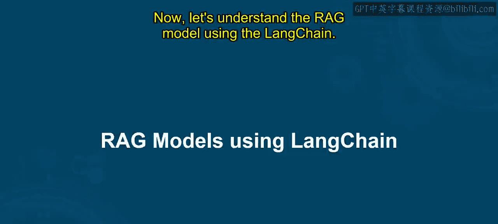
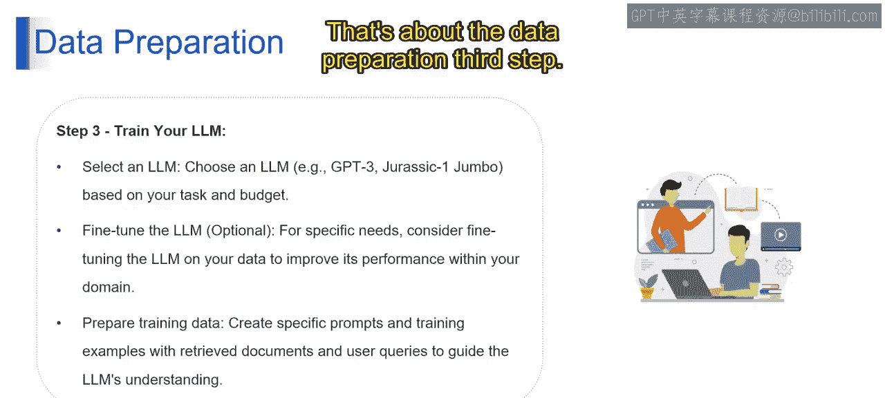

# 第二三四部分 84：使用LangChain构建RAG模型 🧠

在本节课中，我们将学习如何使用LangChain框架构建一个检索增强生成模型。RAG模型结合了信息检索和大型语言模型的能力，能够生成基于特定知识库的准确回答。

上一节我们介绍了生成式AI的基础概念，本节中我们来看看如何具体实现一个RAG系统。

## 概述

RAG模型的构建涉及多个步骤，包括数据准备、检索系统搭建、LLM训练与集成，以及最终应用界面的开发与测试。我们将逐一解析这些步骤。

## 数据准备

第一步是准备模型所需的数据。这个过程确保LLM能够获取并理解高质量、结构化的信息。

以下是数据准备的三个核心环节：

*   **数据收集与组织**：从各种来源收集数据，如文本文件、数据库或电子表格。数据格式需兼容LangChain，例如PDF或文本文件。
*   **数据清洗与结构化**：确保数据干净、一致且无错误。移除噪声和不相关信息能提升检索准确性，使模型更专注于核心内容。
*   **数据预处理**：根据模型需求进行进一步处理，例如**分词**、**归一化**或**实体识别**，以便LLM更好地理解数据。

## 构建检索系统

在准备好数据后，下一步是构建检索系统。该系统负责从知识库中快速找到与用户查询最相关的文档。

上一节我们准备好了数据，本节中我们来看看如何配置检索系统。

以下是构建检索系统的关键步骤：

*   **选择模型**：选择LangChain提供的预训练检索模型，或根据特定需求使用自有数据训练定制模型，以实现最优性能和定制化。
*   **配置设置**：
    *   **定义相似度度量**：设定用于衡量用户查询与检索文档之间语义相似度的数学函数。常用方法包括**余弦相似度**或**L2距离**。该指标用于对检索到的文档进行排序。
    *   **设定检索数量**：指定每次查询需检索的文档数量。需要在获取足够相关信息与计算效率之间取得平衡。
*   **连接至LangChain**：将选定的检索模型集成到LangChain框架中。这使LangChain能够与模型交互并在检索过程中利用其功能。LangChain提供了无缝集成的工具。此步骤在RAG模型中建立了核心检索机制，确保能从数据集中高效、准确地检索相关信息。

## 训练你的LLM

检索系统就绪后，我们需要准备或微调用于生成答案的大型语言模型。

以下是训练LLM的主要步骤：

*   **选择LLM**：根据项目需求和预算选择合适的LLM。流行选项包括GPT-3、Jurassic-1 Jumbo等。选择时需考虑任务复杂度和所需能力。
*   **微调LLM**：为了在特定领域获得更佳性能，可以考虑使用你的数据对选定的LLM进行微调。这涉及使用你的参数化训练数据对LLM进行进一步训练，使其适应你领域内的语言和概念。
*   **准备训练数据**：为你的RAG模型创建高质量的专用训练数据。这些数据应包含检索到的文档、用户查询、预期回答以及提示工程技术。通过为LLM提供精心准备的训练数据，你使其具备了在聊天机器人问答任务中表现出色所需的知识和技能。

本节课中我们一起学习了使用LangChain构建RAG模型的前三个核心步骤：数据准备、检索系统构建以及LLM的训练准备。这些步骤为创建一个能够基于特定知识库生成准确回答的智能系统奠定了基础。下一节我们将继续探讨后续的集成与开发步骤。