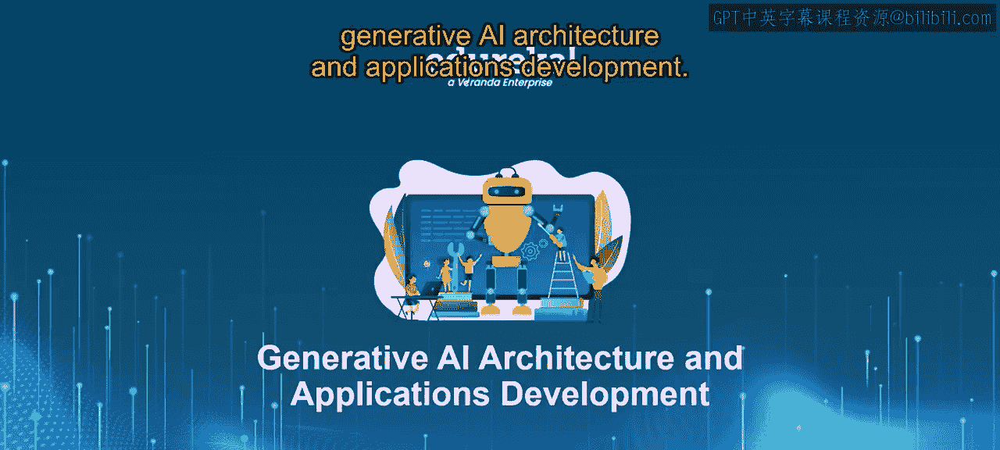
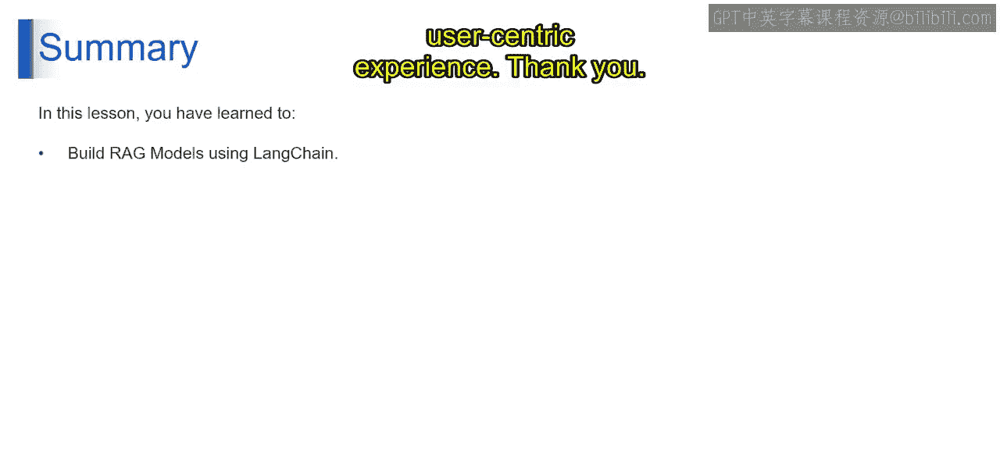

# 第二三四部分 85：使用LangChain构建RAG模型（续）

在本节课中，我们将继续学习如何使用LangChain构建检索增强生成（RAG）模型。我们将重点介绍如何集成大语言模型（LLM）与检索系统、设计和开发聊天机器人，以及如何进行测试与优化。

## 集成LLM与检索系统

上一节我们介绍了如何构建检索系统，本节中我们来看看如何将其与大语言模型（LLM）集成。此步骤包含三个核心任务：LLM集成、RAG链构建以及提示词配置。

以下是具体的集成步骤：

1.  **LLM集成**：将你选择的LLM连接到LangChain链。该链应能与LLM无缝交互并交换数据。
2.  **RAG链构建**：构建一个专为RAG功能设计的模块化链。此链通常包含查询处理、检索触发、信息检索、数据预处理、LLM提示词生成以及LLM响应处理等模块。
3.  **提示词配置**：定义用于为LLM创建有效提示词的机制。这包括：
    *   **基于模板的提示词生成**：利用预定义的模板，将检索到的信息和用户查询结合起来。
    *   **动态提示词生成**：开发根据特定检索到的文档和查询特征动态构建提示词的方法。

通过建立这种集成和提示词配置，你就创建了一个通信通道，允许检索系统向LLM提供上下文信息，从而使其能够在问答过程中生成信息丰富的回答。

## 设计与开发聊天机器人

在成功集成LLM与检索系统后，下一步是设计和开发用户交互界面——聊天机器人。此步骤聚焦于创建用户友好的交互体验。

以下是开发聊天机器人的三个主要方面：

1.  **对话流程设计**：定义聊天机器人的交互逻辑。这包括规划用户查询提示、验证机制、聊天机器人响应结构、基于检索信息和LLM输出的意图识别，以及根据用户输入设计后续问题选项或对话分支。
2.  **界面开发**：为你的聊天机器人选择交互模式。可以是基于文本的界面、基于语音的界面，或是包含视觉元素的图形用户界面（GUI），以提供更丰富的交互体验。
3.  **LangChain集成**：将设计好的聊天机器人与之前构建的RAG链集成。这使得聊天机器人能够根据用户查询触发检索过程，接收并展示LLM利用检索信息生成的回答。

## 测试与优化

构建完成后，严格的测试与评估对于优化你的RAG模型至关重要。这是一个持续迭代的过程。

以下是测试与优化的三个关键环节：

1.  **测试与评估**：基于准确性、相关性和用户体验来评估聊天机器人的回答。
2.  **微调**：根据评估结果，优化RAG模型的各个组件。
    *   **检索模型**：调整参数或探索LangChain内的替代检索技术，以提高检索信息的准确性和相关性。
    *   **LLM**：考虑使用额外的训练数据对LLM进行微调，或调整提示词配置以增强其回答生成能力。
    *   **提示词**：分析提示词的有效性，并优化模板结构或动态生成方法，以便为LLM提供更清晰的上下文。
3.  **主动学习**：实施主动学习技术，使聊天机器人能够持续学习和改进。这可能涉及整合用户反馈机制，或利用强化学习方法引导模型达到最佳性能。

通过迭代式的测试、评估和微调，你可以确保你的RAG模型能够提供准确、信息丰富且用户友好的回答，从而巩固其在聊天机器人问答任务中的有效性。

## 总结

本节课中，我们一起学习了如何使用LangChain的功能构建RAG模型。我们探讨了一个分步方法，涵盖了为优化检索进行数据准备、构建检索系统以查找相关信息、训练你的LLM以理解语言，以及集成这些组件以使LLM能够在问答过程中利用检索到的上下文。我们还深入研究了聊天机器人的设计与开发、测试策略以及优化技术，以确保你的RAG模型能够提供信息丰富且以用户为中心的体验。