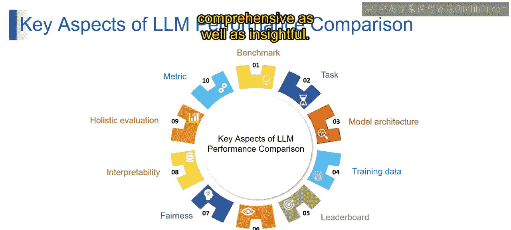

第2：LLM性能比较

在本节课中，我们将学习如何比较不同大型语言模型的性能。理解评估标准、任务和指标是选择合适模型的关键。

---

上一节我们介绍了大型语言模型的基础概念，本节中我们来看看如何系统地比较它们的性能。想象一下，你手头有几个语言模型，想知道哪一个表现更好，这就是LLM性能比较要解决的问题。

以下是理解LLM性能比较的关键方面。

**基准测试**
可以将基准测试视为一套标准化的任务和评估指标。它就像一块“公地”，允许我们在特定领域内衡量语言模型的性能。这类似于为语言模型设计的标准化考试。

**任务**
在LLM评估领域内，我们有具体的挑战，称为“任务”。这些任务的范围可以从机器翻译到问答，甚至是文本摘要。每个任务本质上代表了语言模型被测试的一项不同技能。
例如，假设我们仍在机器翻译领域内：
*   一项任务可能是翻译医学文档。
*   另一项任务可能涉及翻译日常对话。
每个任务评估语言模型能力的一个特定方面，让我们能全面了解其优势和劣势。

**评估指标**
想象你是一位教练，正在评估足球比赛中球员的表现。为了做出公平的评估，你需要一个评分系统，对吗？在语言模型的世界里，指标就扮演着类似的角色。它们就像评分系统，用于评估LLM在给定特定任务上的表现。
以下是几个核心指标：

*   **准确率**
    *   **类比**：进球得分。
    *   **描述**：衡量在事实性任务中给出正确答案的百分比。就像计算球员准确射入的球数。
*   **困惑度**
    *   **类比**：预测下一步行动。
    *   **描述**：估计LLM预测序列中下一个单词的能力，表明其流畅性和连贯性。可以想象为在游戏中准确预测对手的下一步。
*   **BLEU分数**
    *   **类比**：翻译准确度。
    *   **描述**：常用于机器翻译，评估生成文本与参考译文之间的重叠程度。就像检查翻译在多大程度上准确反映了原文。
*   **ROUGE分数**
    *   **类比**：总结成功度。
    *   **描述**：通过测量与参考摘要的重叠来评估摘要的质量。类似于评估一名球员对比赛的总结与官方总结的吻合程度。
*   **损失函数**
    *   **类比**：调整策略。
    *   **描述**：用于训练大型语言模型的数学计算，衡量模型预测与实际数据之间的差异。最小化损失函数就像优化策略，引导模型获得更好性能，类似于教练为改进而调整战术。

本质上，正如教练使用各种指标来评估球员表现的不同方面，语言模型世界的指标帮助我们衡量LLM处理特定语言任务的能力。每个指标都为性能的不同维度提供了有价值的见解，使得评估过程全面且富有洞察力。

---

本节课中我们一起学习了LLM性能比较的三个核心支柱：基准测试、任务和评估指标。理解这些概念是客观评估和选择适合你需求的大型语言模型的基础。下一节视频中，我们将对此主题进行更详细的阐述。