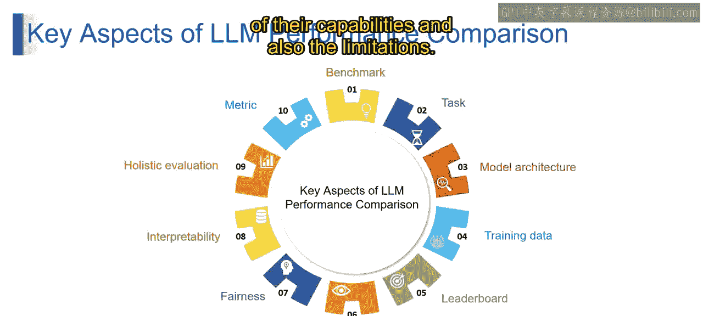

# 第二三四部分 86：LLM性能比较的关键方面 🔍

在本节课中，我们将学习如何评估和比较不同大型语言模型的性能。理解这些关键方面能帮助我们选择最适合特定任务的模型。

上一节我们介绍了LLM的基本概念，本节中我们来看看评估LLM性能的几个核心维度。

## 模型架构 🏗️

模型架构指的是构成语言模型基础的神经网络的设计与配置。模型架构在决定LLM执行各种任务的能力方面起着重要作用。

可以将模型架构视为语言模型的蓝图。不同的建筑有不同的蓝图，语言模型也有不同的架构。这些架构可以针对特定任务进行定制，使某些模型在某些领域表现出色，而在其他领域存在局限。

例如，一个专为文本摘要设计的语言模型，其架构可能与专精于语言翻译的模型不同。这些神经网络的结构方式，影响了它们理解和生成语言的效率，从而决定了其整体性能。

## 训练数据 📚

现在，我们来谈谈任何语言模型的生命线——训练数据。这是用于训练模型的大量文本和代码。训练数据的质量及其存在的偏见，会显著影响模型泛化到新任务的能力，以及它可能表现出的潜在偏见。

想象一下，训练数据就像一个图书馆，大型语言模型从中学习。如果这个图书馆是多样化的，并且代表了不同的语言模式，那么模型就更有可能在各种任务中表现良好。然而，如果图书馆存在偏见或缺乏多样性，这些偏见可能会反映在模型的输出中。

例如，如果我们的语言模型主要是在正式语言上训练的，它可能在处理非正式语言任务时遇到困难。同样，如果训练数据偏向于某个特定观点，模型可能会无意中产生带有偏见的结果。

## 排行榜 🏆

排行榜就像是语言模型世界的记分牌，不同的模型在特定基准测试上竞争并根据其性能进行排名。

想象一个追踪和排名各种语言模型的平台。这个平台就是排行榜，它提供了一个快照，展示了不同模型在特定任务上相互比较的表现。这是一种动态的方式，可以随时了解语言模型领域的最新进展。

例如，可以将其视为体育排行榜。每个语言模型就像一支在各种任务中竞争的队伍。排行榜告诉我们哪些模型处于领先地位，展示了它们在不同领域的优势和创新。

## 人类评估 👥

接下来是人工评估。虽然自动化指标至关重要，但语言学家、领域专家甚至普通人的主观评估，能提供关于人性化、公平性和创造性等方面的独特见解，而这些可能是自动化指标在某些情况下所忽略的。

例如，想象品尝一道菜。自动化指标可能会告诉你营养成分，但人工评估却能捕捉到风味、口感和整体用餐体验。同样，人工评估丰富了我们对于语言模型的理解。

## 公平性 ⚖️

公平性指的是语言模型避免偏见和刻板印象的能力，确保其不受偏见和歧视的影响。

考虑一个生成工作推荐的语言模型。一个公平的模型会确保它不会偏袒或歧视某些人群，为所有用户提供无偏见的建议。

## 可解释性 🔍

另一个重要方面是可解释性。这是大型语言模型解释其推理过程、使其决策透明化并提供其内部运作洞察的能力。

可以将可解释性视为一本打开的书。一个可解释的模型允许我们理解它是如何得出特定结论或生成特定输出的，从而为其决策过程提供清晰度和信任。

## 整体评估 🌐

这种方法超越了单一指标，考虑了流畅性、连贯性、创造性、相关性、公平性和可解释性等多个方面。它提供了对语言模型性能的全面视图。

本节课中我们一起学习了评估大型语言模型性能的七个关键方面：**模型架构**、**训练数据**、**排行榜**、**人类评估**、**公平性**、**可解释性**和**整体评估**。这些方面共同塑造了语言模型评估的格局，为我们提供了对其能力和局限性的多层面理解。