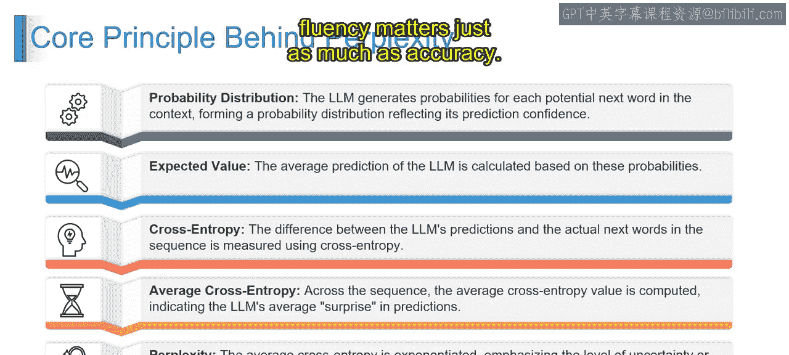

第2：困惑度

在本节课中，我们将要学习困惑度这一概念。困惑度是评估语言模型性能的关键指标，它衡量了模型在预测序列中下一个词时的不确定性程度。

上一节我们介绍了语言模型的基本概念，本节中我们来看看如何量化其预测能力。

想象你的朋友递给你两本不同的书。一本是用你流利的语言写的，另一本则是用你刚开始学习的语言写的。现在设想你第一次阅读这些书，并需要完成一个任务：预测句子中的下一个词。思考一下，哪本书会让你更容易预测下一个词？显然，是你流利语言的那一本。这就是困惑度背后的核心思想。

让我们通过例子来分解这个概念。第一本用你流利语言写的书，句子可能是这样的：“阳光明媚，天空是____。” 你会预测答案是“蓝色”，这似乎相当直接。在这里，选择是有限的，基于流利度和上下文很容易猜测。

但在第二本书中，假设是你第一次学习的语言，比如意大利语。句子可能是：“Il sole splende e il cielo è ____.” 预测这个特定句子的下一个词可能就比较棘手了，因为作为学习者，你具有更高的不确定性。在第二个例子中，分支因子或可能的词选择数量更高。

现在，让我们将其与正式定义联系起来。在信息论中，困惑度是概率分布不确定性的度量。在语言模型或LLM的上下文中，它专门用于估计模型的平均分支因子。它告诉我们，模型在预测序列中下一个词时，平均有多少种可能的选择。

接下来，我们理解几个关键方面。

首先是分支因子。可以将分支因子视为模型拥有的分支或选择的数量。在我们的语言例子中，它就像可以填入句子空白处的可能单词的数量。分支因子越高，模型在预测下一个词时可能越不确定、越困惑。

其次是平均值。困惑度中的“平均”一词告诉我们，它不仅仅是关于单次预测，而是对多次预测的整体估计。它考虑了模型遇到的平均选择数量，从而对其不确定性提供了更全面的视图。

最后是流利度与上下文动态。在我们的例子中，流利和熟悉的语言使预测更容易，而新语言（意大利语）的挑战则增加了困惑度。这些动态因素在困惑度如何帮助我们评估模型性能方面起着作用。

现在，让我们理解为什么困惑度是首选指标。

困惑度提供了几个优势。以下是使其成为首选指标的三个关键原因。

首先是解释简单。在简单性方面，困惑度具有优势。与一些可能让人头疼的复杂指标不同，困惑度保持直接明了。可以将其想象为一个性能分数：越低越好。这是一个易于理解的概念，即使对于那些不深入研究技术细节的人也是如此。较低的困惑度数值直接转化为更好的模型性能。

其次是广泛使用。困惑度并非科学领域的新手。它是一个广泛使用的指标，深深植根于语言建模、机器翻译和语音识别等各种场景中。这种广泛的采用使得跨不同模型和任务的无缝比较成为可能。它就像评估社区使用的通用语言，允许我们一致地衡量模型性能。

最后是关注流利度。与一些基于准确性的指标不同，困惑度专注于生成文本的流畅性和自然度。想象阅读一个故事，困惑度更关心词语如何无缝衔接，而不仅仅是计算正确和错误的预测。这使得它在评估创造性或开放式任务中的语言模型时特别有价值，因为在这些任务中，流利度与准确性同等重要。

本节课中我们一起学习了困惑度的定义、关键方面及其作为评估指标的优势。困惑度通过衡量模型预测的不确定性，为我们提供了一个直观且广泛适用的工具来评估语言模型的性能。下一节视频中，我们将对此主题进行更详细的阐述。