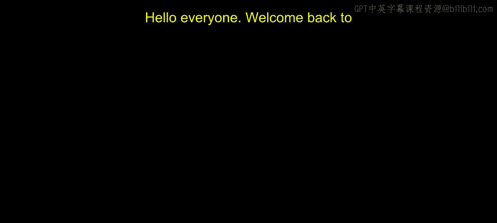
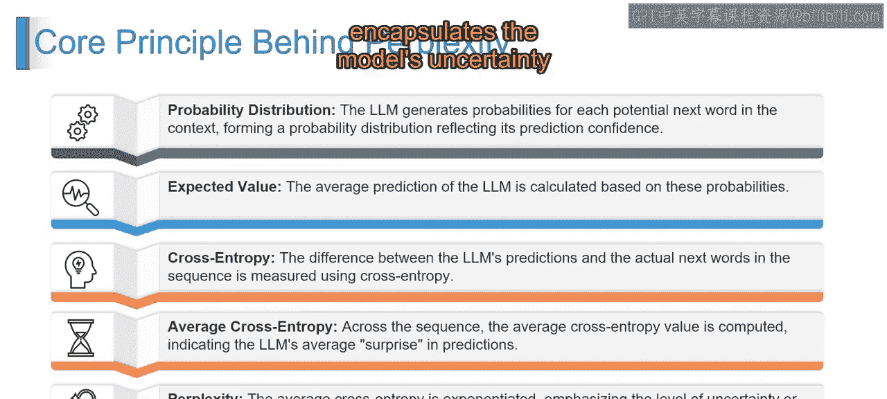

# 第二三四部分 89：困惑度的核心原理 🔍

在本节课中，我们将学习困惑度这一评估语言模型性能的核心指标背后的基本原理。我们将从概率分布开始，逐步理解如何通过交叉熵等概念最终计算出困惑度，以衡量模型预测的不确定性。

---

## 从预测到不确定性：理解困惑度的构建步骤

上一节我们介绍了困惑度作为评估指标的概念。本节中，我们来看看构成困惑度计算的具体步骤。想象这是一个从预测下一个词到理解模型不确定程度的旅程。

以下是构成困惑度计算流程的五个关键步骤：

1.  **概率分布**  
    困惑度的核心是概率分布的概念。语言模型（LLM）如同一个“读心者”，它会为给定句子或上下文中的每一个潜在的下一个词生成一个概率。这些概率的集合构成了一个概率分布，展示了模型对其预测的信心程度。  
    用公式表示，对于一个给定的上下文 \( C \) 和候选词 \( w_i \)，模型会输出概率 \( P(w_i | C) \)。

2.  **期望值**  
    我们基于这些概率计算语言模型的平均预测。这就像是通过考虑所有潜在选项及其可能性，来预测最可能的下一个词。这让我们能感知模型所预期的内容。  
    期望值 \( E \) 的计算可表示为：\( E = \sum_{i} P(w_i | C) \cdot \text{Value}(w_i) \)，其中 \(\text{Value}(w_i)\) 代表该词的某种价值度量（在困惑度计算中，通常与对数概率相关）。

3.  **交叉熵**  
    这是理论付诸实践的关键一步。语言模型的预测与实际序列中下一个词之间的差异，通过交叉熵来衡量。它本质上是评估模型的预测与现实情况的吻合程度。  
    对于真实的下一个词 \( w_{\text{true}} \)，交叉熵 \( H \) 为：\( H(P, Q) = -\log P(w_{\text{true}} | C) \)，其中 \( P \) 是模型分布，\( Q \) 是真实分布（此处为独热编码）。

4.  **平均交叉熵**  
    基于上一步，我们计算整个序列的平均交叉熵。这个值让我们洞察模型在其预测中感受到的平均“惊讶”程度。平均交叉熵越低，模型遇到的意外越少，表明整体预测更准确。  
    对于一个长度为 \( N \) 的序列，平均交叉熵 \( \bar{H} = \frac{1}{N} \sum_{t=1}^{N} H_t \)。

5.  **困惑度**  
    最后，将平均交叉熵取指数，将其转化为一个更易于解释的指标。这个转换强调了文本中的不确定性或不可预测性的程度。简单来说，困惑度越高，意味着不确定性越大，模型在其预测中更加“困惑”。  
    困惑度 \( PP \) 的公式为：\( PP = e^{\bar{H}} \)。

---

## 总结与回顾

本节课中，我们一起学习了困惑度背后的核心原理。这个原理带领我们经历了一个完整的旅程：从模型生成概率分布开始，计算期望值，然后通过交叉熵衡量预测与现实的差距，接着计算平均交叉熵以评估平均惊讶度，最终通过指数运算得到困惑度。困惑度这个指标有效地封装了模型的不确定性和不可预测性。

理解这些步骤，有助于我们更深入地评估语言模型的性能。下一节视频中，我们将对此主题进行更详细的阐述。