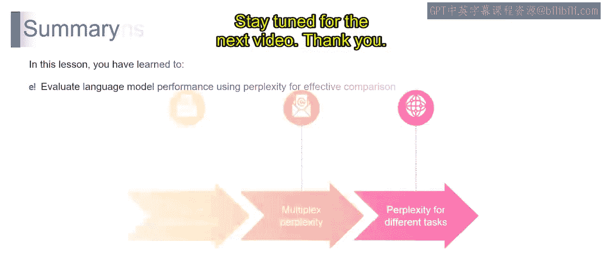

# 第二三四部分 90：如何计算困惑度

在本节课中，我们将要学习困惑度这一重要概念。困惑度是评估语言模型性能的核心指标，它衡量了模型在预测序列中下一个词时的不确定性。理解如何计算困惑度，对于评估和比较不同语言模型至关重要。

## 📝 困惑度公式与计算步骤

上一节我们介绍了困惑度的基本概念，本节中我们来看看其具体的数学定义和计算过程。

困惑度的计算公式如下：

**困惑度 = (∏ P(单词_i | 单词_1, ..., 单词_{i-1}))^{-1/N}**

其中，`N` 是序列中的总词数，`P(单词_i | 单词_1, ..., 单词_{i-1})` 表示给定前面所有单词的条件下，当前单词出现的条件概率。

计算困惑度通常遵循以下四个步骤：

以下是计算困惑度的具体步骤：

1.  **分词**：将给定的句子或文本分割成独立的单词。例如，“The dog chased the cat” 会被分割为 `[“The”, “dog”, “chased”, “the”, “cat”]`。
2.  **计算词概率**：对于序列中的每个单词，计算其在给定前面所有单词的条件下的概率。这表示为 `P(单词_i | 单词_1, ..., 单词_{i-1})`。
3.  **计算概率乘积**：将序列中所有单词的条件概率相乘，得到整个文本序列的联合似然值。
4.  **取几何平均**：将上一步得到的概率乘积，开 `N` 次方（即求其 `1/N` 次幂）。这个值代表了模型在每个预测步骤平均面临的选择数量，也就是困惑度。

## 🔢 计算示例

理解了计算步骤后，我们通过一个具体的例子来演示如何应用这些步骤。

假设一个语言模型为句子“The dog chased the cat”中的每个词分配了以下条件概率：
*   `P(“The”) = 0.8`
*   `P(“dog” | “The”) = 0.9`
*   `P(“chased” | “The”, “dog”) = 0.7`
*   `P(“the” | “The”, “dog”, “chased”) = 0.6`
*   `P(“cat” | “The”, “dog”, “chased”, “the”) = 0.5`

那么，该句子的困惑度计算如下：
1.  概率乘积 = 0.8 × 0.9 × 0.7 × 0.6 × 0.5 = 0.1512
2.  总词数 `N = 5`
3.  困惑度 = (0.1512)^{-1/5} ≈ 3.2

**本质而言，计算困惑度就是将文本分词、计算条件概率、相乘，然后根据序列长度进行调整，最终得到一个能够概括模型预测平均不确定性的度量值。**

## 🛠️ 困惑度的实际应用

困惑度不仅仅是一个理论指标，它在多种实际场景中都有重要应用。让我们探讨三个关键应用，以展示其多功能性和实用性。

以下是困惑度的三个主要应用场景：

1.  **困惑度正则化**：在训练语言模型时，如果发现模型对其预测变得过于自信，可以引入困惑度作为正则化项。这能引导模型保持适当的不确定性水平，有助于防止过拟合，并鼓励模型做出更谨慎的预测，从而增强其泛化能力。
2.  **多重困惑度**：在单一困惑度值可能无法完全反映模型性能的场景下，可以采用多重困惑度策略。这种方法涉及为数据的特定子集（如不同主题、不同难度级别）分别计算困惑度，从而能更细致地理解模型在不同细分领域的表现。
3.  **面向不同任务的困惑度**：困惑度并非“一刀切”的指标。它的适应性体现在针对不同任务（如机器翻译、问答、文本摘要）进行评估时，可以进行调整和定制，使其成为衡量模型在各种语言任务上理解和预测能力的通用标尺。

本节课中我们一起学习了困惑度的定义、计算方法和实际应用。总结来说，困惑度不仅是评估报告上的一个数字，更是一个具有实际应用价值的动态指标。从训练过程中的模型调控，到通过多重分析和任务特定评估提供细致洞察，困惑度在各种现实场景中都证明了其价值。