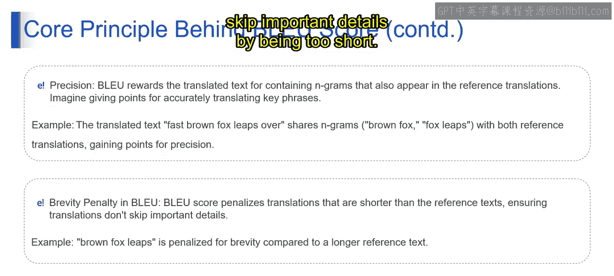

# 第二三四部分 91：BLEU分数详解 🎯

在本节课中，我们将要学习BLEU分数的核心概念。BLEU分数是评估机器翻译文本质量的关键指标。我们将了解其定义、工作原理、计算步骤以及它在实际应用中的意义。

---

## BLEU分数的定义

BLEU是“双语评估替换”的缩写。它是一个专门设计用来**评估机器翻译文本质量**的指标。你可以把它想象成一个裁判，它仔细检查翻译文本与人类参考翻译的表达方式有多接近。

上一节我们介绍了BLEU分数的基本定义，本节中我们来看看其背后的核心原理。

---

## BLEU分数的核心原理

BLEU分数的核心在于**测量机器翻译文本与参考翻译之间的重叠程度**。想象你有一个源语言句子，你想评估它的翻译版本与官方参考翻译的匹配度，BLEU就是用来分析这种对齐情况的工具。

让我们通过一个例子来理解。假设我们有一个原始句子：
`The quick brown fox jumps over the lazy dog.`

以下是机器翻译的句子：
`The fast brown fox leaps over the tired canine.`

我们还有两个参考翻译：
*   参考翻译1：`The agile brown fox vaults over the sluggish dog.`
*   参考翻译2：`The nimble brown fox bounds across the lethargic hound.`

现在，我们将基于这个例子来分解BLEU分数的计算过程。

---

## BLEU分数的计算步骤

以下是BLEU分数计算的关键步骤：

**1. 分词**
首先，BLEU分数使用**分词**技术。它将机器翻译文本和参考翻译文本都分解成独立的单词或子词单元。这一步确保了分析的粒度，因为每个单元都被单独考虑。

例如，句子 `It‘s a beautiful day.` 经过分词后可能变成：`[“It”, “‘s”, “a”, “beautiful”, “day”, “.”]`

**2. 使用N-gram作为构建块**
N-gram是用于分析文本的**连续单词序列**。高阶N-gram能捕捉更长的短语，从而允许进行更深层次的语义比较。

你可以把N-gram看作一组单词。例如，当n=2（即二元组）时，句子“The quick brown fox”会产生以下组合：`[“The quick”, “quick brown”, “brown fox”]`。

**3. 计算精确度**
接下来，BLEU评估**精确度**。它会奖励那些包含在参考翻译中也出现的N-gram的机器翻译文本。简单来说，就是为准确翻译出与参考翻译一致的关键短语而加分。

在我们的例子中，BLEU会奖励机器翻译，因为它包含了“brown fox”和“fox leaps”等短语，这些短语也出现在参考翻译中。这就像一个游戏，你因为准确翻译了关键短语而得分。

**4. 应用简短惩罚**
BLEU是公平但严格的。它会**对短于参考文本的翻译施加惩罚**。这确保了翻译不能通过省略重要细节来“蒙混过关”。可以理解为“不允许偷工减料”。

例如，如果我们的机器翻译仅仅是“Brown fox leaps”，而参考翻译更长（如“The agile brown fox vaults over the sluggish dog”），BLEU会注意到这个长度差异并施加简短惩罚，以确保翻译不会因为过短而跳过重要信息。

---

## 总结

本节课中我们一起学习了BLEU分数的核心内容。我们了解到BLEU是一个通过**比较N-gram重叠度**和**惩罚过短翻译**来评估机器翻译质量的指标。它的计算涉及**分词、N-gram分析、精确度计算和简短惩罚**几个关键步骤。理解BLEU分数有助于我们客观地衡量和比较不同机器翻译系统的输出质量。

在接下来的课程中，我们将进一步探讨如何具体计算和应用BLEU分数。