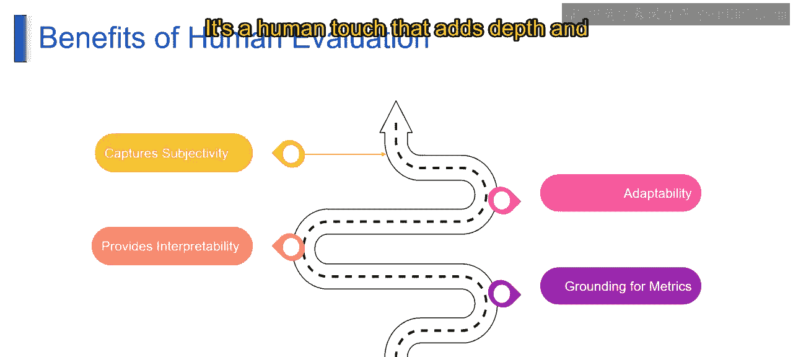

# 第二三四部分 93：人工评估 👨‍⚖️

在本节课中，我们将要学习大语言模型评估中的一个核心环节：人工评估。我们将了解其定义、评估过程以及它为模型评估带来的独特优势。

## 概述

人工评估为评估语言模型带来了“人的视角”。想象一下，一个由专家组成的评审小组，仔细审查大语言模型的输出，并从多个维度给出专业意见。这就像一群经验丰富的评论家，在评估一位语言艺术家的表演。

## 人工评估过程

人工评估并非简单地给出“好”或“坏”的二元判断，而是深入多个方面，确保对语言模型能力和局限性的全面评估。以下是评估过程中涉及的几个关键维度：

*   **流畅性**：评审员评估生成的文本是否读起来流畅自然。这类似于评估一个写得很好的故事的流畅度，确保语言模型能产出让人感觉舒适、连贯的文本。
*   **连贯性**：评审员考量内容是否合乎逻辑、条理清晰。这确保了生成的文本不仅仅是词语的堆砌，而是创造了一个读者能够轻松理解的连贯叙述。
*   **准确性**：这是一个至关重要的方面。评审员评估文本是否正确传达了预期的含义。这关乎衡量语言模型如何准确地捕捉输入的本质，并将其转化为连贯的语言。
*   **语法正确性**：正确的语法是基础。语法正确性是一个关键标准。评审员仔细检查文本是否遵守语法规则。这确保了语言模型生成的文本不仅有意义，而且在语法上是正确的。
*   **风格与语气**：艺术性的考量体现在风格和语气上。评审员评估文本是否达到了预期的风格效果，并保持了恰当的语气。这确保了语言模型能够调整其风格以适应不同的语境和意图。
*   **事实性**：评审员评估文本中呈现的陈述是否在事实上准确。这在生成准确信息至关重要的场景中尤为重要。

## 人工评估的优势

上一节我们介绍了人工评估的具体过程，本节中我们来看看人工评估为模型评估带来了哪些独特的优势。人工评估带来了一系列独特的优势，为语言模型的评估增添了深度和细微差别。让我们来探索这些好处，了解“人的视角”如何加深我们对模型性能的理解。

*   **捕捉主观性**：人工评估擅长捕捉语言的主观性。语言本质上是主观的，而人类擅长解读细微的表达和语境。通过引入人类评审员，评估可以捕捉到自动化指标可能忽略的细微差别、情感和文化背景。这种主观性视角为评估过程增添了丰富性，确保了对语言模型输出更全面的理解。
*   **适应性**：人工评估将适应性置于首位。人类擅长理解不同的风格、语气和语境，这使他们非常适合评估不同场景下的语言模型。这种适应性确保了评估可以针对特定任务或领域进行定制，提供在给定情境中相关且有意义的见解。
*   **提供可解释性**：人工评估的一个关键优势在于其提供可解释性的能力。评审员不仅可以提供分数，还能阐明评估背后的理由。这种可解释性使研究人员、开发人员和模型使用者能够更深入地了解模型在特定方面表现出色或存在困难的原因。这将评估从一个数字分数转变为一个揭示语言生成复杂性的叙述。
*   **为指标提供基础**：人工评估为自动化指标提供了基础。虽然自动化指标有其用武之地，但它们需要以人类判断为基础才能真正有意义。人工评估可以作为校准和验证自动化指标的基准。这种基础确保了指标与人类对质量和有效性的感知保持一致。

## 总结

本节课中，我们一起学习了人工评估的核心概念。我们了解到，人工评估通过引入人类评审员，从流畅性、连贯性、准确性、语法、风格和事实性等多个维度全面评估语言模型的输出。其优势在于能够捕捉语言的主观性、适应多样化的语境、提供评估结果的可解释性，并为自动化评估指标提供至关重要的校准基础。正是这种“人的视角”，为我们理解语言模型的性能增添了深度和语境。