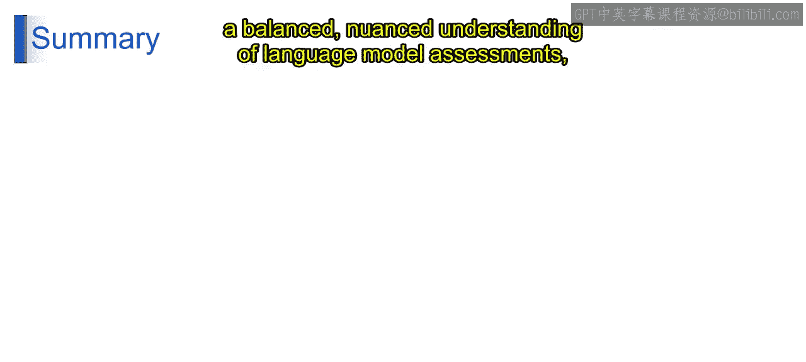

# 第二三四部分 94：人工评估的局限性 🧐

在本节课中，我们将探讨在评估大型语言模型时，人工评估方法所面临的一系列挑战与局限性。理解这些局限性对于全面、客观地评估模型性能至关重要。

上一节我们介绍了人工评估的价值，本节中我们来看看其具体的局限性。

## 主观性与偏见

人工评估的首要挑战源于人类判断固有的主观性和偏见。不同的评估者可能基于其背景、经验和视角，对同一段文本产生不同的解读。这种主观性会导致评估结果出现差异，使得建立一个普遍一致的评估标准变得困难。此外，无论是有意识还是无意识的偏见，都可能影响评估者的判断，从而损害评估过程的可靠性。

## 成本与可扩展性

从实践角度看，成本与可扩展性构成了重大挑战。人工评估，尤其是需要专家参与时，会消耗大量资源和时间。随着评估规模的扩大或对专家意见需求的增长，相关的成本和后勤复杂度会急剧上升。这一局限性可能阻碍进行大规模、全面评估的可行性。

## 一致性与可靠性

评估者之间的一致性与可靠性水平是一个关键考量。在评估标准上达成共识并确保判断的一致性通常很困难。可靠性，即不同评估者意见一致的程度，可能存在波动，这会影响评估的稳健性。这一挑战引发了关于人工评估一致性与可靠性的疑问。

## 伦理考量

人工评估将伦理考量引入了评估过程。确保评估者受到公平对待、避免潜在偏见以及维持伦理标准是至关重要的方面。此外，当评估模型生成具有社会影响的内容时，必须审慎考虑评估行为对个人或社群可能产生的影响。

## 特定应用的局限性

在某些特定应用或领域中，人工评估的适用性可能受到限制。对于某些任务，人类评估者可能缺乏进行准确判断所需的专业知识。在这种情况下，仅依赖人工评估可能无法提供全面的见解，因此需要结合自动化指标和特定领域的评估方法。

以下是人工评估主要局限性的总结列表：
*   **主观性与偏见**：人类判断存在主观差异和潜在偏见。
*   **成本与可扩展性**：大规模评估资源消耗大，难以扩展。
*   **一致性与可靠性**：评估者间难以达成高度一致和稳定的判断。
*   **伦理考量**：涉及公平性、偏见和社会影响等伦理问题。
*   **特定应用限制**：在缺乏专业知识的领域，评估效果有限。

本节课中我们一起学习了人工评估在评估语言模型时的五大核心局限性：**主观性与偏见**、**成本与可扩展性**、**一致性与可靠性**、**伦理考量**以及**特定应用的局限性**。认识到这些局限性，有助于我们更审慎地设计评估方案，并思考如何结合自动化评估方法来获得更全面、客观的模型性能洞察。