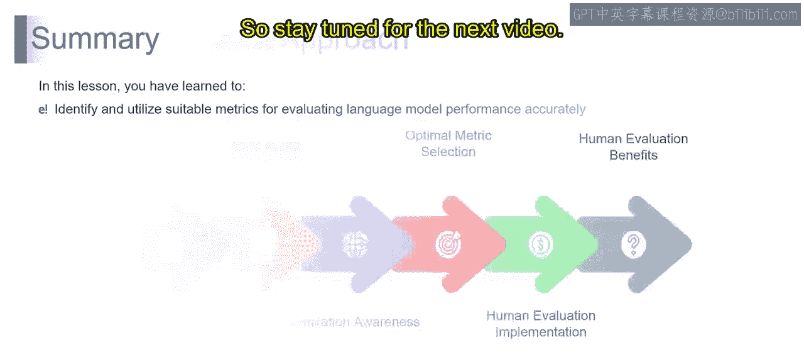

# 第二三四部分 95：选择正确的评估指标 🎯

在本节课中，我们将学习如何为大型语言模型选择正确的评估指标。评估模型性能就像指挥一场交响乐，每个指标都像一种独特的乐器，共同揭示模型的优势与不足。正确的指标选择至关重要，它能确保评估结果清晰、准确，避免产生误导。

## 定义评估目标 🎯

选择正确指标的第一步是明确你的目标。你需要问自己：你希望语言模型达成什么？不同的任务或应用可能优先考虑不同的方面，例如准确性、流畅性或创造性。明确目标有助于定制评估标准，使其与你的目的保持一致。

## 选择任务特定指标 📊

不同的任务需要与其特性特别相关的指标。例如：
*   **机器翻译** 可能强调 **BLEU分数**。
*   **创意写作** 任务则可能受益于评估流畅性、连贯性和风格的指标。

根据任务的具体要求定制指标，能确保评估更加精确。

## 进行平衡评估 ⚖️

实现平衡的评估至关重要。就像交响乐需要多种乐器才能奏出和谐之音，你的评估也应涵盖多种指标。将准确性指标与流畅性、连贯性和风格相关的指标结合起来，才能全面理解语言模型的性能。

## 考虑多方视角 👥

不同的利益相关者可能有不同的侧重点。开发者、用户和领域专家可能强调模型性能的不同方面。选择能够容纳这些不同视角的指标，可以确保评估全面且符合各方需求。

## 理解比较性指标 📈

将你的语言模型性能与基准或之前的版本进行比较，能提供有价值的背景信息。无论是与行业标准还是基准模型进行比较，这些比较性指标都能揭示模型的相对优势和劣势。

## 确保现实相关性 🌍

选择的评估指标应与现实世界场景和应用保持一致。考虑模型输出的实际影响，并选择那些能反映其在预期使用场景中性能的指标。

总而言之，选择正确的指标是一门艺术，需要深思熟虑地结合任务特定考量、平衡性以及对利益相关者不同视角的敏锐意识。就像一位技艺精湛的指挥家，选择和谐搭配的指标，能确保对语言模型性能进行全面且有意义的评估。

---

上一节我们探讨了如何选择评估指标，本节中我们来看看如何微调你的评估方法。

## 微调评估方法 🎛️

为大型语言模型微调评估方法，就像调整交响乐团中乐器的音准，需要精确和对和谐的敏锐感知。让我们探讨微调评估方法时的关键考量，以确保其与你的目标一致，并提供对语言模型性能的深入理解。

### 目标对齐

首先，使你的微调与目标对齐。清晰定义你的目标，并确保你的评估方法与之协调一致。无论你优先考虑准确性、流畅性还是任务特定的细微差别，一个良好对齐的方法能确保评估指标与你期望的结果产生共鸣。

### 理解指标类型

你需要了解可供使用的指标类型。不同的指标服务于不同的目的，有些强调准确性，有些则关注流畅性或创造性。熟悉各种指标类型，并根据你希望评估的语言模型性能的具体方面，策略性地选择或组合它们。

### 认识局限性

就像音乐家会根据乐器的局限性调整演奏方式一样，你需要理解所选指标的约束条件。承认某些指标可能存在不足或引入偏见的地方。这种意识能让你更准确地解读结果。

### 选择最优指标

考虑语言模型的具体任务或应用，选择最优的指标。例如：
*   翻译任务选择 **BLEU分数**。
*   语言建模任务选择 **困惑度**。
*   创意写作任务选择流畅性评估。

最优指标是能最好地捕捉你的模型在给定情境下性能细微差别的那个。

### 实施人工评估

将人工评估作为关键的微调要素。人类的判断能提供自动化指标可能缺乏的深度理解。审慎地实施人工评估，考虑语言模型性能中哪些方面最能从人类洞察中受益，将其作为你评估交响乐中的补充调音工具。

### 认识人工评估的优势

认识到人工评估的优势。人类的判断为评估过程带来了主观性、情境意识和可解释性。利用这些优势，可以深入了解流畅性、连贯性和风格细微差别等方面，这些是自动化指标可能无法完全捕捉的。

---

本节课中，我们一起学习了如何为大型语言模型选择和微调评估指标。我们了解到，评估需要像指挥交响乐一样，综合运用多种指标（如**BLEU**、**困惑度**），并平衡自动化评估与人工判断，才能全面、准确地衡量模型在准确性、流畅性等不同维度的表现。