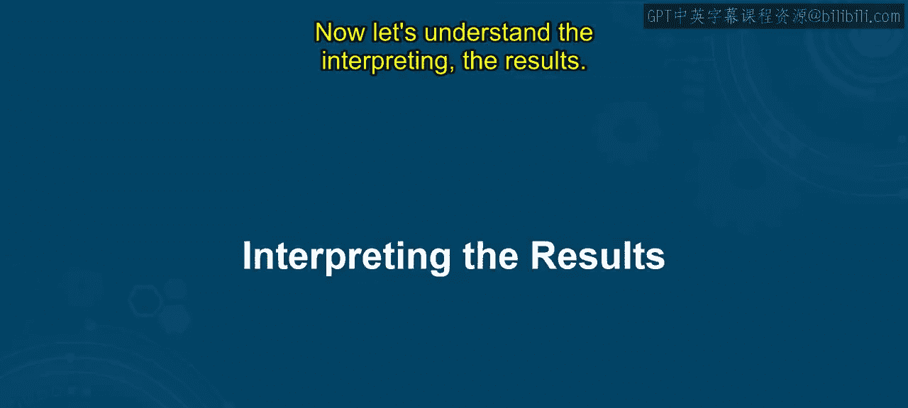
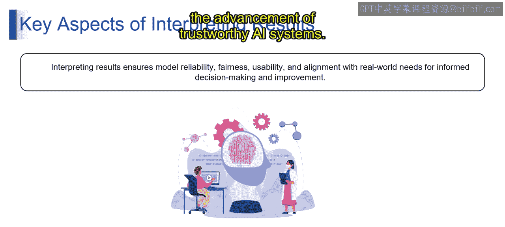

# 第二三四部分 96：解释结果

在本节课中，我们将学习如何解释语言模型的评估结果。理解这些结果是优化模型性能、发现其优缺点并做出明智决策的关键。

上一节我们介绍了语言模型评估的基本概念，本节中我们来看看如何具体分析和解读评估结果。

### 什么是解释结果？
解释结果涉及分析语言模型评估的产出，以深入了解其性能和有效性。这包括理解各项指标的含义、评估模型的优势与不足、识别改进领域，并基于评估发现做出明智决策。

有效的结果解释使研究人员和开发者能够改进语言模型、优化其性能，并解决特定的挑战或缺陷。

### 为何需要解释结果？
解释语言模型评估结果至关重要，原因如下：

以下是解释结果的主要价值：
*   **理解模型性能**：帮助开发者理解模型的优势与弱点，从而进行有针对性的改进和优化。
*   **评估关键方面**：通过评估模型的**泛化能力**、**鲁棒性**和**偏见**，确保模型能在多样化的场景和用户群体中可靠运行。
*   **促进透明与问责**：为模型的预测提供清晰的解释，从而增强用户和监管机构的信任。
*   **整合实际反馈**：结合用户反馈并考虑实际应用场景，确保模型能有效满足现实需求。
*   **预见长期影响**：从跨学科的视角评估长期影响，有助于预测并减轻模型广泛部署可能带来的伦理、社会及经济影响。

总而言之，解释LLM的结果有助于做出明智的决策、推动负责任的开发实践，并促进可信赖AI系统的发展。

本节课中我们一起学习了如何解释语言模型的评估结果，包括其定义、重要性以及具体价值。下一节视频我们将对此主题进行更详细的阐述。