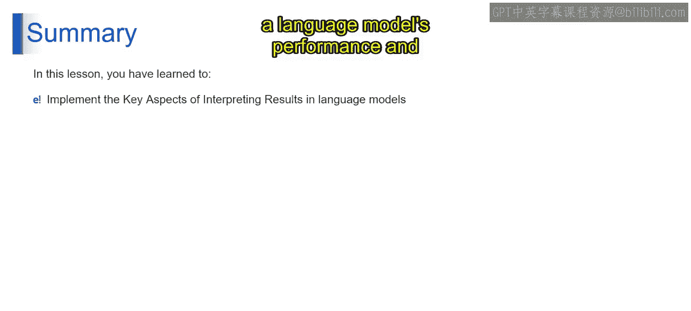
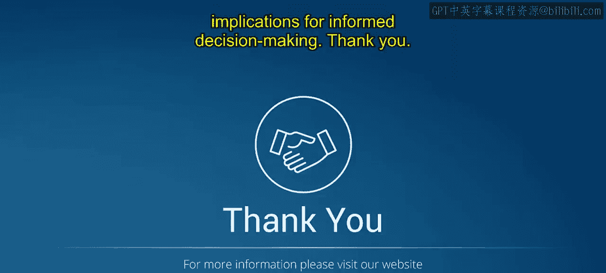

第2：解释结果的关键方面 🔍

在本节课中，我们将学习如何解释语言模型的结果。解释结果涉及评估多个关键方面，以确保模型的可靠性、公平性、可用性，并使其与现实世界需求保持一致。通过分析这些方面，相关方能做出明智的决策并找到改进的方向。

上一节我们介绍了语言模型的基础，本节中我们来看看解释模型结果时需要关注的核心维度。

以下是评估语言模型结果时需要关注的八个关键方面：

1.  **泛化能力**
    泛化能力指模型在**未经过明确训练的数据**上表现良好的能力。它衡量模型如何将其学到的知识应用到新的、未见过的示例上。
    *   **示例**：一个在权威新闻源文章上训练的语言模型，应该能够准确总结和理解来自其他未见过出版物的新文章。

2.  **鲁棒性**
    鲁棒性衡量模型在**变化条件下**（如输入含有噪声或对抗性干扰时）保持性能的能力。一个鲁棒的模型即使在输入存在扰动时也能表现一致。
    *   **示例**：用于情感分析的语言模型，即使在输入文本包含拼写错误或语法错误时，也应能准确分类情感。

3.  **偏见**
    偏见指模型输出中存在的**系统性错误或偏见**，通常源于训练数据中的偏见。解决偏见涉及识别并减轻对特定群体或特征的不公平对待。
    *   **示例**：用于招聘流程的语言模型，不应基于性别、种族或民族等因素，不成比例地偏向来自特定人口群体的候选人。

4.  **可解释性**
    可解释性指模型的预测能够被人类理解和解释的程度。一个可解释的模型能为其输出提供透明的推理过程，从而增强信任和可理解性。
    *   **示例**：用于医疗诊断的语言模型，应能为其预测提供解释，详细说明是哪些症状或因素促成了它的决策。

5.  **用户反馈**
    用户反馈涉及收集最终用户的见解和意见，以评估模型的可用性、有效性和整体满意度。它为优化和提升模型性能提供了宝贵的输入。
    *   **示例**：聊天机器人收集用户对其对话能力的反馈，帮助开发者识别改进领域，例如更准确地理解用户意图。

6.  **现实世界应用**
    这评估模型的输出在解决**实际任务、问题或需求**时，与各种领域实践的契合程度。它评价模型在应对现实世界挑战时的相关性和实用性。
    *   **示例**：为客服训练的语言模型，应能及时、准确地处理客户的咨询和投诉，从而影响客户满意度和留存率。

7.  **长期影响**
    长期影响考虑部署语言模型所带来的**更广泛的社会、伦理和经济影响**。它评估模型被广泛采用和使用后，在较长时间内可能产生的潜在后果。
    *   **示例**：部署用于内容推荐算法的大语言模型，可能对用户行为产生长期影响，逐渐塑造他们的观点和信念。

8.  **跨学科视角**
    跨学科视角涉及整合来自**不同领域的见解和观点**，以全面评估语言模型部署的影响和后果。通过考虑一系列视角和专业知识，它促进了负责任的开发和部署实践。
    *   **示例**：语言学家、心理学家、伦理学家和政策制定者合作，评估使用语言模型生成自动化新闻文章的伦理影响。

本节课中我们一起学习了评估语言模型结果的八个关键方面：泛化能力、鲁棒性、偏见、可解释性、用户反馈、现实世界应用、长期影响和跨学科视角。通过综合考虑这些方面，你可以获得对语言模型性能及其影响的全面理解，从而做出更明智的决策。