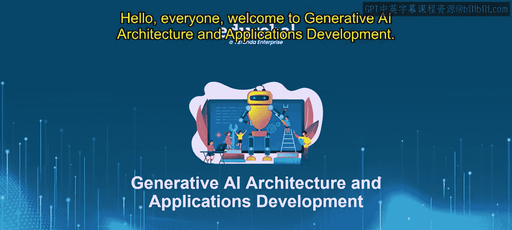
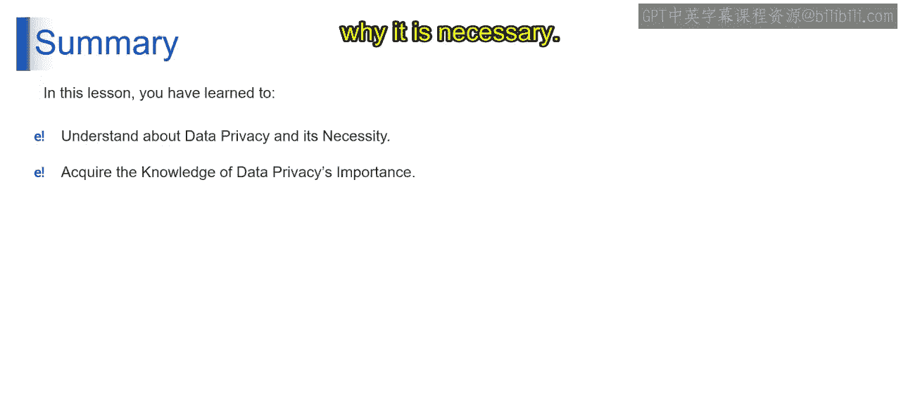
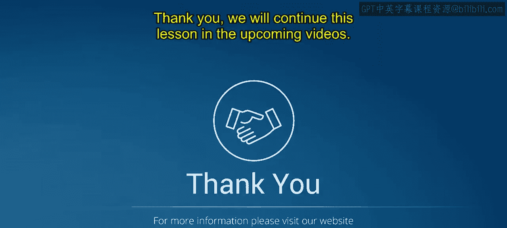

# 第二三四部分 98：数据隐私概述 🔒

在本节课中，我们将深入探讨数据隐私领域。这是一个与我们在线生活密不可分的概念。在个人信息如同货币一样宝贵的时代，理解数据隐私不仅重要，而且至关重要。

## 数据隐私简介

让我们从理解我们所要保护的内容开始。个人信息包括身份标识符，如你的姓名、地址或电话号码。敏感个人信息则更进一步，涵盖诸如你的健康史、种族或民族出身、性取向等细节。这些不仅仅是数据位，它们是我们在数字世界中的身份碎片。

那么，为什么你应该关心数据隐私？答案很简单。我们的个人信息是通往我们生活的门户。如果没有隐私保护措施，我们将面临从身份盗窃到歧视等一系列风险。数据隐私确保我们的信息保持其应有的状态。它是关于将控制权保留在我们自己手中，而不是那些可能不负责任地使用它的人手中。

## 数据隐私的核心原则

接下来，我们来看看数据隐私的核心原则。以下四个概念——数据保密性、数据保护、数据使用透明度和合规性——构成了我们日益数字化的世界中负责任和合乎道德的数据管理的基石。每个方面都在确保数据得到适当处理、尊重个人和组织的隐私与权利方面发挥着至关重要的作用。

让我们详细探讨每一个方面。

### 数据保密性

数据保密性类似于在可信赖的朋友之间保守秘密。在数据管理的背景下，它涉及确保敏感信息只能被有必要授权的人访问。这个概念在许多领域至关重要，例如医疗保健、金融和法律服务，在这些领域，个人或敏感数据需要防范未经授权的披露。

为了维护数据保密性，可以采用各种策略：
*   **访问控制**：严格的访问控制确保只有授权人员才能查看或操作敏感数据。
*   **加密**：对传输中和静态的数据进行加密，使其对未经授权的用户不可读。
*   **培训与意识**：定期培训员工，使其能够识别并避免潜在的保密性破坏。

### 数据保护

数据保护是关于构建数字堡垒来保护数据。这涉及实施措施，以保护数据免受未经授权的访问、盗窃、损坏或篡改。数据保护不仅仅是保持数据机密，还要确保其完整性和可用性。

数据保护的关键要素包括：
*   **物理与网络安全**：保护物理服务器，并使用防火墙和入侵检测系统来保护网络。
*   **定期备份**：确保数据定期备份，以防因硬件故障、自然灾害或网络攻击而造成损失。
*   **反恶意软件工具**：使用最新的防病毒和反恶意软件来保护数据免受恶意攻击。

### 数据使用透明度

数据使用透明度意味着对数据如何被使用保持清晰和开放。这对于与用户和客户建立信任至关重要。透明度包括告知个人收集了哪些数据、如何处理以及用于何种目的。

为了实现透明度，可以采取以下措施：
*   **清晰的隐私政策**：组织应制定清晰易懂的隐私政策，告知用户数据使用情况。
*   **用户同意**：在收集或使用用户数据之前，尤其是在用于最初未同意的目的时，获得用户的明确同意。
*   **开放沟通**：定期就数据使用政策或实践的任何变更与用户沟通。

### 合规性

合规性是指遵守管理数据保护和隐私的法律法规。这在不同地区和行业有所不同，但普遍至关重要。合规性确保组织尊重为数据使用和处理设定的法律界限。

合规性涉及以下方面：
*   **保持信息更新**：及时了解相关的数据保护法律法规，例如欧洲的GDPR或加州的CCPA。
*   **定期审计**：定期进行审计，以确保遵守这些法律和内部政策。
*   **实施法律框架**：制定和实施符合法律要求的政策和程序。

这四个方面相互依存，对于当今数字环境中的负责任数据管理至关重要。它们共同构成了一种全面的数据处理方法，尊重个人隐私、确保数据安全、保持透明度并遵守法律和道德标准。随着技术和数据使用的不断发展，这些原则的重要性只会增加，这突显了在数据管理实践中需要持续保持警惕和适应。

## 忽视数据隐私的后果

那么，你知道当数据隐私不被认真对待时会发生什么吗？后果可能从个人伤害到社会不信任。忽视数据隐私的企业和政府可能会滥用信息，导致信誉丧失和法律后果。

在我们互联的世界中，数据隐私不仅仅是一个技术问题，更是一个个人问题。我们每个人在保护我们的数字自我方面都扮演着角色。无论你是技术爱好者、普通互联网用户还是商业领袖，理解和倡导数据隐私对于确保一个安全、可靠和值得信赖的数字未来至关重要。

## 总结

本节课到此结束，我们学习了数据隐私及其必要性。我们也理解了它在日常生活中的重要性。我们将在接下来的视频中继续本课程的学习。