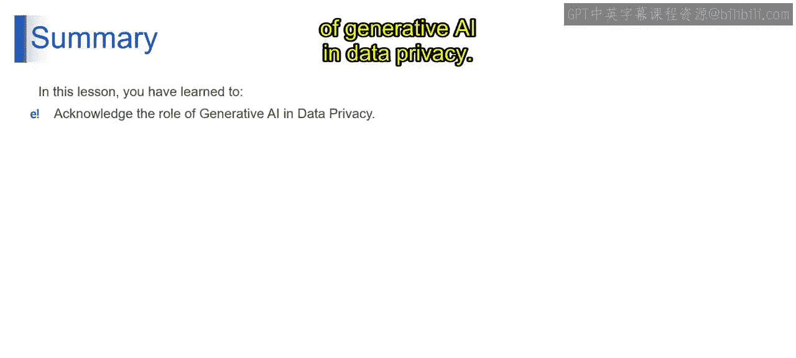

# 第二三四部分 99：理解生成式AI在数据隐私中的角色 🔒

在本节课中，我们将探讨生成式人工智能如何革新我们保护数据安全的方式。我们将了解其在威胁检测、事件响应和自动化任务中的具体应用，并理解它如何作为一个动态的、自适应的防护盾。

---

### 概述

生成式AI模型，如同网络世界中的先进雷达系统，不仅能够检测已知威胁，还能预测潜在威胁。这是通过对海量数据中的模式和行为的复杂分析实现的。与传统依赖已知威胁数据库的签名式方法不同，AI驱动的解决方案采用机器学习算法来识别可能预示新的、未知威胁的异常情况。这种预测能力允许早期干预，从而可能在网络攻击者执行其计划之前将其阻止。

---

### 威胁检测与预防

上一节我们介绍了生成式AI的预测能力，本节中我们来看看它在具体威胁检测场景中的应用。

以下是生成式AI在威胁检测方面的三个核心应用：

1.  **异常行为检测**
    假设一个网络安全系统使用AI监控网络流量。它检测到在非正常时间发生的一种不寻常的数据传输模式，这偏离了公司的典型数据使用模式。该系统会向安全团队发出警报，随后团队发现了一次正在进行的数据泄露企图并加以阻止。这种早期检测之所以可能，是因为AI学习了正常的数据模式并能识别异常。

2.  **恶意软件检测**
    在恶意软件检测方面，生成式AI将防病毒解决方案从反应式工具转变为主动式工具。传统防病毒软件依赖已知恶意软件签名数据库来识别威胁。然而，生成式AI可以分析代码特征，并预测其是否具有恶意，即使它是从未见过的新变种。
    假设一个AI驱动的防病毒程序在安装前扫描一个新的软件应用程序。虽然该软件不在任何恶意软件数据库中，但AI识别出代码中类似于恶意软件行为的可疑特征，例如试图访问和加密文件。防病毒软件将该软件标记为潜在恶意，从而防止了一次潜在的勒索软件攻击。

3.  **网络钓鱼预防**
    网络钓鱼攻击以欺骗性强且不断演变而著称。生成式AI通过不仅分析电子邮件内容和附件中的恶意意图，还分析发送者的行为和模式，来增强电子邮件安全系统。这种全面的审查使得网络钓鱼企图更难不被察觉地通过。

---

### 事件响应与自动化

了解了威胁检测，接下来我们看看生成式AI如何在安全事件发生后以及日常安全维护中发挥作用。

1.  **自动化事件响应**
    当发生安全漏洞时，响应速度至关重要。生成式AI有助于自动化事件响应的早期阶段。这包括隔离受影响的系统以防止漏洞进一步扩散、收集和分析取证数据以了解攻击的性质，以及及时通知安全团队。

2.  **安全编排**
    AI驱动的安全编排平台旨在集成各种安全工具和系统，使它们能够协同工作。这种编排确保了对安全事件的响应不仅更快，而且在整个IT环境中更全面、更协调。

3.  **自动化常规任务**
    生成式AI在自动化常规但至关重要的网络安全任务方面发挥着重要作用，例如定期安全检查、漏洞评估和系统更新。这种自动化使安全专业人员能够专注于更复杂和更具战略性的任务。

4.  **补丁管理**
    在补丁管理领域，AI的作用至关重要。它可以根据威胁的严重性和组织IT环境的具体情况，对软件补丁进行优先级排序。这种智能优先级排序确保首先处理最关键的漏洞，从而降低被利用的风险。

5.  **零日漏洞应对**
    零日漏洞是先前未知的安全缺陷，代表着重大挑战。生成式AI就像一个不知疲倦的侦探，不断审查代码和系统行为，以识别潜在的漏洞模式。通过主动寻找这些潜在威胁，AI有助于在攻击者利用零日漏洞之前降低其带来的风险。

---

### 总结

本节课中，我们一起学习了生成式AI在数据隐私和安全领域的核心角色。总而言之，生成式AI不仅仅是一个工具，更是数据隐私和安全领域一个动态的、自适应的防护盾。它预测、检测、响应和自动化的能力改变了我们处理数据安全的方式，使其更加稳健、智能和高效。随着我们继续将生成式AI整合到网络安全策略中，我们正迈向一个由先进的主动防御来保护数据和系统的未来，使其在不断演变的网络威胁环境中更具韧性。