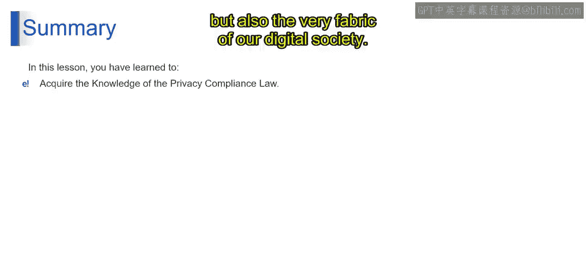

# 第二三四部分 100：深入探讨隐私合规法 🔒

在本节课中，我们将探讨生成式AI，特别是大语言模型，在数据隐私法规领域所面临的核心挑战。我们将重点关注“被遗忘权”这一概念，并分析其对企业和个人带来的影响。

---

## 大语言模型的数据遗忘难题

上一节我们介绍了生成式AI的基本应用，本节中我们来看看其在隐私合规方面的核心挑战。大语言模型无法选择性地遗忘特定数据点，这构成了显著的数据暴露风险。在基于海量数据集进行训练的过程中，这些模型可能会吸收并整合敏感的个人信息，例如姓名和出生日期。

一旦这些数据成为模型知识库的一部分，就无法被单独移除或“遗忘”。对于使用这些模型的企业而言，这种局限性是一个重大的隐私隐患。

## 隐私泄露风险与应对策略

如果大语言模型无意中再现了个人信息，就可能导致隐私泄露。这种风险在医疗和金融等行业尤为突出，因为此类泄露可能引发严重的法律和声誉后果。

为了降低这种风险，企业必须采取以下措施：

*   **数据预处理**：在训练模型前，仔细处理数据以移除敏感细节。
*   **持续监控**：持续监控模型输出，防止未经授权的数据泄露。

## 法规遵从性挑战：“被遗忘权”

此外，大语言模型当前的限制也给遵守数据保护法规带来了挑战，例如欧盟《通用数据保护条例》中的“被遗忘权”。该法规赋予个人要求公司从其记录中删除其个人数据的权利。

接下来，让我们看看不同司法管辖区的“被遗忘权”。在欧盟、阿根廷和菲律宾等地区，隐私法规都支持个人的“被遗忘权”。这项权利允许个人要求从系统中移除或删除其个人信息。

然而，由于大语言模型缺乏“删除”功能，企业面临两难境地：遵守这些请求可能意味着需要从头开始重新训练模型，这是一项既耗时又成本高昂的任务。

## 聚焦GDPR：严格的全球隐私法

现在，让我们更仔细地审视欧盟的《通用数据保护条例》，这是全球最严格的隐私法之一。GDPR不仅赋予个人访问、更正和删除其数据的权利，还允许他们反对自动化决策。

这对使用大语言模型的公司增加了另一层复杂性。这里的挑战是双重的：既要确保大语言模型遵守这些权利，又要在先进的AI技术与严格的隐私规范之间找到平衡。

## 未来展望：技术与法规的对话

随着技术的进步，AI发展与隐私法规之间的对话变得越来越重要。企业将如何适应？大语言模型能否进化以满足这些隐私标准？大语言模型的未来取决于能否找到这些紧迫问题的解决方案。

---

本节课中，我们一起学习了隐私法规对大语言模型提出的严峻挑战。尽管大语言模型在隐私法律领域的征途充满挑战，但也充满了创新的机遇。作为技术爱好者，我们必须保持关注并积极参与这场不断发展的对话。技术进步与个人隐私权之间的平衡，不仅将塑造AI的未来，也将决定我们数字社会的基本结构。