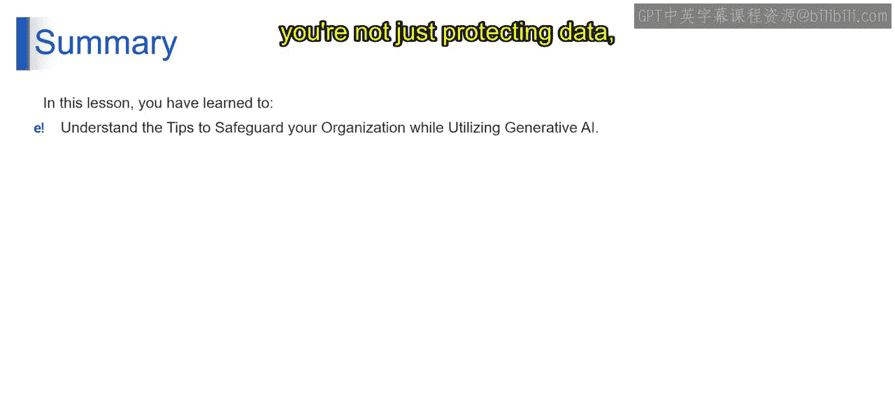

# 第二三四部分 102：保护组织的技巧 🔒

在本节课中，我们将学习如何在使用强大的生成式AI工具时，确保组织数据和系统的安全。我们将探讨一系列关键策略和最佳实践，帮助您在利用生成式AI巨大潜力的同时，有效防范风险。

上一节我们介绍了生成式AI的基本概念，本节中我们来看看如何安全地使用这些工具。

## 遵守准则并明智分享

保护组织的第一步，是严格遵守与生成式AI使用相关的内部准则和政策。这不仅是合规要求，更关乎明智的信息披露。只分享必要的信息，并避免涉及敏感或机密内容。这种遵守与审慎的平衡，不仅满足监管要求，也体现了对组织价值观的承诺，是防范数据漏洞的一道屏障。本质上，这是在专业环境中知情、谨慎且负责任地使用先进技术。

## 仔细审查隐私政策

深入研究生成式AI工具的隐私政策需要一个全面的方法，涵盖以下几个关键方面：
*   **数据保护评估**：评估工具如何保护您输入的数据，包括是否采用强加密和访问控制，以及其安全措施是否符合现行标准。
*   **政策清晰度**：政策应清晰地解释收集哪些数据、如何使用以及保留期限。
*   **法规合规性**：验证工具是否符合GDPR或HIPAA等数据保护法规，以确保其满足数据隐私和用户权利的法律标准。

这种详细的审查使组织和个人能够选择不仅满足功能需求，而且符合严格数据安全和隐私要求的工具。

## 保持工具更新

将每次更新视为对工具防御墙的加固，使其更能抵御安全漏洞和程序错误的“围攻”。这些威胁如同不断设计新方法突破防线的入侵者。定期更新不仅是添加新功能，更重要的是修补已发现的防御弱点。在威胁快速演变的数字世界中，这种主动方法至关重要。保持更新本质上是让您的数字堡垒保持全副武装和准备就绪，确保您的数据（即您的数字财富）的安全与效率。因此，将更新视为第一道防线不仅明智，而且对AI工具的长期安全和稳定至关重要。

## 注销并检测异常活动

在共享环境中使用生成式AI工具后，始终注销是一个简单而有效的安全步骤。但不止于此，定期监控工具的活动日志以查找任何异常模式是关键。如果发现任何异常，需要立即采取行动。这种警惕是一种主动的安全方法。

## 使用强且唯一的密码

将密码视为您在线信息的特殊钥匙。制作强大且为每个登录使用不同的密码非常重要。这意味着使用字母、数字和符号的组合，并且不在各处使用相同的密码。将您的密码想象成只有您知道的秘密代码。经常更改密码就像定期更换门锁，使他人更难闯入。这听起来可能很简单，但为每个账户设置强大、唯一的密码，就像筑起一道高墙，保护您的在线资产免受不应访问之人的侵害。这是您在线保护信息所能做的最好的事情之一。

## 总结

在本节课中，我们一起学习了如何在安全的前提下驾驭生成式AI的世界。这需要将明智的实践与警惕性结合起来。通过遵循这些技巧，您不仅是在保护数据，更是在维护组织的完整性和信任。让我们共同致力于一个安全且创新的未来。我们将在接下来的视频中探讨其他主题。