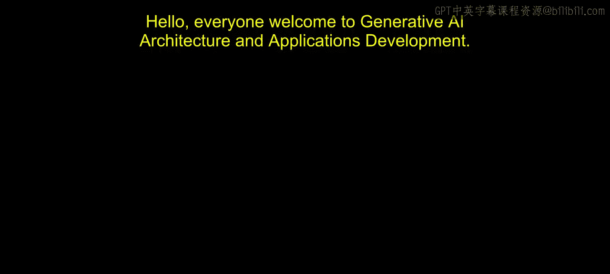
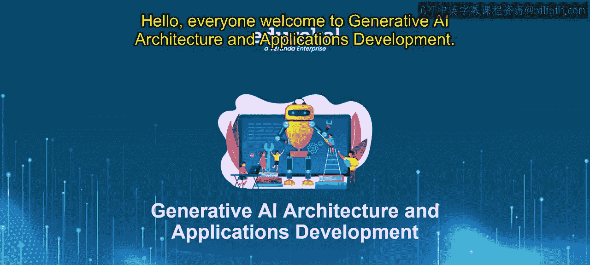
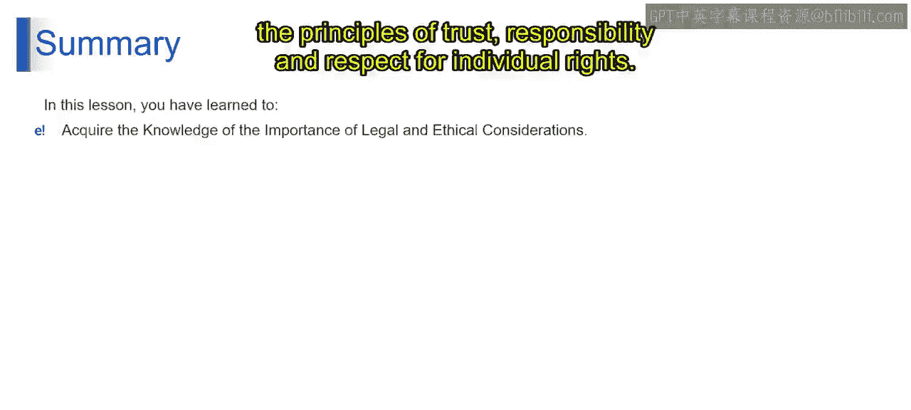

# 第二三四部分 103：伦理与法律考量的重要性 🧭

在本节课中，我们将探讨生成式AI发展与应用中至关重要的伦理与法律考量。我们将重点了解处理个人数据的原则，以及如何遵守GDPR、CPRA和《欧盟人工智能法案》等关键法规。

---

## 概述：生成式AI的浪潮与责任

生成式AI正在彻底改变我们与技术互动的方式，创造了一个机器能够思考、学习和创造的世界。然而，这种前所未有的进步也带来了一系列伦理和法律挑战。这不仅关乎AI能做什么，更关乎确保其以负责任的方式、在法律框架内行事。

上一节我们介绍了生成式AI的基本概念，本节中我们来看看伴随其发展而来的核心法律与伦理框架。

---

## GDPR详解：数据保护的全球标杆 📜

《通用数据保护条例》（GDPR）代表了数据隐私法的重大发展，为个人信息处理设定了新的全球标准。对于使用生成式AI的实体而言，遵守GDPR不仅是建议，更是法律要求。该条例围绕几个关键原则构建，旨在保护个人隐私。

以下是GDPR的核心原则：

*   **合法、透明、公平处理**：要求个人数据的处理必须合法、透明且公平，确保任何数据处理行为对相关方而言都是合理且清晰的。
*   **数据完整性与保密性**：强调数据的完整性和保密性，要求采取强有力的保护措施，防止未经授权的访问、丢失或损坏。
*   **问责制原则**：引入了问责制原则，要求数据控制者能够主动证明其遵守了所有相关规定。

对于生成式AI应用，这意味着需要透明的数据处理方法，并确保个人的数据访问权、更正权或删除权得到维护。

---

## CPRA：美国加州的隐私权利法案 🛡️

跨越大洋来到美国，《加州隐私权利法案》（CPRA）与GDPR精神相似。它在赋予消费者对其个人信息的更多控制权方面向前迈进了一步。对于利用生成式AI的企业而言，这转化为保护用户数据和尊重其隐私选择的高度责任。

遵守CPRA不仅是为了避免处罚，更是为了建立信任和维护数据处理方面的道德标准。通过遵守CPRA，公司展示了其对道德数据实践的承诺，这可以显著提升其声誉和消费者信任。在生成式AI等数据驱动技术的时代，这种对道德数据处理和消费者隐私的承诺，成为可持续和负责任商业实践的基石。

---

## 《欧盟人工智能法案》：风险分级治理 🏛️

《欧盟人工智能法案》代表了AI监管领域开创性的一步，直接应对AI技术带来的复杂性和挑战。该法案以其细致入微的AI治理方法而突出，认识到并非所有AI系统都构成相同级别的风险。它将AI应用分为不同的风险等级，并建立相应的监管要求，强调在促进创新与确保安全及道德标准之间取得平衡。

以下是《欧盟人工智能法案》的关键方面：

*   **基于风险的分类**：AI系统被分为四个风险类别，即**不可接受风险**、**高风险**、**有限风险**和**最小风险**。每个类别都有特定的监管要求，对高风险和不可接受风险类别的控制最为严格。
*   **对不可接受风险的禁止**：被认为构成不可接受风险的AI实践被禁止。例如，使用潜意识技术操纵人类行为以绕过用户自由意志的AI系统，以及政府使用的社会信用评分系统。
*   **对高风险AI的严格要求**：用于关键基础设施、就业、重要私人和公共服务、执法、移民和庇护等领域的高风险AI系统，需遵守严格的合规要求。这些要求包括确保**数据质量、透明度、人类监督、鲁棒性、准确性和安全性**。
*   **特定AI系统的透明度义务**：与人类互动的AI系统（如聊天机器人）或用于生成、操纵图像、音频或视频内容的AI系统，必须以明确告知用户正在与AI互动的方式设计。

对于那些开发或部署生成式AI的公司而言，遵守《欧盟人工智能法案》至关重要。这意味着要确保AI系统，特别是那些被归类为高风险的AI系统，其设计和运行方式尊重基本权利、安全和道德标准。该法案强调，AI创新不能脱离其社会影响而进行。通过遵守这些法规，AI的开发者和使用者不仅是在满足法律要求，也是在为负责任地开发和部署AI技术做出贡献。

---

## 总结与展望

总而言之，在我们拥抱生成式AI卓越能力的同时，也必须致力于遵循指导其使用的伦理和法律框架。这样做，我们不仅是在遵守法律，更是在秉持信任、责任和尊重个人权利的原则。

本节课中我们一起学习了生成式AI领域三大核心法律框架：GDPR、CPRA和《欧盟人工智能法案》。它们共同强调了在AI创新中融入透明度、问责制和风险管理的必要性。在接下来的课程中，我们将继续探讨生成式AI的其他重要方面。