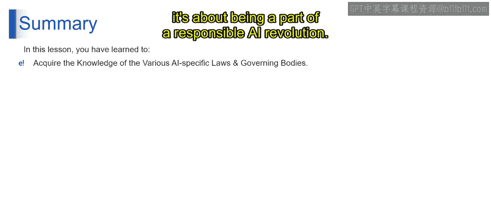

# 第二三四部分 104：AI特定法律与监管机构 👨⚖️

在本节课中，我们将学习全球范围内针对人工智能制定的特定法律与监管框架。理解这些法规不仅是合规的必要条件，也是迈向负责任创新的关键一步。

随着人工智能持续融入生活的方方面面，理解这些法律变得至关重要。接下来，我们将深入探讨复杂的AI监管体系，以及它们对AI未来发展的意义。

## 上海AI法规 🇨🇳

上海的人工智能法规标志着中国在AI治理方面迈出了进步的一步。该法规强调了伦理化AI开发的必要性，其核心原则聚焦于**透明度、公平性和问责制**。通过优先考虑这些价值观，上海不仅利用AI推动技术进步，还确保这种进步符合伦理标准。

对于企业而言，这意味着需要将这些原则整合到AI开发和部署的每一个阶段。具体包括：
*   透明地沟通AI系统的运作方式。
*   确保AI驱动的决策公平且无偏见。
*   对这些系统的结果负责。

上海的做法鼓励了AI的平衡发展，即在发挥其潜力的同时，防范伦理风险。

## 加拿大C-27法案 🇨🇦

上一节我们了解了上海的法规，本节我们来看看加拿大的立法。加拿大的C-27法案在塑造负责任的AI生态系统方面迈出了重要一步。这项专注于实施《数字宪章》的立法，高度重视**用户同意、透明度以及对个人数据的控制**。它承认了AI与个人数据之间的复杂关系，并倡导建立一个负责任处理这种关系的框架。

对于在加拿大境内使用AI的实体，这意味着：
*   确保AI系统的开发和使用尊重用户隐私和自主权。
*   要求明确的数据使用同意协议。
*   透明化AI系统如何利用数据。
*   赋予用户对其个人信息的控制权。

因此，C-27法案不仅指导AI的使用，还旨在建立AI系统与公众之间的信任关系。

## 欧盟AI法规 🇪🇺

欧盟的AI法规是一个全面的立法框架，旨在管理整个欧盟范围内的人工智能。该法规根据风险对AI系统进行分类，并对**高风险AI应用**施加严格的要求。这是一项具有前瞻性的法规，力求在促进AI技术安全可信使用的同时，最大限度地降低相关风险。

对于欧盟的AI开发者和用户而言，这意味着需要根据法规对AI系统进行全面评估。高风险AI系统（例如用于医疗保健、交通或执法的系统）必须遵守严格的合规要求，包括：
*   确保AI系统的**准确性、透明度和鲁棒性**。
*   实施保护用户权利和防止损害的措施。

这项法规使欧盟在倡导伦理AI方面处于领先地位，为全球AI治理树立了标杆。

## 英国数据保护与数字信息法案 🇬🇧

接下来，我们转向英国。英国的《数据保护与数字信息法案》旨在应对数字时代数据保护的挑战，并特别关注人工智能。该立法强调了**保障数据安全、维护个人数据权利以及负责任部署AI技术**的重要性。

对于英国的企业，这转化为以下需求：
*   采取严格的数据安全措施。
*   确保以最大的谨慎和尊重处理个人数据。
*   以尊重个人数据权利和隐私的方式开发和使用AI系统。

该法案鼓励在AI领域创新，但必须在一个安全、尊重隐私且符合数据保护标准的框架内进行。

## 巴西AI监管框架草案 🇧🇷

这是南美洲为建立AI开发伦理准则所做的开创性努力。该框架强调AI应用中的**透明度、问责制和对人权的尊重**，反映出人们日益认识到需要伦理准则来引导AI向正确方向发展。

对于巴西的公司和AI从业者，遵循此框架意味着将这些伦理原则嵌入其AI项目中。具体包括：
*   对AI系统的工作方式保持透明。
*   确保这些系统对其行为和决策负责。
*   在所有AI应用中尊重人权。

该框架旨在创建一个不仅先进，而且以伦理为基础的AI生态系统。

## 纽约市第144号地方法律 🇺🇸

最后，我们来看一项城市层面的法规。纽约市的第144号地方法律是一项开创性的市政法规，针对AI在招聘过程中的作用。该法律强制要求对用于招聘的AI系统进行**偏见审计**，体现了消除AI驱动决策中歧视的承诺。

对于在纽约使用AI进行招聘的企业，这意味着需要实施严格的检查，以确保AI系统没有偏见。该法律旨在通过确保招聘过程中使用的AI工具公正无偏，来促进公平公正的招聘实践。这是将AI打造为促进包容性机会工具的重要一步，为其他城市和地区的AI监管树立了榜样。

## 总结

本节课中，我们一起学习了全球多个司法管辖区的AI特定法律与监管机构。每一项法规都突显了全球对建立AI伦理和法律框架必要性的日益增长的认识。它们代表了集体的努力，以确保AI技术在进步的同时，能够以负责任、合乎伦理且尊重个人权利和社会价值观的方式进行。

正如我们所看到的，全球范围内的AI特定法律和法规差异很大，但它们拥有共同的目标：确保AI以合乎伦理、透明且有益于社会的方式发展。了解这些法律不仅关乎合规，更是参与负责任AI革命的一部分。