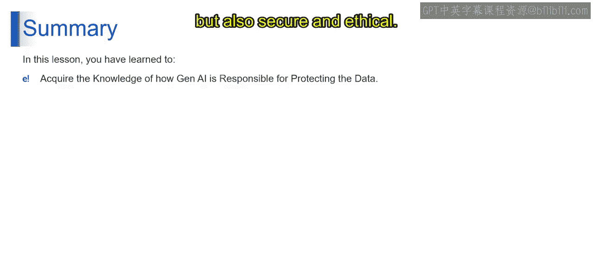

# 第二三四部分 105：生成式AI保护数据的责任

在本节课中，我们将学习生成式AI在数据保护方面的双重角色与责任。我们将探讨如何通过保持警惕、获取信息和保持警觉，在享受生成式AI益处的同时，维护一个安全、合乎道德的数据环境。

## 🤖 生成式AI的力量与责任

生成式AI是现代组织环境中的一股变革性力量。它肩负着双重使命，其作用远不止于提升效率。随着这些AI系统日益融入各种工作流程，它们不仅革新了生产力、激发了创造力，还承担起了数据安全与隐私保护的关键角色。

生成式AI的力量在于其分析、预测和自动化复杂任务的高级能力，从而简化操作并释放新的创造潜力。然而，伴随这种力量而来的是保护其所处理数据的重大责任。当这些工具与广泛多样的数据集交互时，它们会接触到敏感和个人信息，这使得它们在数据保护方面的角色至关重要。

因此，有效利用生成式AI需要深刻理解其对数据隐私和安全的影响。组织必须确保，在利用生成式AI提高效率和创新的同时，不会忽视实施强大数据治理框架的重要性。这包括遵守监管标准、确保AI流程的透明度，以及嵌入强大的数据保护措施。

承认并应对生成式AI作为业务进步的推动者和数据完整性的守护者这双重方面，是至关重要的。

上一节我们介绍了生成式AI的双重角色，本节中我们来看看如何确保数据隐私与保护。

## 🔒 确保生成式AI的数据隐私与保护

那么，我们如何确保生成式AI有助于数据保护呢？这始于对AI系统能力和局限性的透彻了解。了解生成式AI如何处理、存储和利用数据，是保护信息的第一步。

接下来，实施强大的数据治理政策至关重要。这些政策应规定生成式AI应如何处理敏感信息，确保遵守如GDPR或CCPA等数据保护法规。此外，在AI系统内部采用加密和其他安全措施，可以进一步加固数据，防范潜在的泄露。

## 🛡️ 保持警惕、获取信息和保持警觉的重要性

生成式AI融入各行各业，要求我们具备高度的警惕性、信息获取能力和警觉性，这三项原则对于安全、合乎道德地使用AI至关重要。

**在生成式AI的语境下，“保持警惕”** 意味着对AI系统进行持续和主动的监控。这包括观察任何异常或潜在有害的活动，例如意外的输出、决策中的偏见或数据泄露的迹象。关键在于建立能够快速识别并响应这些异常情况的系统。

**“获取信息”** 超越了基本理解AI功能。它包含对不断发展的AI技术和数据保护法律领域的深入且持续的参与。这意味着要随时了解AI的最新进展，理解新发展可能如何影响现有系统，并关注不断变化的监管环境。一个信息灵通的方法使组织能够预见并适应AI领域的新挑战和机遇。

**“保持警觉”** 在此语境下，是指对更新和完善AI系统及其相应安全协议采取积极主动的立场。仅仅设置好AI系统就置之不理是不够的。警觉性要求定期审计这些系统，以确保它们按预期运行，并且不偏离道德或法律标准。它还涉及持续的员工培训和教育，确保组织中的每个人都理解自己在维护AI系统完整性和安全性方面的角色。

此外，在组织内部培养数据隐私文化至关重要。这意味着在AI部署和使用的每个方面，都要优先保护个人和敏感信息。

本质上，保持警惕、获取信息和保持警觉三者结合，形成了一种管理生成式AI的综合方法。这种三合一的策略不仅能保护组织免受与AI相关的潜在风险，还能与利益相关者建立信任，巩固组织在数字化转型时代作为一个负责任、有远见的实体的声誉。

## 📝 总结

在本节课中，我们一起学习了生成式AI在数据保护中的核心责任。我们探讨了生成式AI作为效率工具和数据守护者的双重角色，并学习了通过**了解系统、制定政策、实施加密**来确保数据安全。我们强调了**保持警惕（持续监控）、获取信息（跟进发展）和保持警觉（主动维护）** 这三项原则的重要性。

总而言之，当我们利用生成式AI的变革力量时，也要倡导其在保护数据方面的作用。通过获取知识，并培养一种意识和警觉的环境，我们可以确保我们与生成式AI的旅程不仅是高效的，也是安全和合乎道德的。

感谢您参与这场关于在AI时代平衡创新与责任的重要讨论。我们将在接下来的视频中继续后续课程。

