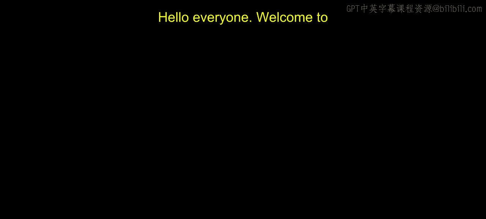
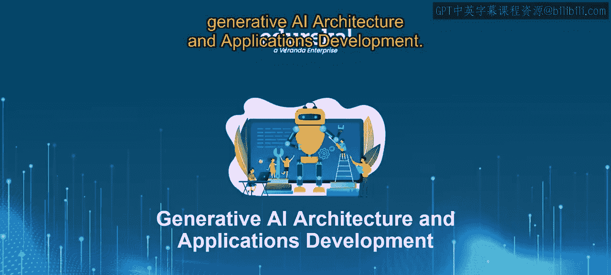
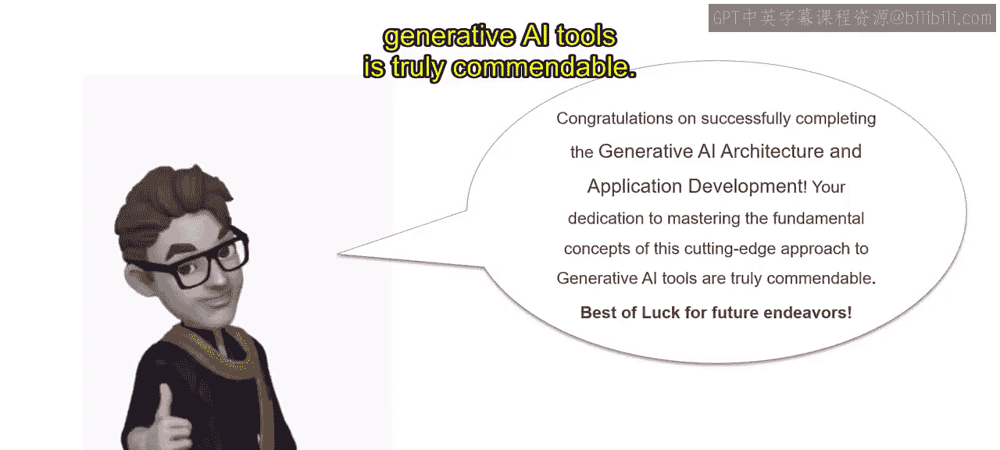

# 第二三四部分 106：课程总结





在本节课中，我们将回顾整个生成式AI架构与应用开发课程的核心内容，总结所学知识，并展望未来的应用前景。

---

### 课程概述

本课程全面探讨了生成式AI的各个方面。我们从探索基于大语言模型的生成式AI开始，理解了如何利用LLM进行搜索、预测和生成任务。随后，我们深入学习了用于LLM应用开发的LangChain平台，并通过实践环节学习了如何使用LangChain与数据进行交互。此外，我们还涵盖了LLM性能评估，并探讨了生成式AI在数据隐私和生产环境中的应用。

---

### 核心模块回顾

上一节我们介绍了课程的整体框架，本节中我们来详细回顾每个核心模块的内容。

以下是各模块的关键要点：

1.  **生成式AI与LLMs基础**
    *   我们探索了生成式AI的基本原理及其应用，重点聚焦于大语言模型在文本生成中的核心作用。核心概念可表示为：**生成式AI = 模型（如LLM） + 创造性任务**。

2.  **LLMs的搜索、预测与生成**
    *   我们深入研究了如何利用LLM执行多样化任务，例如搜索、预测和文本生成，展示了它们在自然语言处理领域的强大通用性。

3.  **LangChain：LLM应用开发平台**
    *   我们介绍了LangChain作为一个用于开发基于LLM的应用程序的综合平台，强调了其简化应用开发与部署流程的特性。一个简单的代码示例如下：
        ```python
        from langchain.llms import OpenAI
        llm = OpenAI(model_name="gpt-3.5-turbo")
        response = llm("请解释一下机器学习。")
        print(response)
        ```

4.  **使用LangChain与数据进行交互**
    *   我们研究了使用LangChain和检索增强生成模型与数据集成的高级技术，重点关注数据处理和利用策略。

5.  **评估LLM性能**
    *   我们探讨了评估LLM性能的各种方法，包括使用BLEU、ROUGE等指标以及人工评估，以确保建立稳健的评估体系。

6.  **生成式AI的数据隐私与生产部署**
    *   我们讨论了生成式AI应用中数据隐私和保护的关键方面，探讨了在LLM使用背景下保护敏感数据的策略与技术。

---

### 课程总结与展望

通过全面覆盖以上主题，学习者已经获得了对生成式AI基础的全面理解，并掌握了在实际场景中高效利用LLM的实用技能。

完成本课程为AI工程师、机器学习工程师、数据科学家、应届生及其他相关角色开启了充满可能性的世界。前方多样化的机遇极具前景，为在生成式AI领域探索和成长提供了丰富的路径。

最后，祝贺你完成生成式AI架构与应用开发课程。你致力于掌握这一前沿生成式AI工具的基本概念、架构与应用开发，这份努力值得称赞。

祝大家好运。

---




本节课中我们一起回顾了生成式AI架构与应用开发课程的全部核心内容，从基础概念到实际应用开发，再到性能评估与生产部署。希望你已准备好将这些知识应用于实践，在生成式AI的领域不断探索。