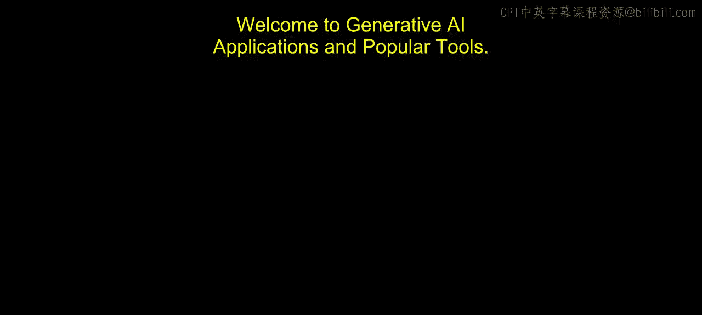
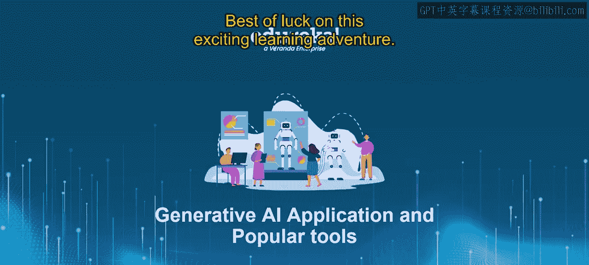
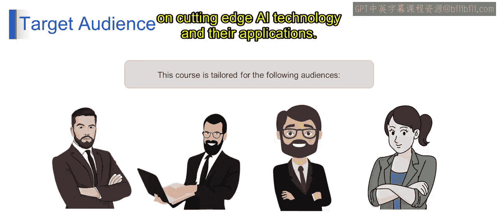
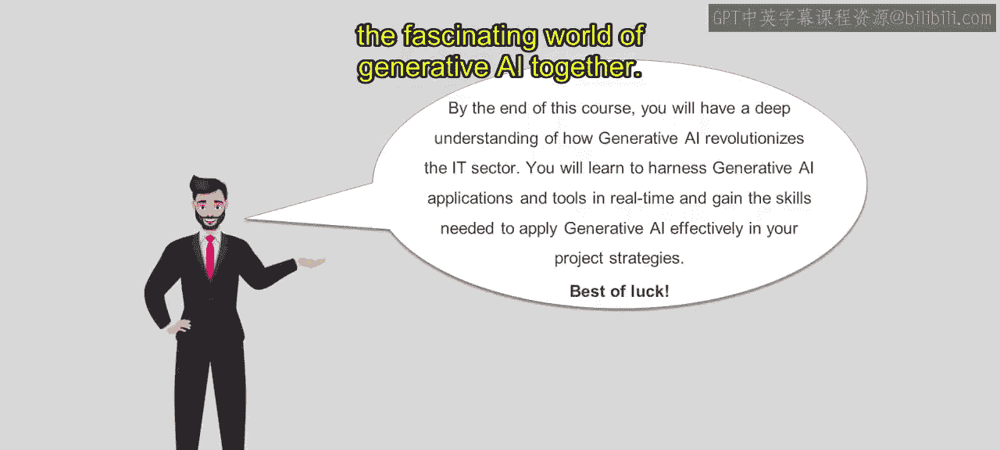

# 第二三四部分 107：课程简介 🚀

在本节课中，我们将对《通过LLMs学习生成式AI》这门课程进行整体介绍。您将了解课程的核心目标、涵盖的主要模块以及它适合的学习者群体。

欢迎来到生成式AI应用与流行工具的课程。这是一次深入生成式AI动态领域的全面探索之旅。本课程经过精心设计，旨在为机器学习/人工智能工程师、数据科学家、初学者以及计算机科学专业的学生提供深刻的理解，了解生成式AI如何革新IT行业。到本课程结束时，您不仅能掌握生成式AI的变革性力量，还将获得在实际项目策略中有效应用生成式AI所需的实践技能。祝您在这段激动人心的学习之旅中一切顺利。

## 课程核心内容概览 📚

上一节我们介绍了课程的整体目标，本节中我们来看看课程将具体涵盖哪些核心内容。

课程深入探讨了聊天机器人的构建，涵盖了聊天机器人开发的基本方面，并提供实践练习，指导学员使用各种平台和框架创建和部署聊天机器人。课程将详细解析用于聊天机器人交互的自然语言处理技术。

之后，课程将深入探讨用于计算机视觉的OpenCV。

课程介绍了计算机视觉的概念及其应用，并通过专注于图像处理、物体检测等项目的实践练习，演示了使用OpenCV实现计算机视觉任务。

Midjourney部分介绍了文本到图像的生成技术。

随后，课程探讨了GitHub Copilot及其在AI驱动开发中的作用。学员将深入探索GitHub Copilot的功能和特性，包括通过协作编码练习来提升生产力。

接着，课程讨论了流行的生成式AI工具，概述了生成式AI中的GPT模型、VAs以及其他工具和库。课程探索了真实世界的应用案例，并通过实际演示和项目来展示这些工具的能力。

最后，课程以总结和评估收尾，回顾了整个课程中涵盖的关键知识点和概念。课程包含评估练习，以检验学员对生成式AI的理解和熟练程度。课程还提供了关于后续学习步骤和资源的指导，以支持持续学习和专业发展。

## 目标学员 👨‍🎓👩‍🎓

以下是本课程主要面向的学习者群体。

*   **机器学习/人工智能工程师**：希望深化对生成式AI的理解和实践技能。
*   **初学者**：希望探索该领域并获得实践经验。
*   **数据科学家**：有兴趣将专业知识扩展到生成式AI应用领域。
*   **计算机科学与工程专业学生**：热衷于前沿AI技术及其应用。

## 课程寄语与总结 🌟

恭喜您踏上探索生成式AI的旅程。到本课程结束时，您将具备知识、技能和信心，能够在您的项目和计划中利用生成式AI的变革潜力。祝您好运，让我们一起潜入迷人的生成式AI世界吧！

本节课中我们一起学习了《通过LLMs学习生成式AI》课程的简介。我们了解了课程旨在提供生成式AI的全面知识与实践技能，核心内容包括聊天机器人开发、计算机视觉（OpenCV）、图像生成（Midjourney）、AI编程助手（GitHub Copilot）以及各类流行生成式AI工具。本课程适合从初学者到专业人士的广泛群体学习。