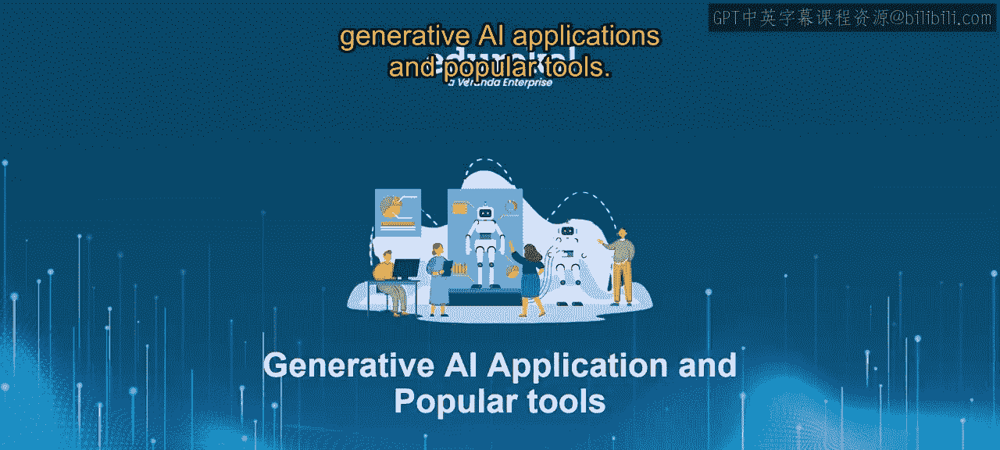
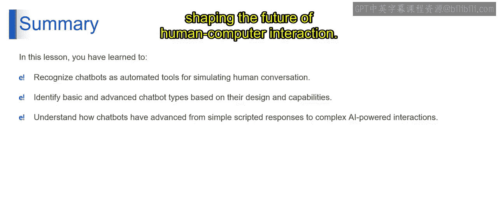

# 第二三四部分 108：聊天机器人介绍 🤖




在本节课中，我们将深入探索聊天机器人的世界，了解其从诞生到现代演化的历程。我们将学习不同类型的聊天机器人及其核心工作原理，并回顾其发展史上的关键里程碑。

---

## 什么是聊天机器人？

聊天机器人本质上是一个计算机程序，旨在模拟与人类用户的对话，通常通过互联网进行。它们被部署在各种平台上，包括网站、消息应用和独立应用程序，目标是提供自动化客户服务或帮助用户快速高效地查找信息。

---

## 聊天机器人的类型

以下是几种主要的聊天机器人类型，每种都有其独特的工作原理和应用场景。

### 1. 基于规则的聊天机器人
这类聊天机器人遵循一组预定义的规则和决策树来确定对用户输入的响应。它们通常用于简单的任务和交互，例如回答常见问题或提供基本的客户支持。其核心逻辑可以用一个简单的**决策树**或**if-else规则**来描述。

**示例代码结构：**
```python
if user_input == "营业时间":
    response = "我们的营业时间是周一至周五，9:00-18:00。"
elif user_input == "联系方式":
    response = "请发送邮件至 support@example.com。"
else:
    response = "抱歉，我不理解您的问题。"
```

### 2. 自学习聊天机器人
自学习聊天机器人利用人工智能和机器学习算法。它们能够理解用户的意图和上下文，从而随着时间的推移提供更细致和相关的响应。这类聊天机器人通过持续从用户交互中学习来改进其性能。其核心是**机器学习模型**，例如一个意图分类器。

**核心概念公式：**
`响应 = 模型(用户输入， 对话历史)`

### 3. 任务导向型聊天机器人
任务导向型聊天机器人专为特定任务而设计，例如预订航班、订购食物或安排预约。它们擅长引导用户完成结构化的交互流程，以高效完成特定任务。其内部通常包含一个**状态机**或**工作流引擎**来管理任务步骤。

### 4. 对话式聊天机器人
对话式聊天机器人旨在模拟类人对话。它们优先考虑自然语言理解和生成，力求与用户进行流畅、直观的互动。它们通常用于客户服务，提供个性化和引人入胜的支持体验。其核心是**自然语言生成（NLG）** 技术。

### 5. 混合型聊天机器人
混合型聊天机器人结合了基于规则和自学习技术的元素，提供了更先进、更自然的对话体验。这些聊天机器人利用预定义规则和机器学习算法来动态适应用户输入，并提供与上下文相关的响应。这可以看作是一个**混合系统**，结合了规则引擎和AI模型。

---

## 聊天机器人的发展历程

上一节我们介绍了聊天机器人的主要类型，本节中我们来看看它们是如何一步步发展到今天的。以下是聊天机器人演化过程中的关键节点。

*   **1960年代：诞生**
    聊天机器人的诞生可以追溯到约瑟夫·魏岑鲍姆创造的第一个聊天机器人Eliza。Eliza利用初级的自然语言处理技术来模仿人类对话。

*   **1980-1990年代：早期应用**
    随着个人电脑和互联网的兴起，用于客户服务的聊天机器人开始出现。早期的聊天机器人严重依赖基于规则的**模式匹配**来解释用户输入。

*   **2010年代：AI革命**
    人工智能和机器学习的进步彻底改变了聊天机器人。Siri和Alexa等虚拟助手展示了AI驱动聊天机器人的能力，它们能够理解和执行超越简单文本交互的复杂任务。

*   **2016年：平台化发展**
    企业开始利用Facebook Messenger聊天机器人进行客户支持和营销，这是聊天机器人应用的一个重要里程碑。聊天机器人设计和部署工具的激增进一步推动了其增长和普及。

*   **2018年：大语言模型登场**
    OpenAI推出了其GPT语言模型的第一个版本GPT-1，以其强大的语言生成能力而闻名。这标志着聊天机器人技术的重大飞跃，实现了更复杂和具有上下文感知能力的交互。

---



## 总结与展望

本节课中，我们一起学习了聊天机器人的基本概念、主要类型及其发展历史。我们看到，聊天机器人自诞生以来已经走过了漫长的道路，从简单的脚本响应演变为智能且自适应的对话代理。

随着人工智能和机器学习的持续加速发展，我们可以预期聊天机器人将在提升客户体验、简化业务流程以及塑造未来人机交互方面扮演越来越重要的角色。


感谢您加入我们对聊天机器人演化的探索。希望您现在对多样化的聊天机器人类型及其发展历程中的关键里程碑有了更深的理解。在您继续探索聊天机器人世界时，我们鼓励您尝试不同的技术和方法，以在您的项目和工作中释放其全部潜力。请继续关注我们后续视频中关于聊天机器人领域的更多见解。