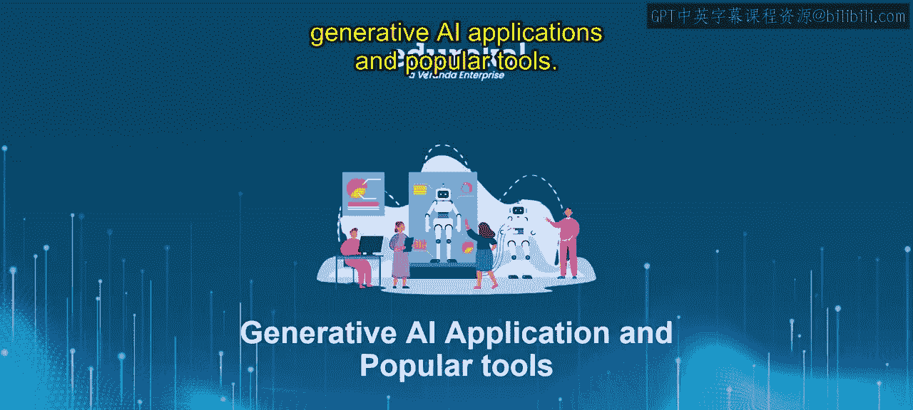
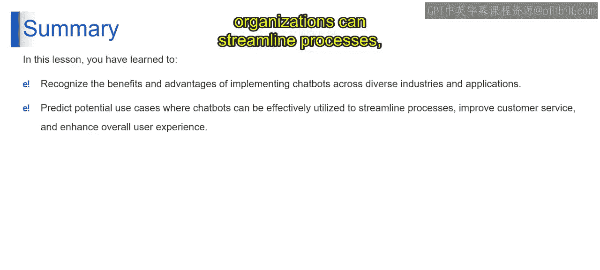

# 第二三四部分 109：聊天机器人的优势与用例 🚀

在本节课中，我们将深入探讨聊天机器人的核心优势及其在各行各业中的潜在应用场景。通过学习，你将全面理解聊天机器人如何提升效率、优化用户体验，并能够设想其在具体业务中的价值。

## 概述

聊天机器人作为一种基于生成式AI的应用，正日益成为连接用户与服务的关键桥梁。本节我们将系统性地分析其优势，并预测其多样化的应用场景。

---

## 聊天机器人的优势 🤖

聊天机器人之所以被广泛采用，是因为它们能带来多方面的显著益处。以下是其主要优势的详细列表。

1.  **全天候支持**
    聊天机器人提供7x24小时不间断的协助，确保用户在任何时间都能获得支持与信息。

2.  **快速解答简单问题**
    用户能立即获得对简单询问的回复，无需等待人工客服介入。

3.  **即时响应**
    聊天机器人能实现瞬时回复，从而提升用户满意度与沟通效率。

4.  **便利性**
    聊天机器人为用户提供了一个便捷的沟通渠道，使他们能够轻松互动并无缝获取信息。

5.  **沟通顺畅**
    聊天机器人促进了流畅且直接的沟通，使用户能够进行自然对话并获得所需的信息或帮助。

6.  **投诉登记能力**
    用户可以通过聊天机器人方便地登记投诉或报告问题，确保问题得到及时解决并提升客户满意度。

7.  **高效处理投诉**
    聊天机器人擅长高效解决客户投诉，通过提供即时协助和引导用户完成投诉处理流程。通过自动化重复性任务并提供即时响应，聊天机器人确保客户问题得到及时处理，从而提高满意度和忠诚度。

8.  **良好的客户体验**
    聊天机器人通过友好、平易近人的互动，为用户创造了积极的客户体验。借助自然语言处理和定制化回复，聊天机器人为用户创造了个性化且引人入胜的体验，培养了用户对品牌的满意度和信任感。

9.  **快速解答复杂问题**
    聊天机器人擅长快速解答复杂问题，这得益于其快速处理大量信息的能力。通过利用AI算法和数据分析，聊天机器人可以分析用户查询并实时提供准确答案，从而减少客户等待时间并提高整体效率。

10. **获取详细或专家级答案**
    聊天机器人通过访问庞大的知识库和资源，为用户提供详细且专业的答案。无论是产品规格、技术信息还是故障排除指导，聊天机器人都能为用户提供全面可靠的信息，加深他们的理解并提升满意度。

11. **友好与平易近人**
    聊天机器人被设计得友好且平易近人，为用户创造了一个温馨的互动环境。通过对话式界面和富有同理心的回应，聊天机器人与用户建立了融洽的关系，使用户感到被重视和欣赏，从而提升了整体客户体验。

---

## 聊天机器人的预测用例 💡

了解了聊天机器人的核心优势后，我们来看看它们可以在哪些具体场景中发挥作用。以下是几个预测的典型用例。

1.  **支付账单**
    聊天机器人可以协助用户支付账单，提供支付选项、引导完成支付流程，并解答相关疑问或处理问题。

2.  **购买昂贵商品**
    用户在考虑购买电子产品或家电等昂贵商品时，可以向聊天机器人寻求建议和信息，以帮助做出明智的决策。

3.  **获取灵感与创意**
    聊天机器人可以根据用户的偏好和兴趣，提供个性化的推荐、建议和灵感，从而促进用户的决策制定和探索过程。

4.  **进行预约**
    用户可以使用聊天机器人为各种服务进行预约，包括餐厅、酒店、航班和活动，从而简化预订流程并确保资源可用性。

聊天机器人的预测用例范围广泛，从支付账单、预约到寻求建议和灵感等。通过利用聊天机器人，组织可以优化流程、改善客户服务并提升整体用户体验。

---

## 总结

本节课我们一起学习了聊天机器人的主要优势，包括**全天候支持**、**即时响应**和**提升客户体验**等。同时，我们也探讨了其在**支付账单**、**商品购买咨询**和**服务预约**等多个场景下的潜在应用。理解这些优势与用例，是有效设计和部署聊天机器人解决方案的基础。在后续课程中，我们将继续深入探索聊天机器人技术的更多可能性。