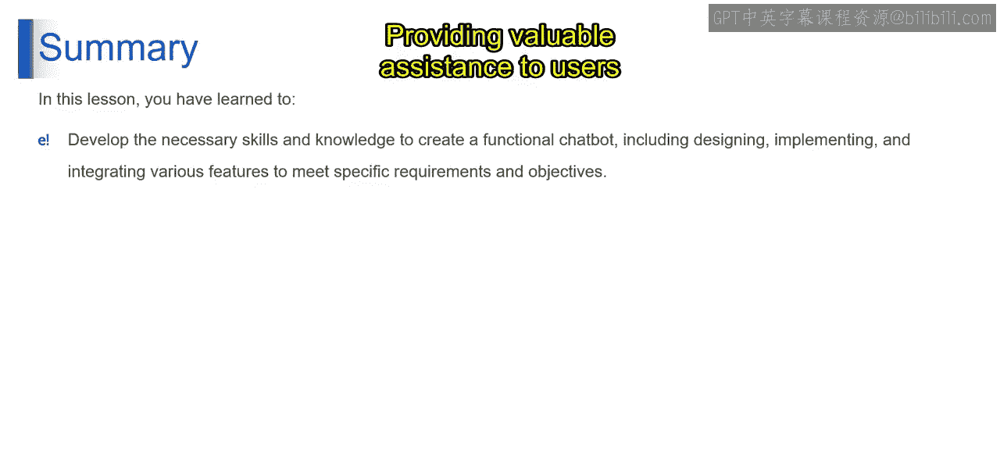
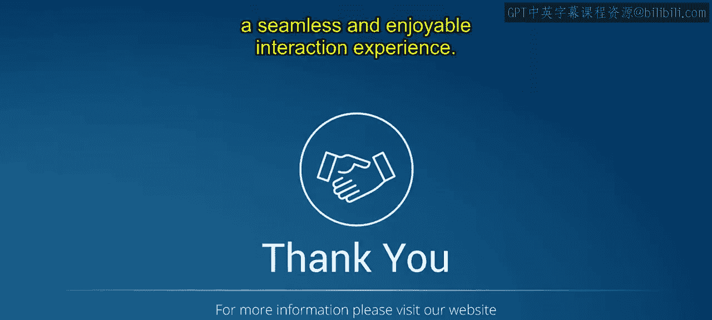

# 第二三四部分 110：如何构建聊天机器人

在本节课中，我们将学习如何从零开始构建一个聊天机器人。我们将详细介绍设计、开发和测试一个基础聊天机器人原型的逐步过程。通过本课的学习，你将掌握创建功能性聊天机器人的技能与知识，使其能够有效与用户互动并执行特定任务。

## 概述

构建一个聊天机器人需要系统性的规划。我们将遵循一个清晰的步骤流程，从定义目标开始，到最终测试和优化。以下是构建聊天机器人的核心步骤。

## 步骤详解

### 步骤一：定义目标

构建聊天机器人的第一步是明确其目标。你需要识别聊天机器人最能服务用户的不同用例，并围绕这些用例来规划产品。定义聊天机器人的确切目标至关重要，无论是提供客户支持、协助产品推荐，还是提供个性化内容。

### 步骤二：设定个性与语气

在定义了目标之后，下一步是设定聊天机器人的个性与语气。聊天机器人的个性代表了你公司在个人层面的形象，有助于吸引用户。你需要决定聊天机器人应如何响应用户的询问和互动，确保整个对话过程的一致性和相关性。

上一节我们介绍了如何定义聊天机器人的目标，本节中我们来看看如何为其注入个性。

### 步骤三：创建任务流与原型

接下来，我们创建任务流，并列出用户可以通过聊天机器人执行的具体任务。将任务流转化为对话脚本，勾勒出用户与聊天机器人之间的对话。然后，在聊天机器人开发平台上根据脚本构建原型，以可视化交互流程。

以下是创建任务流与原型的具体行动项：
*   **列出任务**：明确用户能通过聊天机器人完成的所有具体任务。
*   **编写脚本**：将任务流转化为用户与机器人的自然对话脚本。
*   **构建原型**：在开发平台上搭建原型，可视化交互流程。

### 步骤四：与机器人交互测试

一旦聊天机器人在构建平台上开发完成，就可以开始与实际的聊天机器人进行交互，以识别对话流程中的任何问题或缺口。测试各种场景和用户输入，确保聊天机器人能够准确有效地响应。根据用户反馈和测试结果，迭代改进设计和功能。

## 为什么个性对聊天机器人很重要？

个性对聊天机器人至关重要，因为它使人与机器之间的互动更加人性化，让对话更亲切、更具吸引力且更有效。以下是详细解释。

### 人性化互动

具有个性的聊天机器人模仿了人类的特质，如幽默、同理心和友好。通过将个性注入聊天机器人的回应中，可以创造更自然、更愉快的对话体验。用户更可能感觉自己在与真人而非机器互动，从而提升参与度和满意度。

### 建立品牌标识

聊天机器人的个性反映了其所代表公司的品牌标识和价值观。通过使聊天机器人的个性与品牌的基调和声音保持一致，公司可以强化其品牌形象，并在所有接触点创造一致的体验。例如，一个面向年轻时尚品牌的聊天机器人可能采用俏皮和非正式的语气，而一个专业服务公司的聊天机器人则可能传达专业性和专业知识。

### 提升用户参与度

具有个性的聊天机器人更有可能在整个对话过程中吸引并保持用户的注意力。根据用户偏好和沟通风格量身定制的个性化互动，可以带来更深层次的参与和更长的互动时间。此外，用户更可能再次使用一个他们认为友好、乐于助人且互动愉快的聊天机器人。

### 创造难忘体验

与聊天机器人一次难忘的互动可以给用户留下持久印象，并加强他们与品牌的关系。一个具有鲜明个性的聊天机器人可以通过添加幽默、个性化问题或令人难忘的短语，使对话变得难忘。这些元素有助于创造积极的用户体验，并增加用户未来再次与聊天机器人互动的可能性。

### 引导对话

个性在从初始问候到提供信息和服务的每个阶段引导着对话。一个友好、平易近人的个性可以帮助用户在与聊天机器人互动时感到舒适和自信，鼓励他们提问、寻求帮助以及探索可用的服务或产品。通过以对话式和富有同理心的方式引导用户完成对话，聊天机器人可以有效地满足他们的需求并解决他们的问题。

## 总结

本节课中我们一起学习了构建聊天机器人的完整流程。构建聊天机器人需要细致的规划、设计和测试，以创造功能完善且吸引人的用户体验。通过遵循本课概述的步骤，你可以培养必要的技能和知识，创建一个满足特定要求和目标的聊天机器人，为用户提供有价值的帮助，并提升整体用户满意度。

感谢你加入我们学习如何构建聊天机器人的旅程。我们希望你现在已经准备好去设计、开发和测试你自己的聊天机器人原型。在你继续探索聊天机器人世界时，请记住要专注于用户需求和反馈，以创造无缝且愉快的互动体验。我们将在接下来的视频中继续本课程。