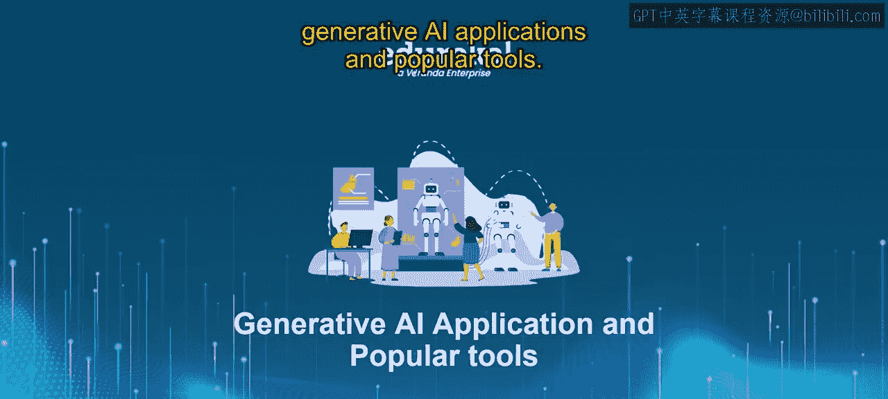
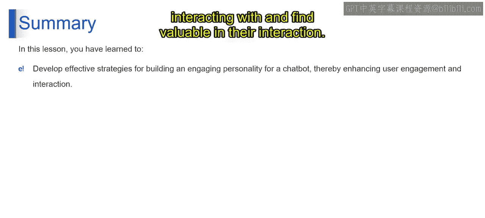

# 第二三四部分 111：为聊天机器人构建引人入胜的个性的技巧 🎭




在本节课中，我们将学习如何为聊天机器人构建一个引人入胜的个性。一个精心设计的个性可以显著提升用户的互动体验，使对话更加自然、愉快且富有成效。我们将探讨一系列实用技巧，从提供相关建议到管理响应时间，帮助你打造一个用户乐于与之交流的聊天机器人。

---


上一节我们介绍了构建聊天机器人个性的重要性，本节中我们来看看具体有哪些有效的策略。

## 提供相关建议 🤔

构建引人入胜的聊天机器人个性的基石之一，是通过提供相关建议来促进顺畅的互动。这包括向用户提出相关问题，并提供简单的“点击即可回答”的建议作为消息按钮。

通过让用户轻松浏览对话选项，你不仅能最大限度地发挥聊天机器人的能力，还能获得宝贵的见解，了解机器人哪些方面需要进一步训练。此外，当用户不确定该说什么时，提供一个建议任务列表可以确保对话流畅进行，使用户保持参与感和满意度。

以下是实现这一点的关键方法：
*   **主动提问**：根据上下文，向用户提出引导性问题。
*   **提供选项按钮**：使用按钮形式提供预设的、常见的回答选项。
*   **展示任务列表**：在对话开始时或用户犹豫时，展示机器人可以处理的核心任务。

## 个性化对话 👤

要创造真正引人入胜的聊天机器人体验，必须在对话中注入个性化的元素。首先，要经常称呼用户的名字，热情地问候他们，甚至祝贺他们取得的成就。

这种个性化有助于与用户建立融洽的关系，让他们感到被重视和赞赏。通过调整回复以匹配用户的偏好和沟通风格，你可以创造一种更人性化的互动，在更深层次上与用户产生共鸣，最终提升参与度和满意度。

以下是实现个性化的具体步骤：
*   **使用用户名**：在对话中自然地嵌入用户的姓名。
*   **情境化问候**：根据时间、用户上次互动或特殊日期（如生日）调整问候语。
*   **记忆上下文**：记住用户之前提到的偏好或信息，并在后续对话中引用。

## 有效管理响应时间 ⏱️

有效的响应时间管理对于维持用户参与度和满意度至关重要。虽然聊天机器人处理用户请求需要一些时间是正常的，但必须在这些短暂的间隔期间让用户知情并保持参与。

加入进度更新的填充内容，可以让用户确信他们的查询正在被处理。然而，要注意不要让用户等待太久，因为这可能导致挫败感和脱离感。在及时性和彻底性之间取得适当的平衡，是确保对话流程顺畅和用户体验积极的关键。

管理响应时间的策略包括：
*   **设置预期**：告知用户“我正在处理您的请求”或“请稍等片刻”。
*   **使用进度指示**：例如显示“正在输入…”或进度条。
*   **优化后端流程**：确保知识库检索和模型推理等环节尽可能高效。

## 基于情境强调情感 😊😢

情感在人类交流中扮演着重要角色，对聊天机器人也是如此。根据对话情境强调情感，能为互动增添深度和真实性，使其对用户来说更具吸引力和共鸣。

例如，如果用户成功完成一项任务，应以热情和鼓励来回应，以庆祝这一成就。相反，如果用户遇到困难或未能完成任务，则应表达同理心和理解，以传达支持和安慰。

通过镜像并恰当地回应用户的情感线索，你可以培养更牢固的联系和信任，从而提升参与度和满意度。实现情感回应的核心是**条件判断**，伪代码如下：
```python
if user_sentiment == “positive” and task_completed:
    response = generate_enthusiastic_response()
elif user_sentiment == “frustrated”:
    response = generate_empathic_response()
else:
    response = generate_neutral_response()
```

---




本节课中我们一起学习了为聊天机器人构建引人入胜的个性的四个核心技巧：**提供相关建议**以引导对话，**个性化对话**以建立联系，**有效管理响应时间**以维持耐心，以及**基于情境强调情感**以增加共鸣。通过综合运用这些策略，你可以创建一个用户乐于互动并认为有价值的聊天机器人。请记住，在持续开发过程中，要优先考虑用户体验，并根据用户反馈进行迭代，以不断改进和完善聊天机器人的个性。