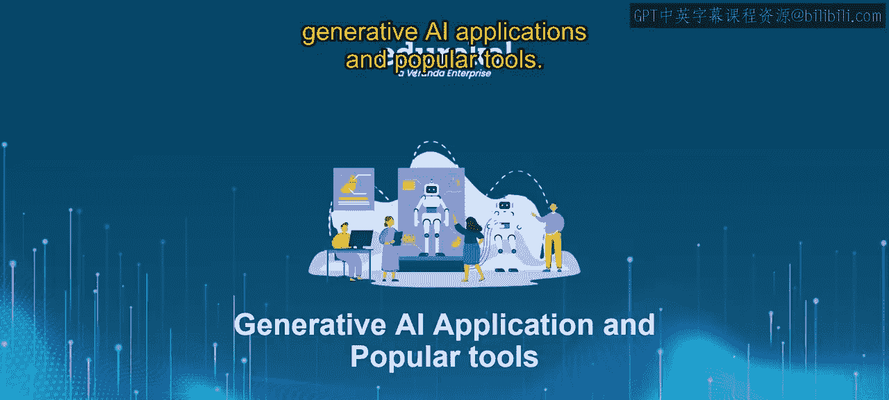
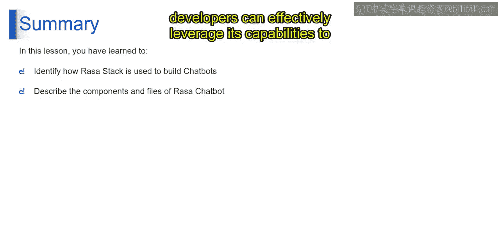

# 第二三四部分 112：Rasa聊天机器人介绍 🧠

在本节课中，我们将学习Rasa聊天机器人。Rasa是一个开源框架，用于构建、部署和管理具有完全环境控制权的AI对话助手。我们将了解其核心组件、工作原理以及构建一个Rasa聊天机器人所需的关键文件。

## 概述

Rasa聊天机器人是Rasa技术栈的一部分，它是一个开源AI工具，专为构建、部署和托管聊天机器人而设计，开发者对其环境拥有完全控制权。它提供了一个可定制的解决方案，允许开发者根据特定需求调整聊天机器人的行为。Rasa的开源特性使其在部署和定制方面具有灵活性，适用于各种用例。即使数据有限，其默认设置也能高效处理后台任务，如部署和创建服务器。

上一节我们介绍了生成式AI的应用概览，本节中我们来看看一个具体的工具——Rasa。

## Rasa的核心组件

Rasa技术栈包含两个核心组件：Rasa NLU（自然语言理解）和Rasa Core。每个组件在Rasa聊天机器人的开发和功能中都扮演着至关重要的角色。

### 1. Rasa NLU（自然语言理解）

Rasa NLU负责理解和解释用户的输入或消息。它的主要任务是从用户消息中提取**意图**（用户的意图或目的）和**实体**（具体的信息片段）。

*   **意图**代表用户想要执行的目标或行动。
*   **实体**提供了实现该意图所需的具体细节。

例如，在一个天气聊天机器人中，意图可能是“获取天气预报”，实体则可能包括请求预报的**地点**和**日期**。

Rasa NLU使用机器学习算法，基于提供的训练数据来处理和分类用户消息。开发者使用标注了意图和实体的用户消息示例来训练NLU模型。这些示例让模型能够学习不同词语、短语与对应意图和实体之间的模式和关联。因此，Rasa NLU使聊天机器人能够准确理解用户输入并确定用户的意图。

### 2. Rasa Core（对话管理）

Rasa Core负责管理对话流程，并针对用户的查询或行动生成适当的回应。

与遵循预定脚本或决策树的传统基于规则的聊天机器人不同，Rasa Core采用一种基于机器学习的方法，称为**强化学习**。这种方法使聊天机器人能够从交互数据中学习，并根据当前对话上下文决定下一步应采取什么行动。

Rasa Core维护一个对话管理模型，该模型预测聊天机器人在对话的每一步应采取的**最佳下一个行动**。该模型会考虑对话的当前状态，包括用户意图、之前的消息以及聊天机器人的回应，从而做出如何继续的明智决策。

例如，如果用户请求天气预报，Rasa Core可能会判定适当的行动是获取指定地点的天气数据，并向用户提供天气预报。

通过将Rasa NLU对用户输入的理解与Rasa Core的对话管理能力相结合，Rasa技术栈使开发者能够构建复杂的聊天机器人，能够与用户进行自然且上下文相关的对话。这种方法为聊天机器人开发提供了更大的灵活性和适应性，因为聊天机器人可以通过与用户的交互不断学习和改进。

这些组件可以独立工作，但Rasa建议同时使用两者以达到最佳效果。

## 构建Rasa聊天机器人所需的文件

了解了核心组件后，我们来看看构建一个Rasa聊天机器人需要哪些关键文件。以下是四个必需的文件：

1.  **NLU训练文件**
    此文件包含训练数据，包括映射到意图和实体的用户输入。提供多样化的示例可以提高机器人的自然语言理解能力。

2.  **故事文件**
    故事文件包含用户与机器人之间的示例交互。Rasa Core利用这些数据为每个故事创建一个可能的交互概率模型。

3.  **领域文件**
    领域文件列出了所有的意图、实体、动作和模板等相关信息。模板包含可作为对话中动作使用的示例机器人回复。

4.  **策略文件**
    策略文件决定了机器人在对话每一步应采取的行动。Rasa的策略类会根据对话的上下文选择适当的动作。

## 总结

本节课中我们一起学习了Rasa聊天机器人。Rasa技术栈为构建聊天机器人提供了一个强大的框架，为开发者提供了定制和部署AI驱动对话助手的灵活性。通过理解Rasa聊天机器人的组件和必需文件，开发者可以有效地利用其功能，创建智能且用户友好的对话界面。