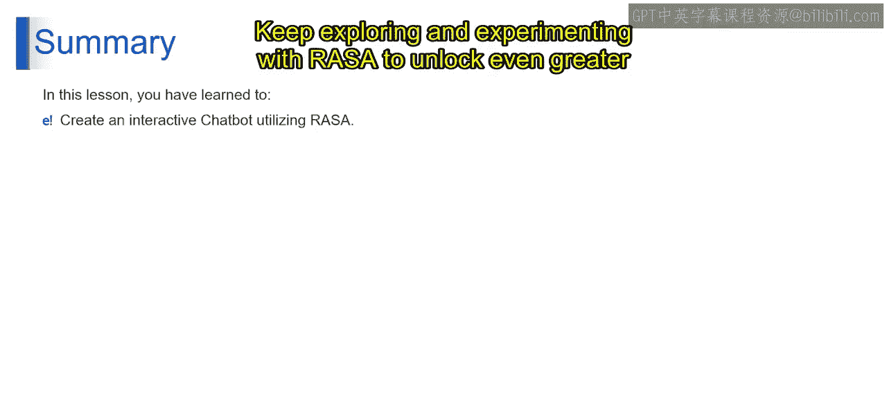

# 第二三四部分 113：使用Rasa构建聊天机器人 🚀


在本节课中，我们将学习如何使用Rasa这一强大的开源框架来构建一个交互式聊天机器人。我们将从环境准备开始，逐步深入到项目结构创建、配置文件编写、模型训练，最终实现与机器人的实时对话。

## 概述

Rasa是一个用于构建对话式AI应用的开源框架。通过本节课的学习，你将掌握使用Rasa创建聊天机器人的完整流程，包括设置项目结构、定义对话内容、配置处理管道、训练模型以及进行交互式测试。

---

## 环境准备与依赖安装

要成功运行代码，你需要确保系统中已安装Python。此外，根据提供的代码，你还需要安装一些必要的Python库。

以下是需要安装的库：

1.  **OS模块**：此模块是Python标准库的一部分，通常默认包含。
2.  **PIP包管理器**：用于安装和管理Python包。
3.  **Rasa库**：这是一个用于构建对话式AI聊天机器人的流行Python库。它提供了训练和运行聊天机器人模型的工具和实用程序。

你可以使用Python包管理器PIP来安装这些包。打开终端或命令提示符，运行以下命令：

```bash
pip install rasa
```

如果在安装过程中遇到权限问题，请确保你拥有管理员权限。

一旦你安装了Python和必要的包，就应该能够成功运行提供的代码来设置聊天机器人项目。

---

## 项目文件结构与内容定义

上一节我们介绍了环境准备，本节中我们来看看如何定义项目的初始文件结构。

代码首先定义了一个名为 `project_files` 的字典。每个键代表项目目录中的一个文件路径，其对应的值是将要写入该文件的内容。

例如，键 `./data/nlu.yml` 代表自然语言理解文件，其内容包括问候语、告别语和天气相关查询的示例。

---

## 自动化创建文件夹与文件

以下是创建文件夹和写入文件的具体步骤：

1.  代码遍历 `project_files` 字典中的每个键值对。
2.  对于每个文件，它使用 `os.path.dirname()` 函数提取目录路径。
3.  为确保目录存在，如果不存在，则使用 `os.makedirs()` 函数创建必要的目录结构。
4.  然后，它使用上下文管理器以写入模式打开每个文件，并使用 `f.write()` 函数将相应的YAML内容写入文件。

一旦这个循环完成，所有指定的YAML文件都会被创建并用预定义的内容填充。

这段代码本质上自动化了聊天机器人项目的初始设置过程。它创建并组织必要的文件和文件夹，确保它们包含所需的内容。这种自动化简化了项目设置，使得开始开发聊天机器人变得更加容易，无需手动创建和填充每个文件。它简化了流程，并有助于在不同项目之间保持一致性。

---

## 配置聊天机器人处理管道

上一节我们自动化创建了项目文件，本节中我们来看看如何配置聊天机器人的核心处理逻辑。

这段Python代码片段负责为聊天机器人项目创建一个配置文件，即 `config.yml`。该配置文件指定了聊天机器人应如何处理和理解自然语言输入。

以下是代码功能的分解：

1.  **管道配置**：代码定义了一个多行字符串 `pipeline_config`，其中包含YAML格式的文本。此文本代表了聊天机器人处理管道的配置设置。管道由多个处理步骤组成，这些步骤将原始文本输入转换为聊天机器人可以理解和响应的结构化数据。
2.  **语言设置**：在管道配置中，代码将语言参数设置为 `en`，表示聊天机器人配置为处理英语文本。此设置确保聊天机器人的语言处理组件针对英语输入进行了优化。
3.  **管道组件**：管道配置指定了构成聊天机器人处理管道的各种组件。这些组件包括分词器、特征提取器、分类器和响应选择器。每个组件执行特定任务，例如将文本拆分为单个单词（分词）、从文本中提取特征、对用户消息的意图进行分类以及选择适当的响应。
4.  **训练设置**：配置包括某些组件的训练设置。例如，DIET分类器组件被配置为进行100个训练周期，这有助于提高聊天机器人意图分类模型的准确性。
5.  **写入配置文件**：最后，代码将管道配置写入名为 `config.yml` 的文件。它使用上下文管理器以写入模式打开文件，并使用 `f.write()` 方法将YAML格式的配置文本写入文件。

总之，这段代码为聊天机器人项目设置了配置，指定了聊天机器人应如何处理自然语言输入。它确保聊天机器人配置为理解英语文本，并将此配置保存到文件中，以便在后续的训练和推理中使用。

---

## 训练聊天机器人模型

`rasa train` 是Rasa提供的命令行界面命令。此命令用于根据项目目录中提供的配置和训练数据，训练聊天机器人项目所需的机器学习模型。

1.  **模型训练**：当你运行 `rasa train` 时，Rasa会启动聊天机器人模型的训练过程。这包括基于项目目录中存在的项目和配置文件，训练NLU和对话管理模型。Rasa使用 `data/nlu.yml` 和 `data/rules.yml` 文件中提供的训练数据来训练NLU模型，该模型负责理解用户消息并提取意图和实体。
2.  **对话管理训练**：此外，Rasa使用 `config.yml` 文件中指定的配置和训练数据来训练对话管理模型，该模型根据当前对话上下文决定聊天机器人应如何响应用户消息。

---

## 与聊天机器人进行交互式对话

`rasa shell` 是Rasa提供的另一个命令行界面命令。此命令用于直接从命令行与训练好的聊天机器人模型进行实时对话交互。

以下是 `rasa shell` 命令的功能：

1.  **启动聊天机器人**：当你运行 `rasa shell` 时，Rasa会从项目文件夹内的 `models` 目录加载训练好的聊天机器人模型。这些模型包括NLU模型和对话管理模型。
2.  **交互式对话**：模型加载后，Rasa启动一个交互式会话，你可以直接从命令行与聊天机器人对话。你可以像与真实用户聊天一样输入消息，聊天机器人将根据其训练模型和对话上下文进行响应。
3.  **自然语言理解**：当你输入消息时，Rasa的NLU模型会处理文本以理解用户意图并提取消息中提到的任何实体。
4.  **响应生成**：基于识别出的意图和实体，Rasa的对话管理模型决定当前对话上下文的适当响应。处理用户消息后，Rasa生成响应并将其显示在命令行界面中。响应可能包括文本、图像、按钮或其他交互元素，具体取决于聊天机器人的配置。
5.  **对话流程**：随着你和聊天机器人来回交换消息，对话将持续迭代进行。你可以根据聊天机器人的功能和训练数据提出问题、提供信息或触发特定操作。

现在，你可以开始使用你的聊天机器人了。

---

## 总结

在本节课中，我们通过动手演示和实践练习，引导你完成了使用Rasa构建聊天机器人的全过程。通过跟随演示并完成练习，你获得了利用Rasa创建复杂对话式AI应用的宝贵见解和实践经验。

恭喜你完成本节课，并掌握了使用Rasa构建聊天机器人的技巧。凭借你新获得的技能，你已经完全有能力开发创新的对话式AI应用，以增强用户体验并推动互动。继续探索和尝试Rasa，以解锁对话式AI领域更大的可能性。




感谢你的参与，祝你在掌握Rasa和构建卓越聊天机器人的旅程中一切顺利！